# Benchmarks

In this evaluation we've benchmarked Nakama on a number of workloads testing several of its core APIs you'd typically use to build a large scale multiplayer game.

The workloads have been run on a set of different hardware configurations to demonstrate the performance advantages that come from Nakama's modern hardware-friendly and highly-scalable architecture.

As the results demonstrate; Nakama's performance grows as the hardware size grows. Scaling both up and out offers many advantages: from simplified cluster management to access to generally better hardware and economies of scale.

## Methodology

The benchmarks were performed using [Tsung](http://tsung.erlang-projects.org/), a powerful, distributed load testing tool.

The Tsung workloads benchmark Nakama in single-node deployment (Nakama OSS) and clustered mode (Nakama Enterprise) in a few different configurations, using a single database instance.

The database instance hardware was kept constant throught all configurations and workloads to ensure there were no bottlenecks on I/O. Although we've also tested some database-bound APIs these benchmarks will focus on the capabilities of Nakama.

The Tsung servers are run on Google Compute Engine (GCE). Both Nakama OSS and Enterprise have been run on our [Heroic Cloud](https://cloud.heroiclabs.com) infrastructure.

No warmup runs were executed before the actual workloads.

## Setup

### Tsung / Database

The Tsung topology consists of one master and twenty slave nodes. This setup was unchanged across all the benchmark runs and the hardware specification was:

|| Tsung Master  | Tsung Slaves    | Database    |
|---             |---              |---       |---             |
|Instance Type   |n1-standard-32   |n1-standard-32 |dedicated-core vCPU |
| vCPU / Mem      | 6 / 8GB         | 3 / 2GB       | 8 / 30GB  |
| IOPS (read/write)       |---              |---  |3000

The database was set up on Google CloudSQL.

### Nakama

We've run the benchmark workloads against three configurations:

**Nakama OSS**

* 1 Node - 1 CPU / 3GB RAM

**Nakama Enterprise**

* 2 Nodes - 1 CPU / 3GB RAM (per node)
* 2 Nodes - 2 CPU / 6GB RAM (per node)

All the containers were running on the GCP instance type: "n1-standard-32" and were created on Heroic Cloud platform. The Nakama nodes are behind a GCP L7 load balancer.

## Workloads

The proposed workloads are meant to display Nakama's throughput and capacity for effortless production-ready scale.

We'll present the benchmarking results for the following workloads:

1. Number of concurrent socket connections (CCU count)
2. Throughput of new user registration
3. Throughput of user authentication
4. Throughput of custom RPC call in the Lua runtime
5. Throughput of custom RPC call in the Go runtime
6. Number of authoritative realtime matches using custom match handlers

The following subsections are respectively dedicated to each of the aformentioned workloads, where each one of them will be described in more detail; followed by the benchmark results gathered by Tsung for each of the considered hardware and topology configurations.

## Results

### Workload 1 - Number of concurrent socket connections (CCU count)

This workload consists of authenticating a user, opening a socket connection to Nakama, and keeping it open for around 200 seconds.

| 1 Node - 1 CPU / 3GB RAM|
|---                      |
| Number of connected users |
| 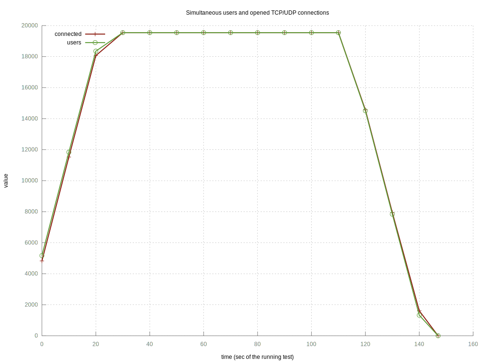 |

| 2 Nodes - 1 CPU / 3GB RAM (per node)|
|---                      |
| Number of connected users |
| 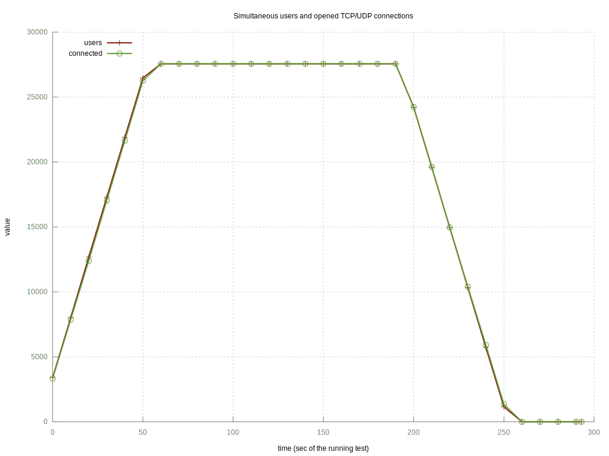 |

| 2 Nodes - 2 CPU / 6GB RAM (per node)|
|---                      |
| Number of connected users |
| 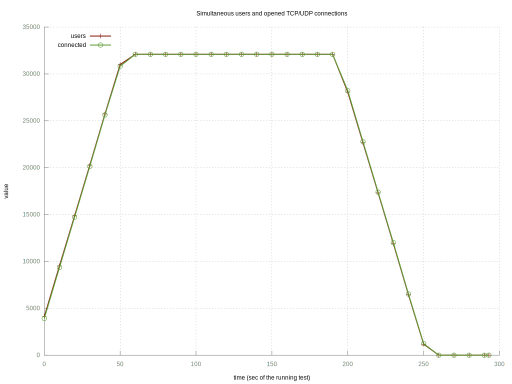 |

<table>
  <tr>
    Time to connect
  </tr>
  <tr>
    <th>Hardware</th>
    <th>Max Connected</th>
    <th>highest 10sec mean</th>
    <th>lowest 10sec mean</th>
    <th>Highest Rate</th>
    <th>Mean Rate</th>
    <th>Mean</th>
  </tr>
  <tr>
    <td>1 Node - 1 CPU / 3GB RAM</td>
    <td>19542</td>
    <td>42.40 msec </td>
    <td>26.54 msec</td>
    <td>1340 / sec</td>
    <td>196.12 / sec</td>
    <td>34.21 msec </td>
  </tr>
    <tr>
    <td>2 Nodes - 1 CPU / 3GB RAM (each)</td>
    <td>27558</td>
    <td>16.93 msec </td>
    <td>15.92 msec</td>
    <td>930 / sec</td>
    <td>161.52 / sec</td>
    <td>16.60 msec </td>
  </tr>
    <tr>
    <td>2 Nodes - 2 CPU / 6GB RAM (each)</td>
    <td>32092</td>
    <td>20.17 msec </td>
    <td>18.18 msec</td>
    <td>1097.7 / sec</td>
    <td>187.82 / sec</td>
    <td>19.15 msec </td>
  </tr>
</table>

!!! Summary
  A single Nakama instance with a single CPU core can have up to \~19,500 connected users. Scaling up to 2 nodes with 2 CPU cores each this values goes up to \~32,000 CCU.

## Workload 2 - Register a new user

This workload emulates the registration of new users through the game server's [device authentication](../authentication/#device) API which stores the new accounts to the database.

| 1 Node - 1 CPU / 3GB RAM|
|---                      |
| Throughput (req/s)      |
| 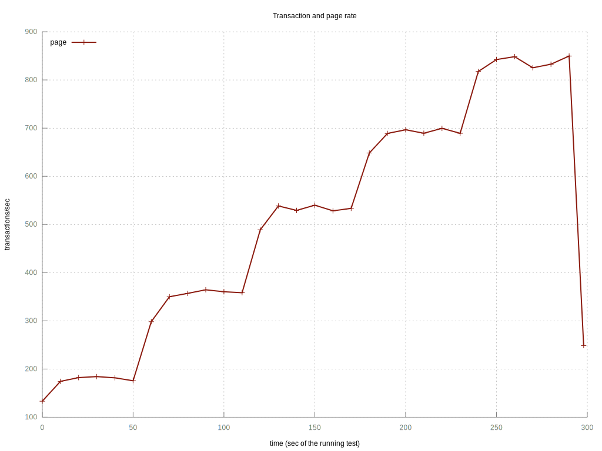 |

| 2 Node - 1 CPU / 3GB RAM (per node)|
|---                      |
| Throughput (req/s)      |
| 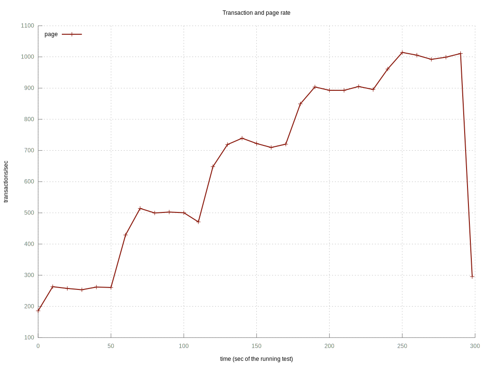 |

| 2 Node - 2 CPU / 6GB RAM (per node)|
|---                      |
| Throughput (req/s)      |
| 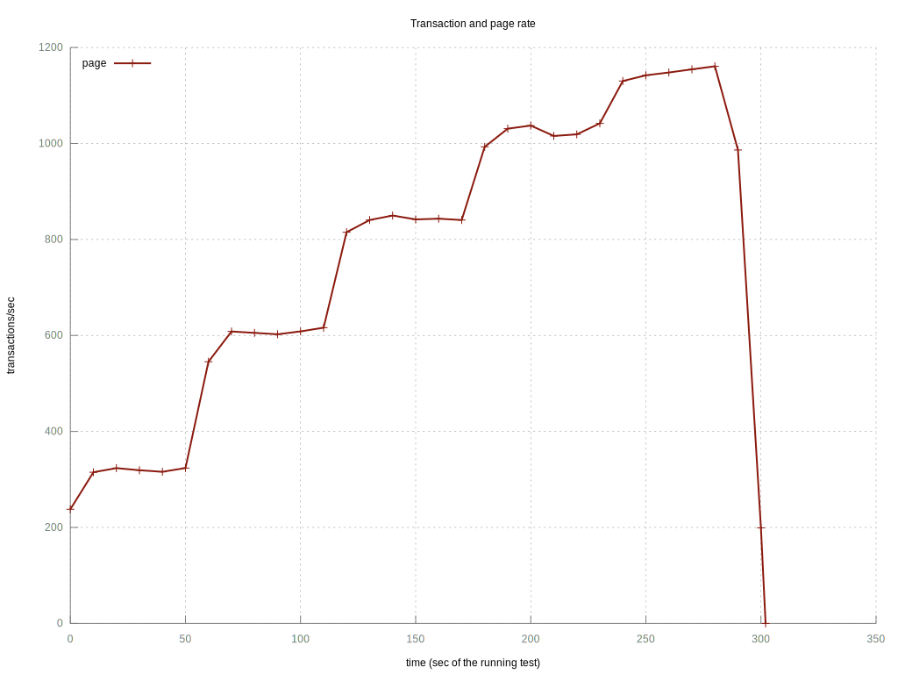 |

<table>
  <tr>
    Request statistics
  </tr>
  <tr>
    <th>Hardware</th>
    <th>highest 10sec mean</th>
    <th>lowest 10sec mean</th>
    <th>Highest Rate</th>
    <th>Mean Rate</th>
    <th>Mean</th>
  </tr>
  <tr>
    <td>1 Node - 1 CPU / 3GB RAM</td>
		<td>29.07 msec </td>
		<td>20.10 msec</td>
		<td>849.6 / sec</td>
		<td>519.46 / sec</td>
		<td>24.60 msec </td>
  </tr>
  <tr>
    <td>2 Nodes - 1 CPU / 3GB RAM (each)</td>
		<td>31.65 msec </td>
		<td>20.01 msec</td>
		<td>1014.3 / sec</td>
		<td>672.18 / sec</td>
		<td>25.95 msec </td>
  </tr>
  <tr>
    <td>2 Nodes - 2 CPU / 6GB RAM (each)</td>
		<td>0.14 sec </td>
		<td>20.01 msec</td>
		<td>1160.8 / sec</td>
		<td>750.76 / sec</td>
		<td>28.46 msec </td>
  </tr>
</table>

!!! Summary
    A single Nakama server can handle average loads of \~500 requests/sec with requests served in 24.60 ms (mean) with a database write operation for a new user. At this rate a game can create 1.86 million new players every hour. This value goes up to 2.7 million player accounts per hour when scaled to 2 nodes.

## Workload 3 - Authenticate a user

This workload consists of authenticating an existing user using the game server's [device authentication](../authentication/#device) API.

| 1 Node - 1 CPU / 3GB RAM|
|---                      |
| Throughput (req/s)      |
| 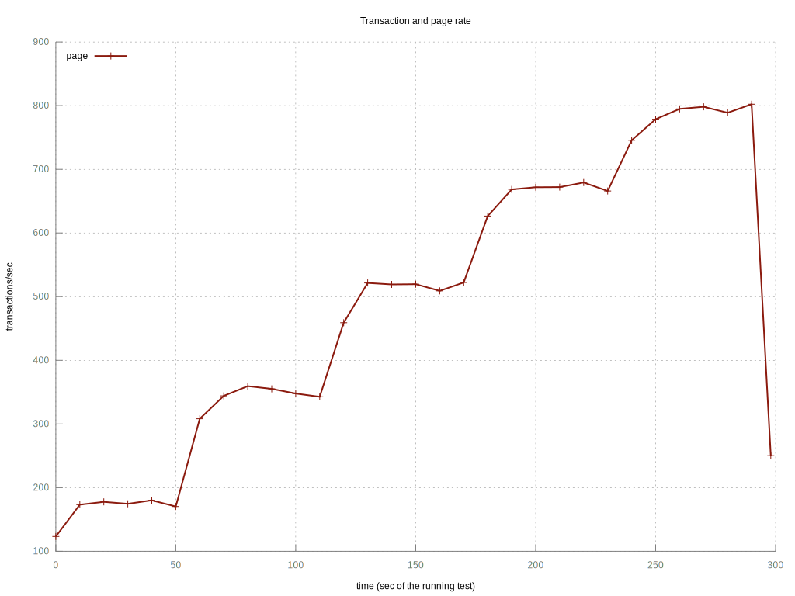 |

| 2 Node - 1 CPU / 3GB RAM (per node)|
|---                      |
| Throughput (req/s)      |
| 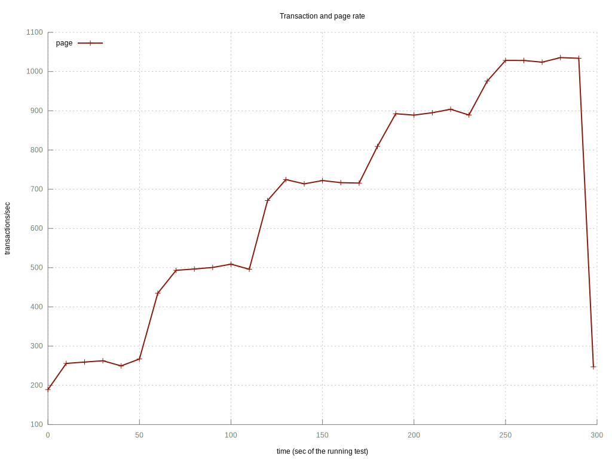 |

| 2 Node - 2 CPU / 6GB RAM (per node)|
|---                      |
| Throughput (req/s)      |
| 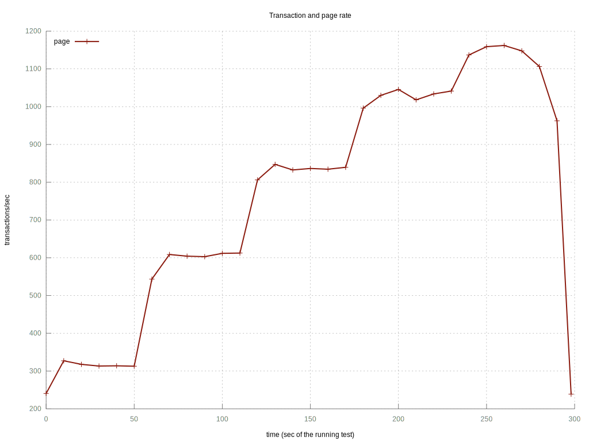 |

<table>
  <tr>
    Request statistics
  </tr>
  <tr>
    <th>Hardware</th>
    <th>highest 10sec mean</th>
    <th>lowest 10sec mean</th>
    <th>Highest Rate</th>
    <th>Mean Rate</th>
    <th>Mean</th>
  </tr>
  <tr>
    <td>1 Node - 1 CPU / 3GB RAM</td>
		<td>33.40 msec </td>
		<td>17.27 msec</td>
		<td>802.2 / sec</td>
		<td>499.63 / sec</td>
		<td>24.61 msec </td>
  </tr>
  <tr>
     <td>2 Nodes - 1 CPU / 3GB RAM (each)</td>
		<td>27.87 msec </td>
		<td>16.81 msec</td>
		<td>1035.5 / sec</td>
		<td>673.42 / sec</td>
		<td>22.19 msec </td>
  </tr>
  <tr>
    <td>2 Nodes - 2 CPU / 6GB RAM (each)</td>
		<td>76.85 msec </td>
		<td>16.95 msec</td>
		<td>1162 / sec</td>
		<td>776.77 / sec</td>
		<td>25.03 msec </td>
  </tr>
</table>

## Workload 4 - Custom Lua RPC call

This workload executes a simple [RPC function](../runtime-code-basics/#rpc-hook) exposed through the Lua runtime. The function receives a payload as a JSON string, decodes it, and echoes it back to the sender.

| 1 Node - 1 CPU / 3GB RAM|
|---                      |
| Throughput (req/s)      |
| 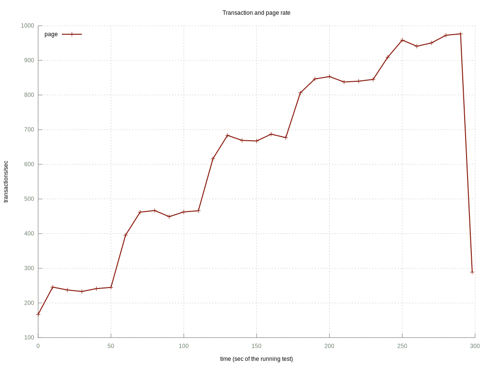 |

| 2 Node - 1 CPU / 3GB RAM (per node)|
|---                      |
| Throughput (req/s)      |
| 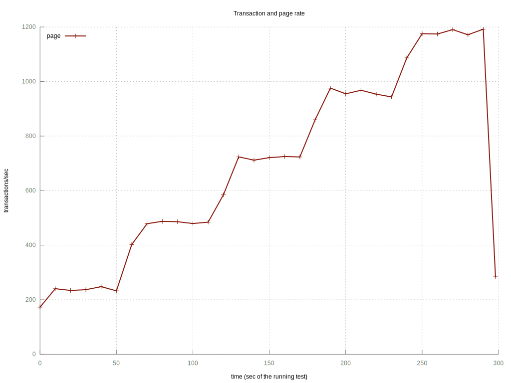 |

| 2 Node - 2 CPU / 6GB RAM (per node)|
|---                      |
| Throughput (req/s)      |
| 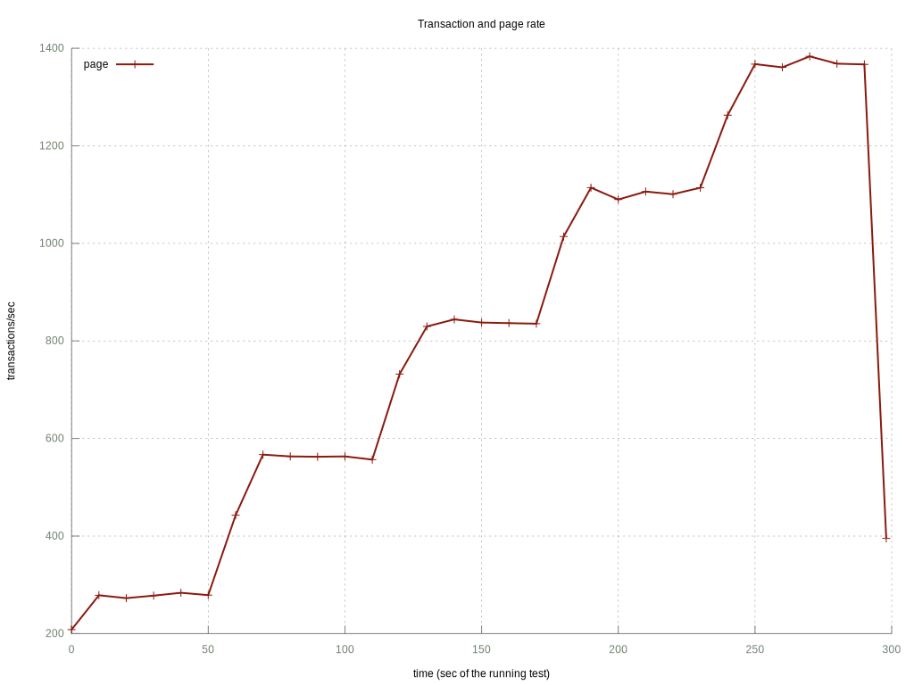 |

<table>
  <tr>
    Request statistics
  </tr>
  <tr>
    <th>Hardware</th>
    <th>highest 10sec mean</th>
    <th>lowest 10sec mean</th>
    <th>Highest Rate</th>
    <th>Mean Rate</th>
    <th>Mean</th>
  </tr>
  <tr>
    <td>1 Node - 1 CPU / 3GB RAM</td>
		<td>26.18 msec </td>
		<td>15.01 msec</td>
		<td>976.5 / sec</td>
		<td>633.42 / sec</td>
		<td>20.22 msec </td>
  </tr>
  <tr>
    <td>2 Nodes - 1 CPU / 3GB RAM (each)</td>
		<td>19.25 msec </td>
		<td>15.68 msec</td>
		<td>1192 / sec</td>
		<td>706.71 / sec</td>
		<td>17.48 msec </td>
  </tr>
  <tr>
    <td>2 Nodes - 2 CPU / 6GB RAM (each)</td>
		<td>20.27 msec </td>
		<td>16.11 msec</td>
		<td>1383.4 / sec</td>
		<td>823.55 / sec</td>
		<td>18.16 msec </td>
  </tr>
</table>

## Workload 5 - Custom Go RPC call

This workload executes a simple [RPC function](../runtime-code-basics/#rpc-hook) exposed through the Go runtime. The function receives a payload as a JSON string, decodes it, and echoes it back to the sender.

| 1 Node - 1 CPU / 3GB RAM|
|---                      |
| Throughput (req/s)      |
|  |

| 2 Node - 1 CPU / 3GB RAM (per node)|
|---                      |
| Throughput (req/s)      |
| 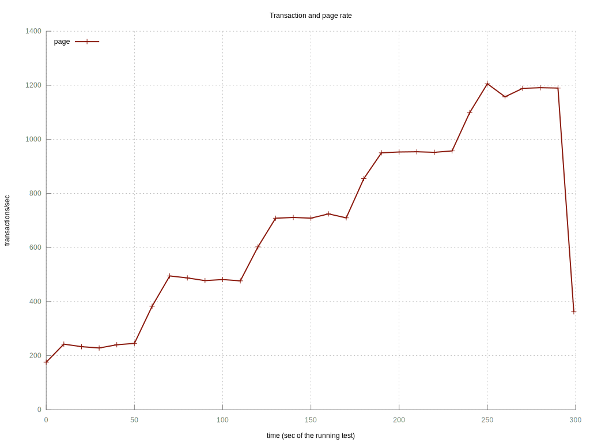 |

| 2 Node - 2 CPU / 6GB RAM (per node)|
|---                      |
| Throughput (req/s)      |
| 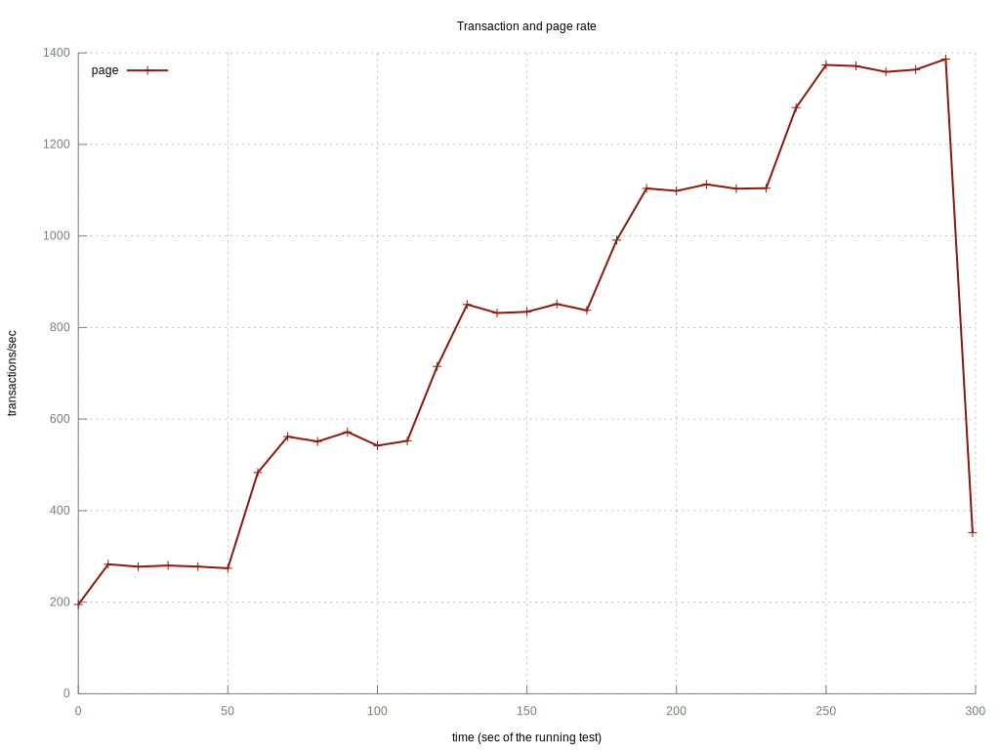 |

<table>
  <tr>
    Request statistics
  </tr>
  <tr>
    <th>Hardware</th>
    <th>highest 10sec mean</th>
    <th>lowest 10sec mean</th>
    <th>Highest Rate</th>
    <th>Mean Rate</th>
    <th>Mean</th>
  </tr>
  <tr>
    <td>1 Node - 1 CPU / 3GB RAM</td>
		<td>26.12 msec </td>
		<td>14.42 msec</td>
		<td>975.9 / sec</td>
		<td>635.36 / sec</td>
		<td>19.97 msec </td>
  </tr>
  <tr>
    <td>2 Nodes - 1 CPU / 3GB RAM (each)</td>
		<td>20.87 msec </td>
		<td>14.91 msec</td>
		<td>1205.7 / sec</td>
		<td>707.12 / sec</td>
		<td>17.29 msec </td>
  </tr>
  <tr>
    <td>2 Nodes - 2 CPU / 6GB RAM (each)</td>
		<td>20.19 msec </td>
		<td>15.59 msec</td>
		<td>1386.4 / sec</td>
		<td>820.41 / sec</td>
		<td>18.00 msec </td>
  </tr>
</table>

!!! Summary
    A single Nakama server can handle an average of \~600 requests/sec served in 19.97 msec (mean). When compared with the results with Workload 5, we see that the results between the Lua and Go runtime are very similar. This is because the benchmarked workload does not incur significant CPU computations; causing the results to be similar despite the differences of the Lua virtual machine. With CPU intensive code the performance results would start to differ as would RAM usage by the Lua runtime.

## Workload 6 - Custom authoritative match Logic

This workload emulates a realtime multiplayer game running on Nakama's [server-authoritative multiplayer](../gameplay-multiplayer-server-multiplayer/) engine. Although the client and custom logic are not an actual multiplayer game; the code creates an approximation of a real use-case scenario in terms of messages being exchanged between the server and the connected game clients. We'll briefly explain the server and client logic in this workload.

### Server side logic

The server runs multiplayer matches with a tick rate of 10 ticks per second. Each match can have a maximum of 10 players.

The server implements an RPC call that the client can query to get the ID of an ongoing match (with less than 10 players). When this API is invoked, the server will use the [Match Listing](../gameplay-multiplayer-server-multiplayer/#match-listings) feature to look for matches that are not full and return the first result. If no matches were found; a new one is initiated.

The match loop logic is simple; the server expects to receive one of two opcodes from the client and performs either of the following actions:

1. Echo back the received message to the client.
2. Broadcast the message to all of the match participants.

### Client side logic

The client logic is also simple; each game client performs the following steps in-order:

1. Authenticates an existing user with Nakama to receive a token.
2. Execute the server RPC function to receive an ID of an ongoing match (which is not full).
3. Establishes a websocket connection with the realtime API.
4. Join the match with the ID received in step 2.
5. For 180 seconds the client will loop and each half second will alternate between sending a message with opcode 1 or 2.

The messages sent by the client contain a payload of fixed size with a string of 44 and 35 characters for opcode 1 and 2 respectively.

|---                      |
| Number of connected users      |
| 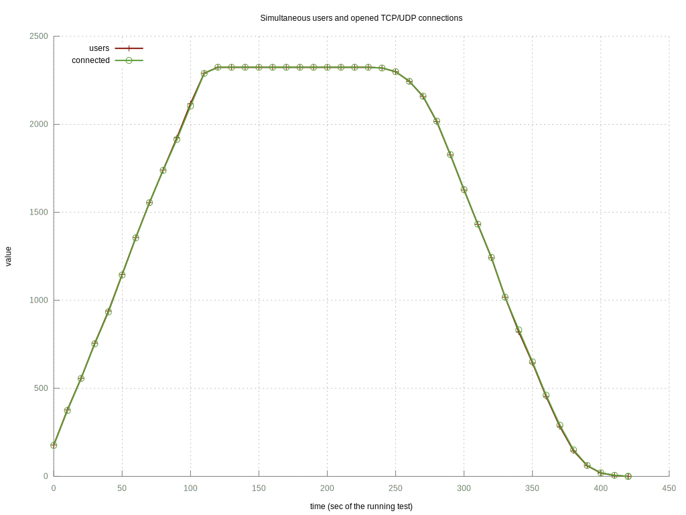 |

| 2 Node - 1 CPU / 3GB RAM (per node)|
|---                      |
| Number of connected users      |
| 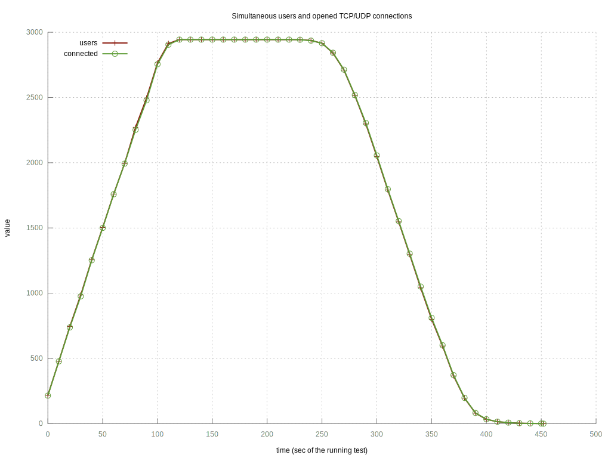 |

| 2 Node - 2 CPU / 6GB RAM (per node)|
|---                      |
| Number of connected users      |
| 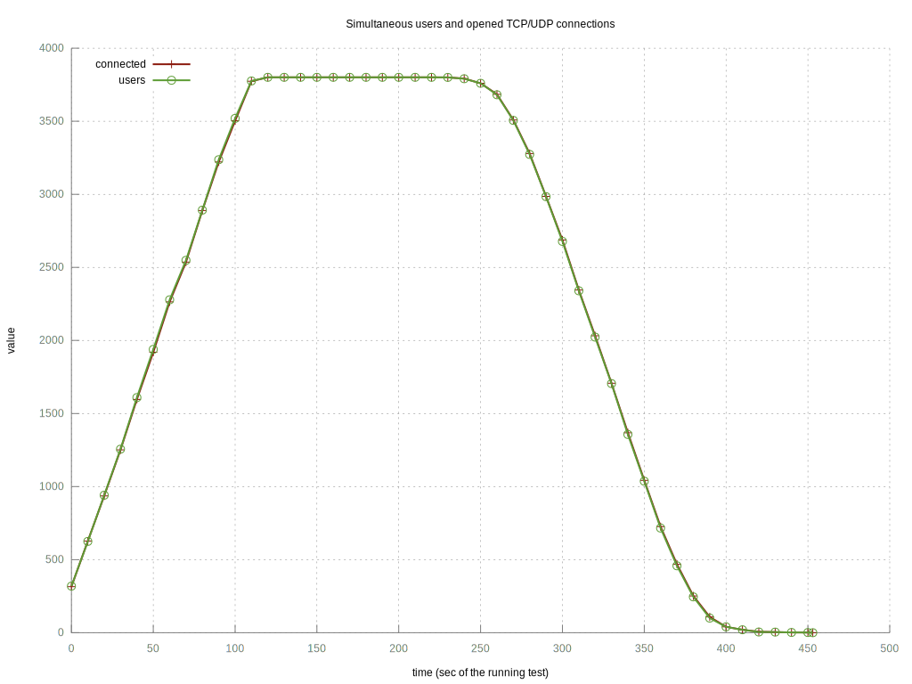 |

These results are the averages for each request made by the client because this workload involved:

1. Authentication
2. RPC Call
3. Connect to Wwebsocket and
4. Send messages through the websocket connection;

the results take into account the entire set of request logic performed within each of the client sessions.

<table>
  <tr>
    Request statistics
  </tr>
  <tr>
    <th>Hardware</th>
    <th>highest 10sec mean</th>
    <th>lowest 10sec mean</th>
    <th>Highest Rate</th>
    <th>Mean Rate</th>
    <th>Mean</th>
  </tr>
  <tr>
    <td>1 Node - 1 CPU / 3GB RAM</td>
		<td>42.21 msec </td>
		<td>1.07 msec</td>
		<td>126.5 / sec</td>
		<td>36.72 / sec</td>
		<td>15.06 msec </td>
  </tr>
  <tr>
    <td>2 Nodes - 1 CPU / 3GB RAM (each)</td>
		<td>0.10 sec </td>
		<td>1.14 msec</td>
		<td>213.8 / sec</td>
		<td>54.68 / sec</td>
		<td>28.21 msec </td>
  </tr>
  <tr>
    <td>2 Nodes - 2 CPU / 6GB RAM (each)</td>
		<td>41.82 msec </td>
		<td>1.07 msec</td>
		<td>350 / sec</td>
		<td>85.82 / sec</td>
		<td>15.93 msec </td>
  </tr>
</table>

The table below includes the amount of network throughput handled by the game server with the data messages exchanged within the matches. We can see that the number of bytes received by the clients is much higher than the number of bytes sent; 50% of messages sent by clients introduce a broadcast to all match participants by the server as noted above.

<table>
  <tr>
    Network Throughput
  </tr>
  <tr>
    <th>Hardware</th>
    <th>Sent/Received</th>
    <th>Highest Rate</th>
    <th>Total</th>
  </tr>
  <tr>
    <td style="border-right: .05rem solid rgba(0,0,0,.07);">1 Node - 1 CPU / 3GB RAM</td>
    <td>Sent</td>
		<td>4.65 Mbits/sec</td>
		<td>157.92 MB</td>
  </tr>
  <tr>
    <td style="border-top: 0; border-right: .05rem solid rgba(0,0,0,.07);"></td>
    <td>Received</td>
		<td>24.88 Mbits/sec</td>
		<td>809.65 MB</td>
  </tr>
  <tr>
    <td style="border-right: .05rem solid rgba(0,0,0,.07);">2 Node - 1 CPU / 3GB RAM (each)</td>
    <td>Sent</td>
		<td>5.90 Mbits/sec</td>
		<td>201.35 MB</td>
  </tr>
  <tr>
    <td style="border-top: 0; border-right: .05rem solid rgba(0,0,0,.07);"></td>
    <td>Received</td>
		<td>31.96 Mbits/sec</td>
		<td>1020.68 MB</td>
  </tr>
  <tr>
    <td style="border-right: .05rem solid rgba(0,0,0,.07);">2 Node - 2 CPU / 6GB RAM (each)</td>
    <td>Sent</td>
		<td>7.64 Mbits/sec</td>
		<td>261.61 MB</td>
  </tr>
  <tr>
    <td style="border-top: 0; border-right: .05rem solid rgba(0,0,0,.07);"></td>
    <td>Received</td>
		<td>40.54 Mbits/sec</td>
		<td>1.30 GB</td>
  </tr>
</table>
