# Builders

From the Builders dashboard you can view and manage your existing CI pipelines (builders) across all [organizations](organizations.md), and [create new builders](#creating-builders).

Builders are used to clone your custom [Runtime Code](../nakama/server-framework/basics.md) written in Lua, TypeScript, and Go. It then conditionally compiles your code against the Nakama image selected and packages it into a Docker image. 
This image is then available for deployment in a project in the [Configuration](projects.md#configuration) tab, enabling you to quickly deploy a new image or return to a previous one whenever needed.  

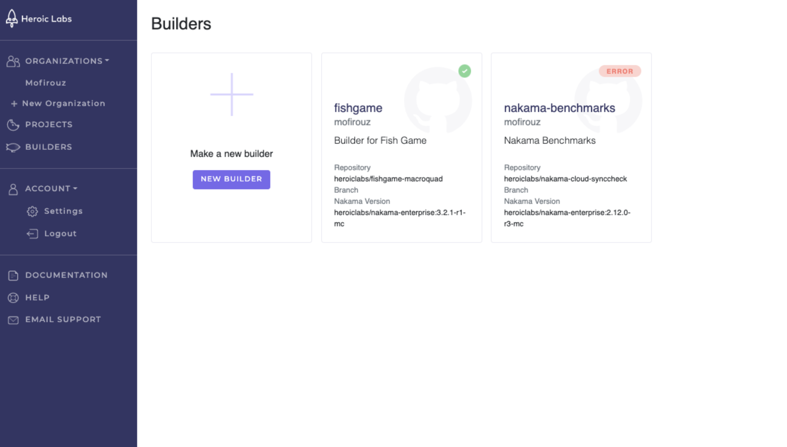

Each tile on the dashboard provides the details of the corresponding builder:

* **Status**: Icon indicates the status of the most recent build process.
* **Builder name**: The name of this builder, used to build the resultant image. This cannot be edited once set.
* **Organization**: The organization this builder belongs to.
* **Description**: The user provided builder description.
* **Repository**: The Git repository this builder is linked to.
* **Branch Nakama Version**: The Nakama version associated with this builder. Any custom code must use the same Nakama version.

## Best practices

Before you start [creating builders](#creating-builders) and deploying new projects, be sure to keep in mind the following:

* The repository should only contain source code relevant for the server module (i.e. do not place your Unity project there).
* Beside your custom runtime code files, all other files will be removed from the builder **except** for the following extensions: `.yml`, `.json`, `.txt`, and `.md`.

***For Go:*** 

* Your `main.go` and mod files must be in the root directory, all others can be in subfolders. The shared object or Dockerfile **do not** need to be committed.

***For TypeScript:*** 

* You must include the (single) compiled bundled JavaScript file, not TypeScript.

***For Lua***: 

* You must include at least one file in the root directory, all other Lua modules can then be included in subfolders.
* Builders are designed to ignore your Lua test files as follows:
    
    * All `.lua` files in a `/tests` directory
    * Any files named in the format `*.test.lua` or `*_test.lua`

## Creating builders

You can create a new builder from your Organization or Builders dashboards.

1. From the dashboard page, select the **New Builder** tile. The **Create your Builder** page is displayed.
    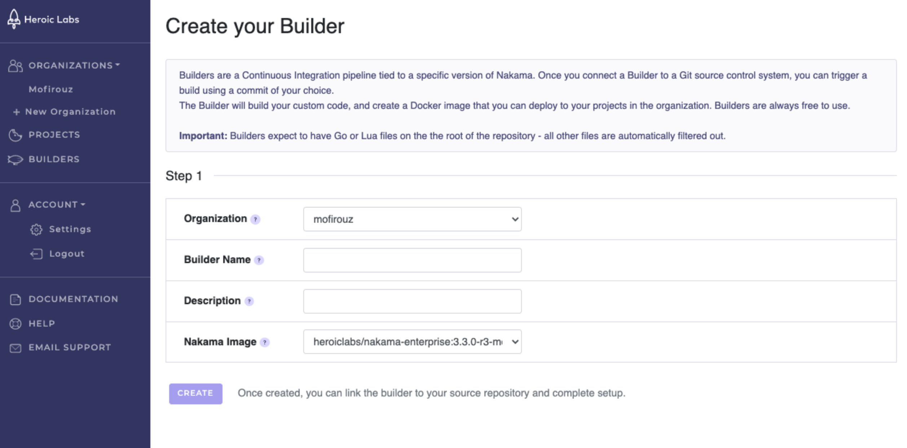
2. Provide the following details for your new builder:
    * **Organization**: The Organization this builder will be associated with. Use the drop-down to select from your available Organizations.
    * **Builder Name**: Enter a unique identifier for your builder. This name will be used for the Docker images created by this builder. Only alphanumeric characters may be used and cannot exceed 20 characters in length.
    * **Description**: Enter a short description of this builder for easy identification.
    * **Nakama Image**: Use the drop-down to select the Nakama version this builder will use.
3. Click **Create** to finalize your new builder, then proceed to the [builder details page](#managing-builders) to connect it to your desired repository and complete setup.

### Connecting to source control

To link your new builder to a desired repository, navigate to the Edit tab in your builder settings:

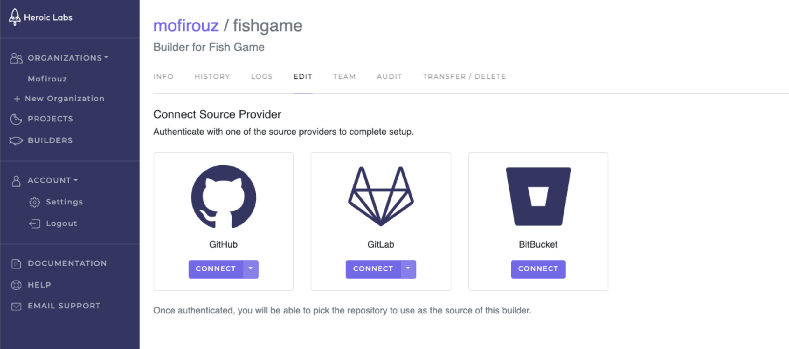

Use the drop-down of your source control provider (Git) to enter your connection details, then click **Connect**.

## Managing builders

Select any builder tile from your Organization or Builders dashboards to view its details page and manage the configuration.

There are eight tabs available in the project details page:

### Info
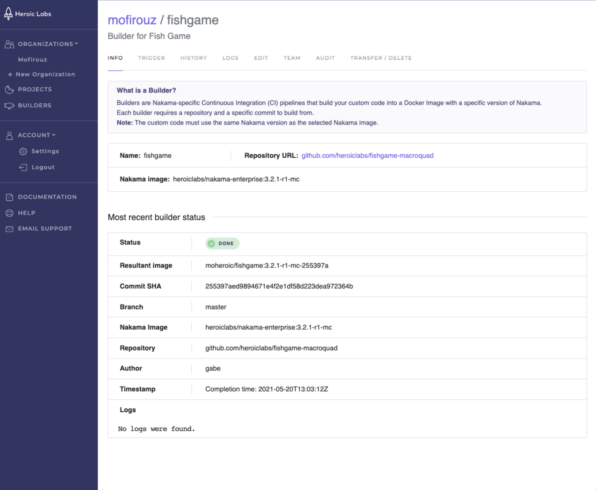

The Info tab provides all relevant details for this builder, such as the associated repository and Nakama image, and the recent status for this builder.

### Trigger

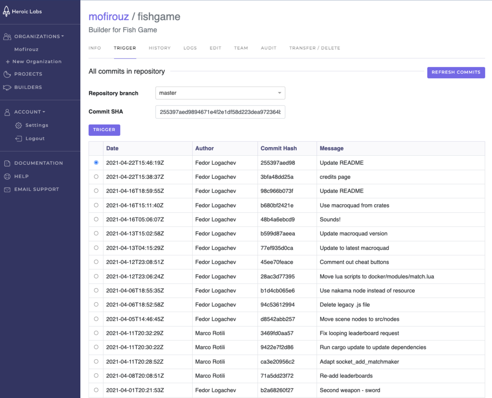

The Trigger tab enables you to view all recent commits for the linked repository and selected branch, then trigger a new image build using your desired commit SHA.

After selecting **Trigger** you can view the progress on the **Info** tab and, when finished, use this new image to update any projects in your organization.

### History

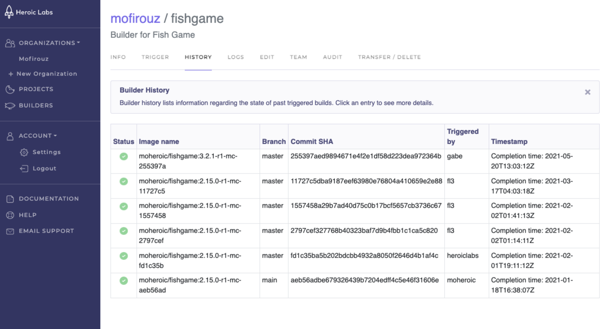

The History tab displays all previously triggered builds. Select any listed build to view additional details.

### Logs

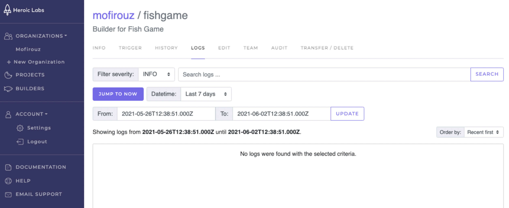

The Logs tab enables you to view all logs generated by this builder, and filter according to logging level and any desired time period.

### Edit

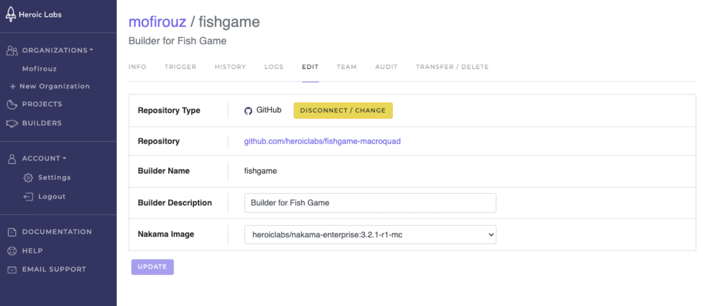

The Edit tab enables you to change available builder settings, such as the linked repository, description, and Nakama image used.

### Team

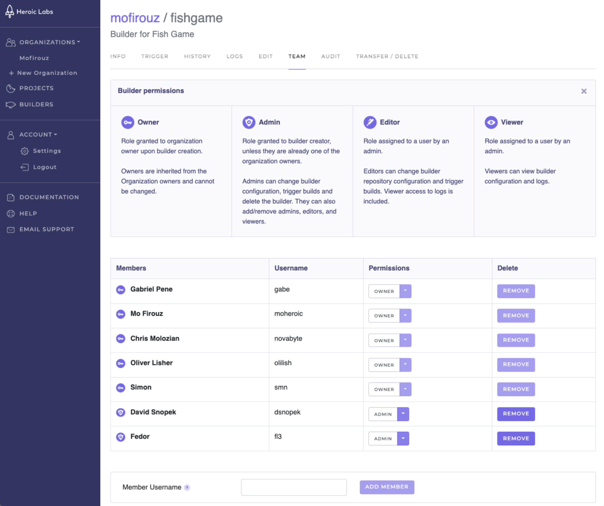

The Team tab enables you to view existing team members, manage their permission level for this builder, and add or remove team members from the builder entirely.

Users must have previously [registered with Heroic Cloud](https://cloud2.heroiclabs.com/register) before they can be added here.

### Audit

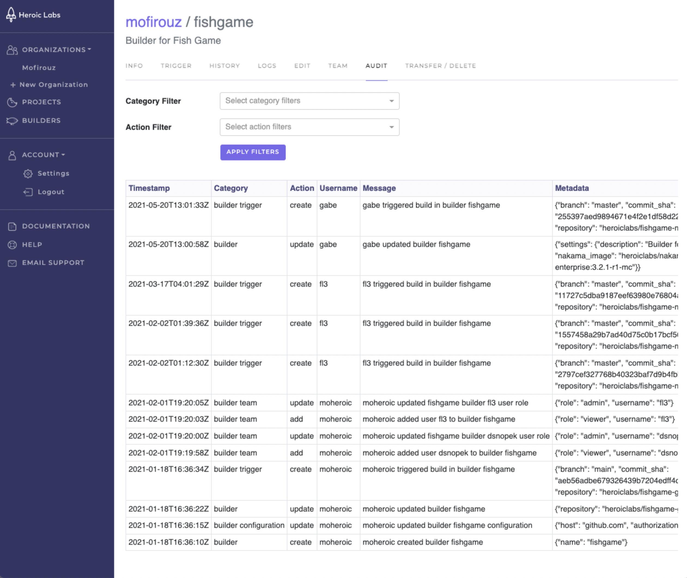

The Audit tab enables you to view a list of all user actions performed on this builder. You can filter this list according to the Category and Action performed.

### Transfer/Delete

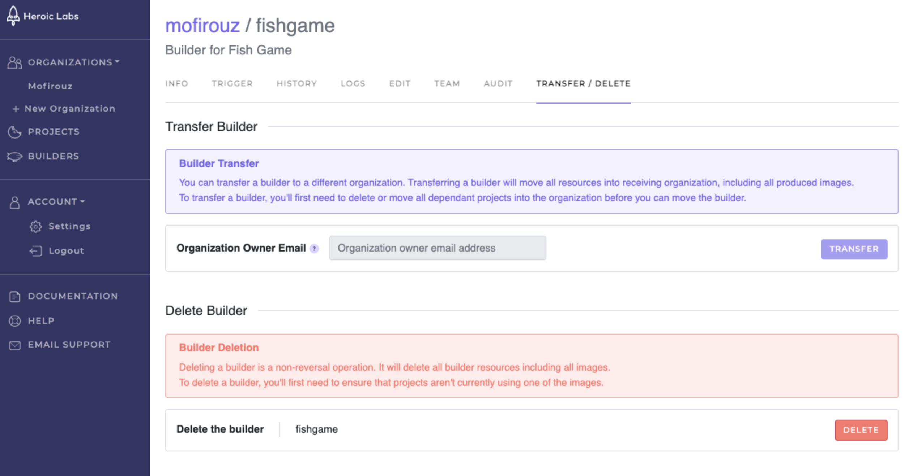

The Transfer/Delete tab enables you to transfer this builder to another organization, moving all of its resources and produced images, or to delete the builder entirely.