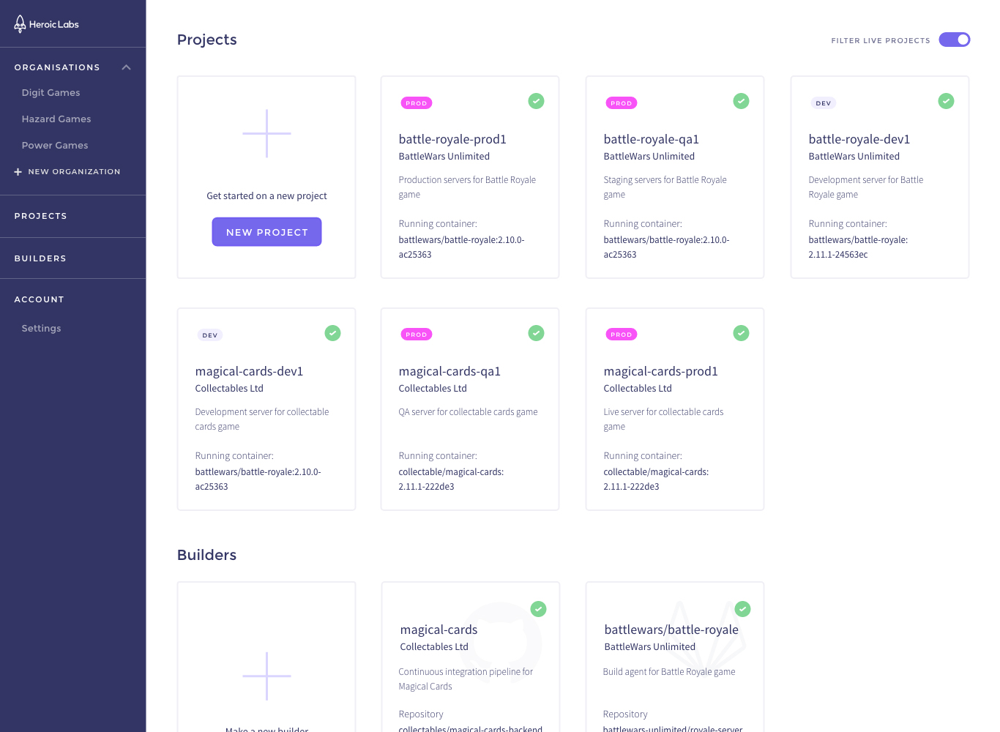

# Introduction

Heroic Cloud is the managed cloud offering from Heroic Labs, enabling you to collaboratively operate, manage and monitor your Nakama instances across your entire organization, no matter the scale. Heroic Cloud is available in three deployment zones:

* Unites States East
* Europe West
* East Asia (Seoul)

Use Heroic Cloud to manage your [Organizations](#organizations), [Projects](#projects), and [Builders](#builders).

Heroic Labs can provision Nakama instances on your own cloud provider (Azure, GCP, AWS, etc.) via our Private Cloud solution. Contact the [Heroic Labs team](mailto:sales@heroiclabs.com) to learn more about the available options. 
Every deployment still enjoys the same features and benefits:

* Nakama Enterprise: Built on top of open-source Nakama and adding the performance and resiliency to handle any requirements. Nakama Enterprise provides the scaling and high-availability guarantees for your most demanding projects. Read more about it on our [website](https://heroiclabs.com/nakama-enterprise/).
* Dedicated Resources: Your project resources are exclusively provisioned and not shared with other projects. This includes all CPU/RAM/Disk/Bandwidth resources for Nakama and its database, as well as load-balancers.
* Scaling: Your instance can scale up or down in minutes to meet demand or reduce resource costs.
* Data Segregation: All project data belongs to your organization and is stored separately from any other customer.
* SSL Enabled: Every project comes with SSL-enabled load balancers by default.
* Logs and Metrics: Central, easily searchable, access to logs from all nodes across your deployment.
* Automatic Backups: Heroic Cloud maintains automated, scheduled backups of all your data, ensuring easy rollback if needed.

Heroic Cloud is currently available in three deployment regions: Europe-West, Asia-Northeast, and US-East. 

## Organizations

Organizations represent the parent entity within Heroic Cloud. All projects and builders you create are owned by an organization.

They enable you to segregate projects and teams with fine-grained access control, granting users differing levels of access to your entire organization or to individual projects within it.

Learn more about using [Organizations](organizations.md).

## Projects

Projects represent the individual products (i.e. games) being developed by your organization.

Each project is a dedicated Nakama cluster with its own hardware resources. You can deploy your projects to any of our available deployment zones, and maintain separate projects for development and production.

Development projects have limited hardware resources assigned, and thus lower operating costs, but do not scale and are not intended to handle any production workload.

Your organization will be billed monthly per project for the hardware resources used.

Learn more about using [Projects](projects.md).

## Builders

Builders represent the Nakama-specific CI pipelines within Heroic Cloud, enabling you to quickly build and deploy your custom runtime code.

Each builder is linked to a desired repository from your source control provider (e.g. GitHub, BitBucket) and can then be used to trigger builds.

Builds are triggered by selecting a commit SHA from your desired repository branch. Your game, and the version of Nakama it depends on, are built into a Docker image which is accessible by your projects.

Learn more about using [Builders](builders.md).
