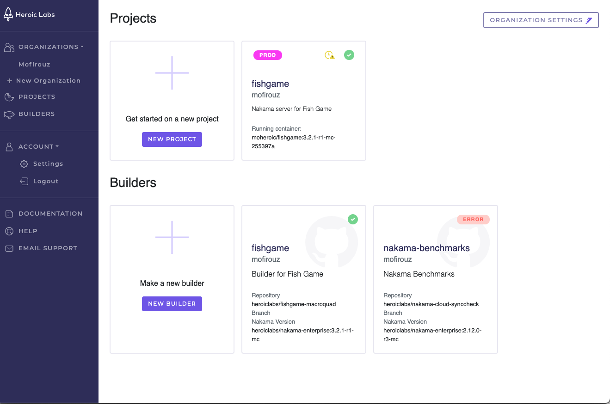
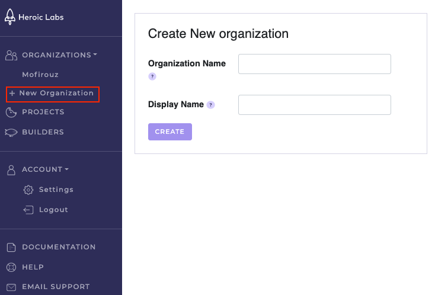
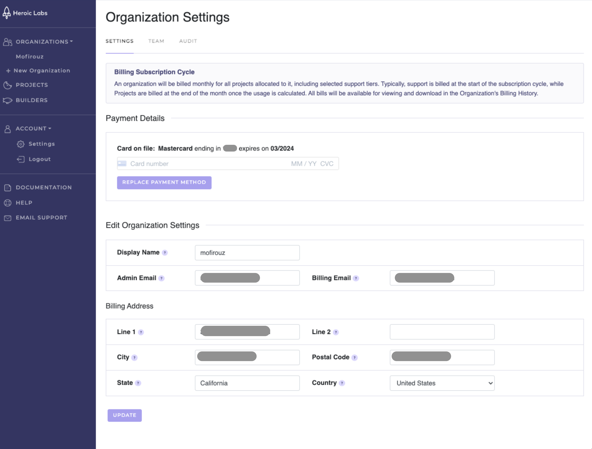
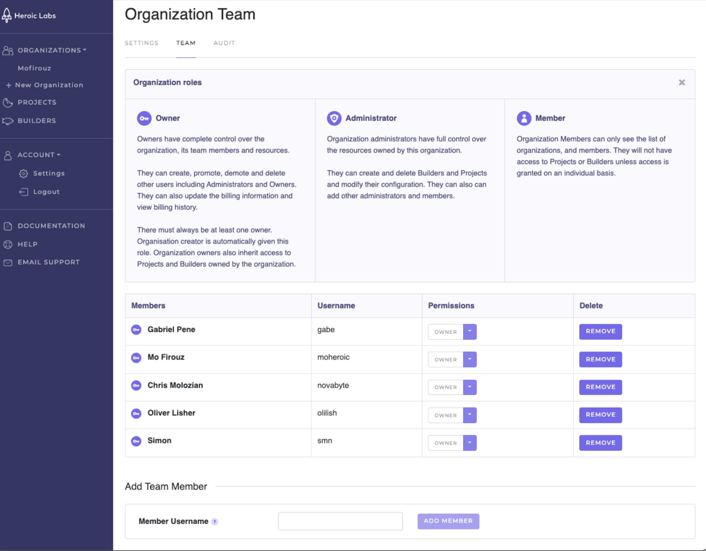
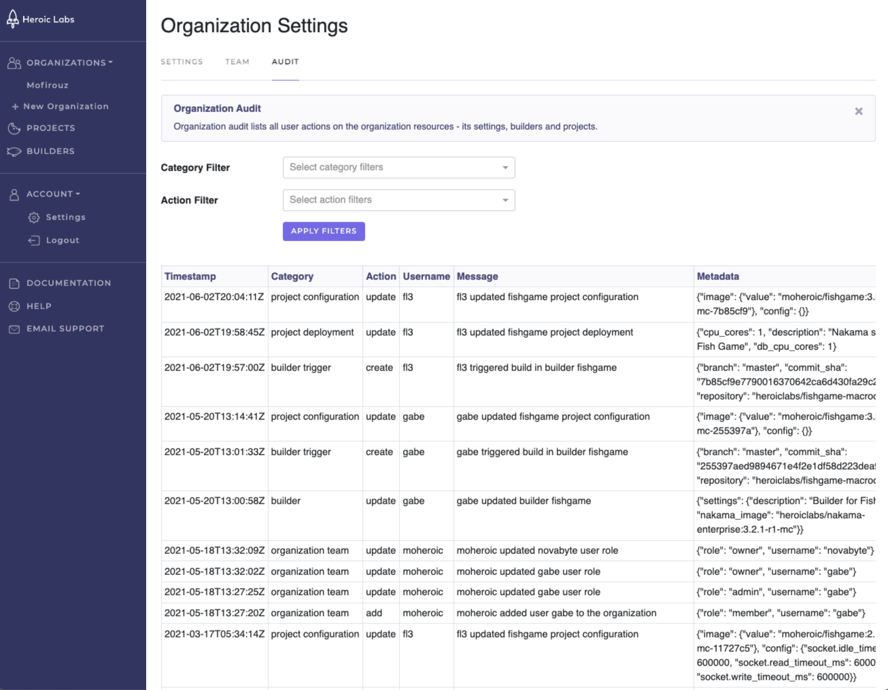

# Organizations

From the Organization dashboard you can manage your associated [Projects](projects.md) and [Builders](builders.md) for the selected organization, and the [Organization settings](#organization-settings).

## Creating organizations

1. From the side menu, select **+ New Organization**.
    
2. Enter the following for your new organization:
    * **Organization Name**: A unique identifier for this organization. It is case-insensitive and cannot be changed later.
    * **Display Name**: The organization name that will be displayed on the Organizations dashboard, and your invoices.
3. Click **Create** to finalize your new organization.

You can now begin creating new projects associated with this organization, or manage your settings (e.g. add team members, edit billing details).

## Organization settings

The Organization Settings page has three tabs:

### Settings

The Settings tab enables you to manage this organization's name, contact address, and billing details:

* **Payment Details**: Displays the current billing credit card on file. To change, enter the new credit card number to use and click **Replace Payment Method**.
* **Edit Organization Settings**: Edit the Organization's display name (seen on all dashboards, projects, and billing statements), and contact email addresses. When making changes, be sure to click **Update** once finished to confirm.
* **Billing Address**: The address associated with your selected payment credit card. When making changes, be sure to click **Update** once finished to confirm.

### Team
    

The Team tab enables you to manage the members of this organization. You can add new members, edit the permissions of, or remove, existing members.

Members added at the organization level will have that corresponding level of access to all organization resources (projects, builders, etc.). Add a new member using the corresponding project or builder team members page to invite them to collaborate on that single resource.

Users must have previously [registered with Heroic Cloud](https://cloud2.heroiclabs.com/register) before they can be added here.

#### Roles and permissions 
    
The actions available to you within an organization depend on your assigned role:

* **Owner**: Full access to all organization resources and settings, and any Projects and Builders owned by this Organization. The Organization creator is automatically granted this role, and may create other Owner users if desired.
* **Administrator**: Full access to all organization resources but *not* settings. Administrators can create and manage Projects and Builders, and create additional Administrator users.
* **Member**: Can only view the Organization and its members. Members do not have access to any Projects or Builders unless granted access on a per project/builder basis.

### Audit

The Audit tab enables you to view a filterable display of all user actions performed on the organization resources.
