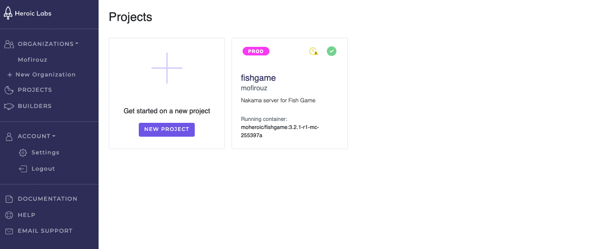
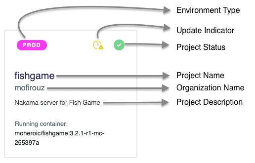
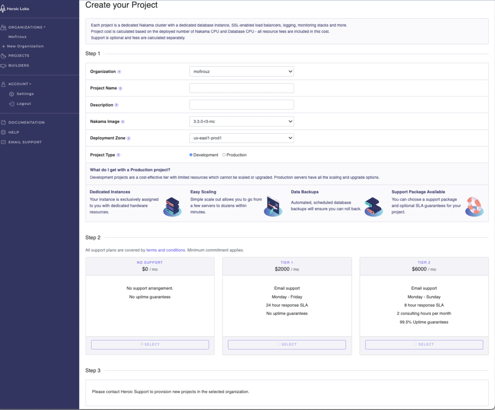
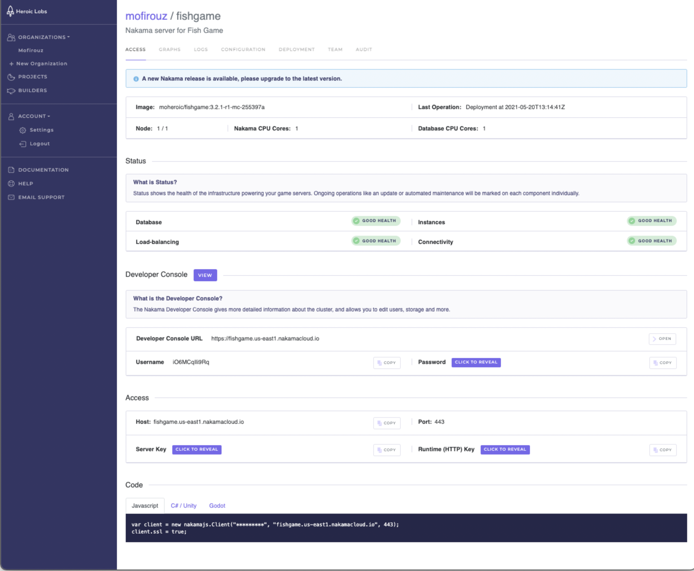
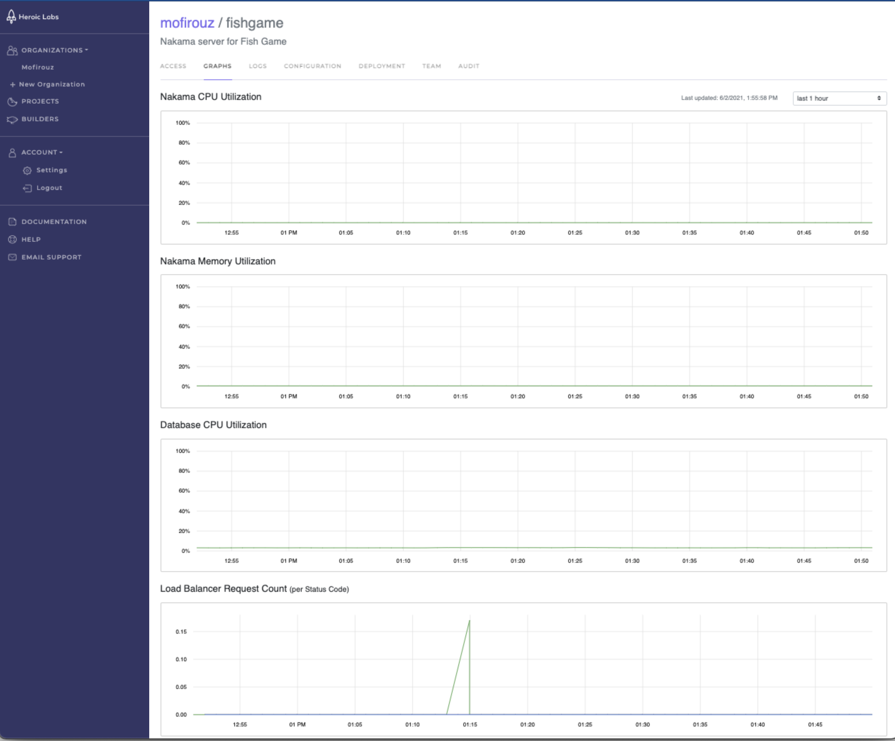
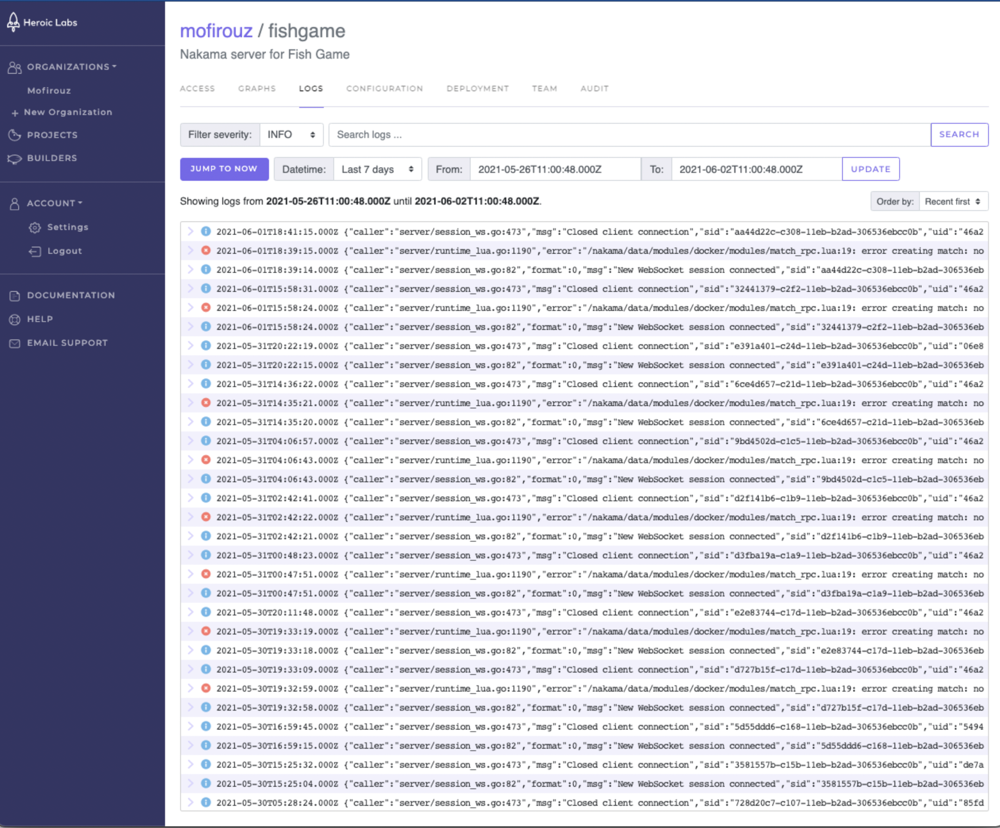
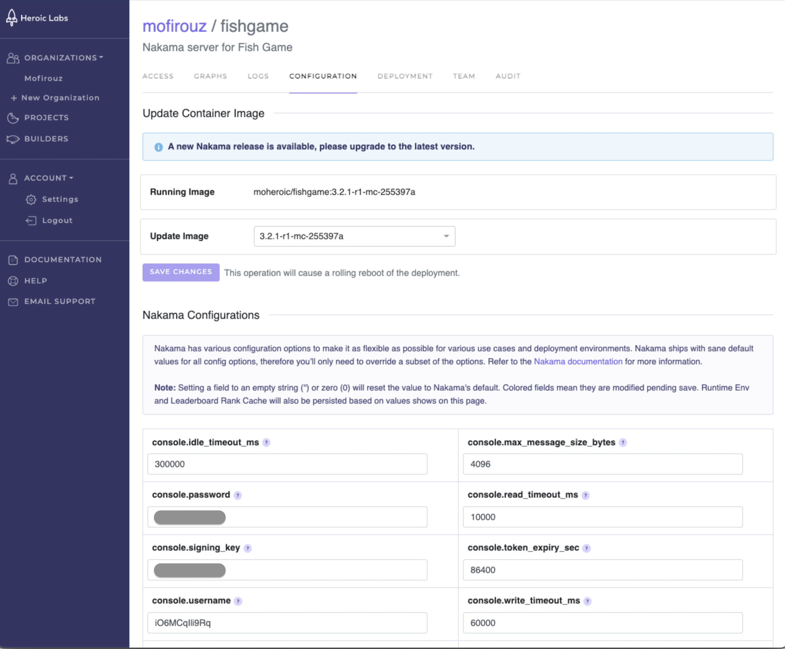
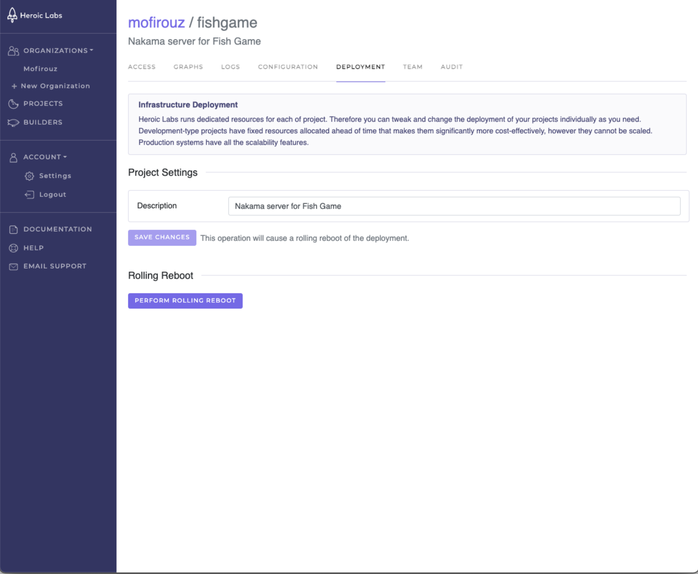
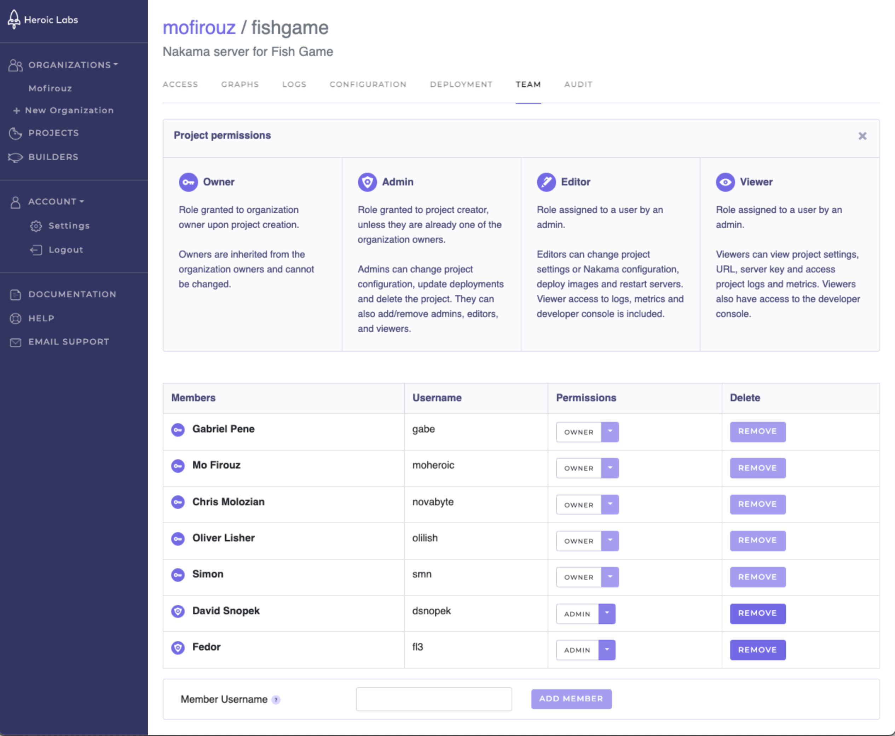
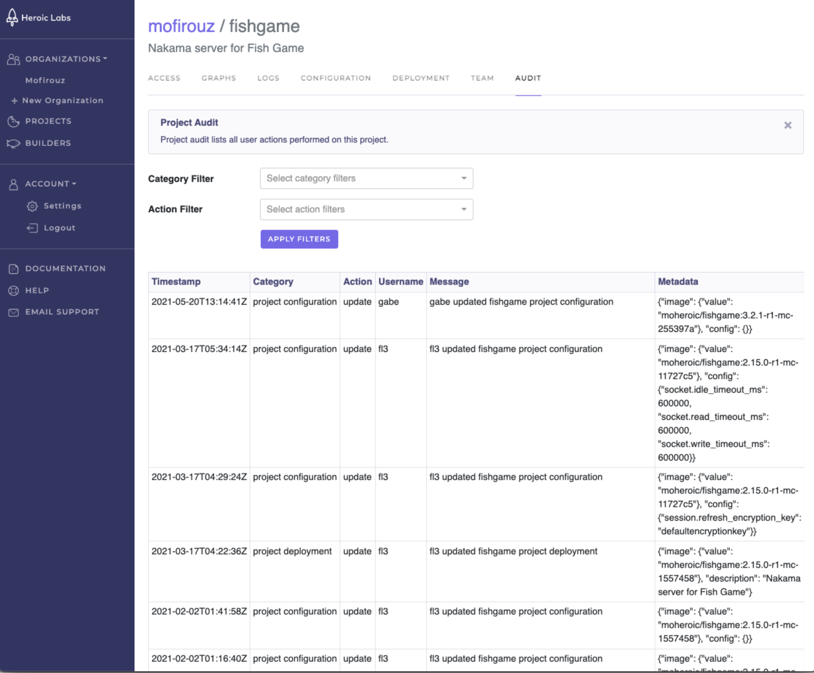

# Projects

From the Projects dashboard you can view and manage all of your existing projects across all [organizations](organizations.md), and [create new projects](#creating-projects).

Each tile on the dashboard provides the details of the corresponding project:

* **Environment**: Indicates if this project is deployed to a Development or Production instance.
* **Update**: Indicates a newer version of Nakama is available. We recommend updating your projects as soon possible so that you are always able to benefit for the latest features and improvements in Nakama server.
* **Status**: Icon indicates the health of the infrastructure powering your game servers.
* **Project name**: The display name of this project, and used in forming the hostname/URL used to access this project instance.
* **Organization**: The organization this projects belongs to.
* **Description**: The user provided project description, if any.
* **Running container**: The current Docker image deployed. See [Builders](builders.md) to learn more.

## Creating projects

You can create a new project from your Organization or Projects dashboard.

!!! note "Note"
    When selecting the **Project Type** for your new project (Development vs. Production), keep in mind that development projects are meant for testing purposes only and do not offer any scaling or upgrade options beyond the initial deployed infrastructure.

1. From the dashboard page, select the **New Project** tile. The **Create your Project** page is displayed.
    
2. Provide the following details for your new project:
    * **Organization**: The Organization this project will be associated with. Use the drop-down to select from your available Organizations.
    * **Project Name**: Enter a unique identifier for your project. Only alphanumeric characters may be used and cannot exceed 20 characters in length.
    * **Description**: Enter a short description of this project for easy identification.
    * **Nakama Image**: Use the drop-down to select the Nakama version this project will be deployed with. This can be changed to custom images you create via your builders later.
    * **Deployment Zone**: Use the drop-down to select your desired deployment zone from the available options. Contact Heroic Labs if you need additional deployment zone options.
    * **Project Type**: Indicate if this project is a **Development** or **Production** environment.
3. For Production projects only, select your desired Support Tier.
4. **Provision** your project.

!!! note "Note"
    For accounts not configured with automatic billing you must contact Heroic Labs support to provision new projects.

## Managing projects

Select any project tile from your Organization or Projects dashboards to view its details page and manage the configuration.

There are seven tabs available in the project details page:

### Access

The Access tab provides the deployment details for this project, such as the image currently in use, number of nodes, and CPU cores. In addition, the following sections are available:

* **Status**: Displays the current health, and any relevant operations, of the infrastructure powering your Nakama servers.
* **Developer Console**: The URL, username, and password to access the [Developer Console](../console-overview.md) for this project. Use the **View** button to navigate there directly.

!!! note "Note"
    Each project will have its own Developer Console.
    
* **Access**: The host details and associated keys for connecting to this server.
* **Code**: Code snippets in JavaScript, C#, and Godot for connecting your Client SDK to this server.

### Graphs

The Graphs tab enables you to visualize and analyze the load on your server for the following:

* Nakama CPU Utilization
* Nakama Memory Utilization
* Database CPU Utilization
* Load Balancer Request Count

This view can be filtered according to the last hour, last 3 hours, last 6 hours, last 12 hours, last 24 hours, and the last 7 days.

### Logs

The Logs tab enables you to view all logs generated by this project, and filter according to logging level and any desired time period.

### Configuration

The Configuration tab enables you to update the container image used by this project to any image you have previously created via your builder, and also update any of the available [configurations](../install-configuration.md) for your deployment.

In case of a bad deployment, you can quickly revert to the previously used image and return your project to its original state.

When you select **Save Changes**, the update will be performed via rolling reboot to ensure all nodes are never down simultaneously.

### Deployment

The Deployment tab enables you to change available project settings and perform a rolling reboot.

### Team

The Team tab enables you to view existing team members, manage their permission level for this project, and add or remove team members from the project entirely.

Users must have previously [registered with Heroic Cloud](https://cloud2.heroiclabs.com/register) before they can be added here.

### Audit

The Audit tab enables you to view a list of all user actions performed on this project. You can filter this list according to the Category and Action performed.