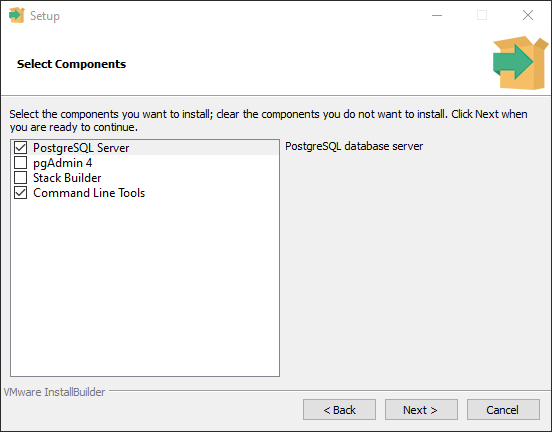
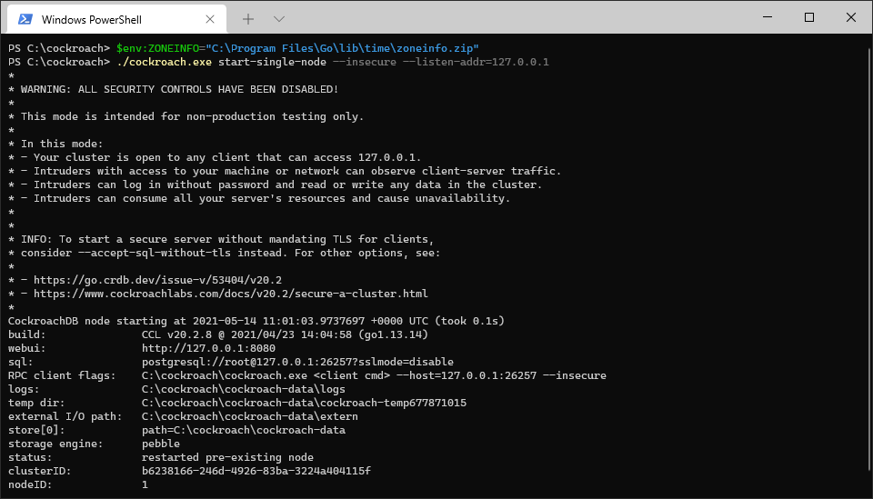
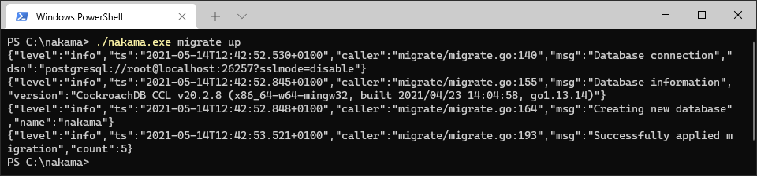
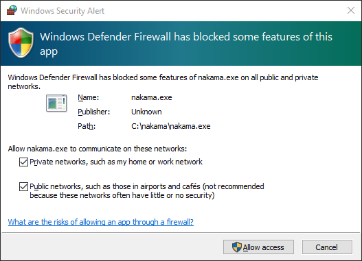
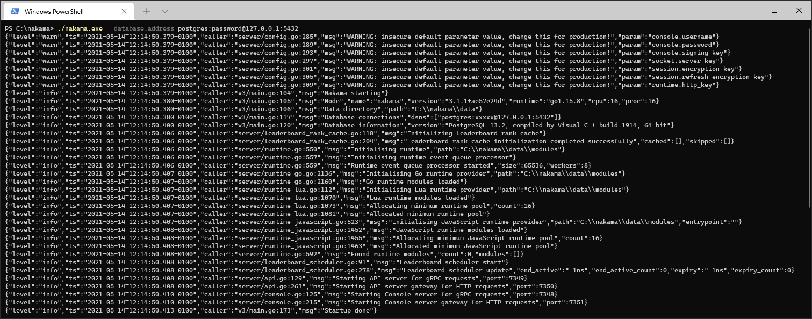

# Nakama Binary for Windows

This tutorial will show you how to setup and run Nakama binary and its prerequisites on Windows.

The binary setup allows you to install and manage Nakama without Docker but it requires extra steps to setup and manage:

* Installing CockroachDB or PostgreSQL
* Manually applying database migrations
* Manually upgrading Nakama and its database to newer versions
*	Configuring services or manually starting Nakama and its database

!!! summary "Recommended Approach"
	[Docker](install-docker-quickstart.md) is the quickest way to download and start developing with Nakama.

## Prerequisites

### Operating system

Before proceeding ensure that you are running 64bit Windows 8 or higher to run CockroachDB, or 64bit Windows 7 or higher for PostgreSQL.

Next, install a supported database engine.

### CockroachDB

Nakama officially supports CockroachDB v20.0 or higher, with queries optimised for its storage engine.

Follow the official guide to [Install CockroachDB on Windows](https://www.cockroachlabs.com/docs/stable/install-cockroachdb.html).

### PostgreSQL

Nakama unofficially supports PostgreSQL 9.6 or higher for development environments only.

Download and run a [PostgreSQL Windows installer](https://www.postgresql.org/download/windows/) from the official site:

1. Only the "PostgreSQL Server" and "Command Line Tools" components are required, the rest are optional.

	

3. Provide a password for the database superuser.
2. Use the default values for other options in the installation process.

!!! note "Mater password"
	Take note of the password you provide for the database superuser (postgres), you will need this later when configuring Nakama to connect to your database server.

## Download Nakama

Get the latest binary release of Nakama server for Windows:

1. Download a release from the Nakama GitHub repo [releases page](https://github.com/heroiclabs/nakama/releases).
2. Extract the archive, optionally rename and move the folder to a suitable location.

## Running Nakama

Before starting Nakama server you will need to run:

1. Your chosen database, CockroachDB or PostgreSQL.
2. Nakama database migrations if it is your first time running Nakama or you have upgraded Nakama versions.

### CockroachDB

The easiest way to run CockroachDB is as a single-node server with insecure mode enabled, making it accessible only on your localhost (127.0.0.1). For more access and security control consult the [CockroachDB documentation](https://www.cockroachlabs.com/docs/v20.2/secure-a-cluster.html).

1. Open a shell (Command Prompt, Powershell, Bash, etc) and navigate to your CockroachDB directory.
2. To start CockroachDB, run the following:

=== "Command Prompt"
	```shell
	cockroach.exe start-single-node --insecure --listen-addr=127.0.0.1
	```
=== "Powershell or Bash"
	```shell
	./cockroach.exe start-single-node --insecure --listen-addr=127.0.0.1
	```

Your output from successfully running CockroachDB should look similar to the following screenshot:



!!! note "Advanced"
	CockroachDB can be configured to run as a Windows Startup App or Service to skip this step in future.

**Error: unable to load named timezones**

Some version of CockroachDB require a Go time zone .zip archive to load time zone information from.

You can get a compatible zoneinfo file by [downloading](https://golang.org/dl/) and installing the latest Go release. The `zoneinfo.zip` file is located in your Go installation folder at `lib/time/zoneinfo.zip`.

Before running CockroachDB, in the same shell session set the `ZONEINFO` environment variable to the full path of your `zoneinfo.zip` file:

=== "Command Prompt"
	```shell
	set ZONEINFO="C:\Program Files\Go\lib\time\zoneinfo.zip"
	```
=== "Powershell"
	```shell
	$env:ZONEINFO="C:\Program Files\Go\lib\time\zoneinfo.zip"
	```
=== "Bash"
	```shell
	export ZONEINFO="c/Program Files/Go/lib/time/zoneinfo.zip"
	```

Alternatively, set the environment variable through Windows Settings.

### PostgreSQL

Once installed, PostgresSQL should automatically run in the background and you can proceed to running Nakama migrations or Namaka server.

!!! note "Advanced"
	You can use PostgreSQL Command Line Tools or GUI applications like pgAdmin to create application specific users with restricted permissions.

### Nakama migrations

If this is your first time running Nakama or you have upgraded Nakama versions, you may need to run Nakama database migrations. If you are unsure, running migrations again is safe.

If you are running CockroachDB with the default configuration, running migrations is straightforward with no additional options necessary:

**CockroachDB**

=== "Command Prompt"
	```shell
	nakama.exe migrate up
	```
=== "Powershell or Bash"
	```shell
	./nakama.exe migrate up
	```



**PostgreSQL**

If you are using PosgreSQL you will need to supply your database server address, user and password. Unless you have created a custom user, this will be the default superuser `postgres` and the master password you provided during the installation:

=== "Command Prompt"
	```shell
	nakama.exe migrate up --database.address postgres:password@127.0.0.1:5432
	```
=== "Powershell or Bash"
	```shell
	./nakama.exe migrate up --database.address postgres:password@127.0.0.1:5432
	```


### Nakama server

To start Nakama server with CockroachDB or PostgreSQL, run the following:

**CockroachDB**

=== "Command Prompt"
	```shell
	nakama.exe
	```
=== "Powershell or Bash"
	```shell
	./nakama.exe
	```

**PostgreSQL**

You will need to provide the same `database.address` value used for running [Nakama PostgreSQL database migrations](#nakama-migrations):

=== "Command Prompt"
	```shell
	nakama.exe --database.address postgres:password@127.0.0.1:5432
	```
=== "Powershell or Bash"
	```shell
	./nakama.exe --database.address postgres:password@127.0.0.1:5432
	```

If you get a Windows Security Alert, tick the "Private networks..." box to allow Nakama to communicate over your network and click "Allow Access" to confirm security permissions.



Nakama server will now be running and should display similar logging output with warnings and useful information such as:

* Nakama data directory
* Nakama and database version
* Ports for various services

=== "Nakama with CockroachDB"
	
=== "Nakama with PostgreSQL"
	

## Nakama Console

You can access the Nakama Console by navigating your browser to [127.0.0.1:7351](http://127.0.0.1:7351).

!!! note "Note"
	When prompted to login, the default credentials are `admin:password`. These can be changed via configuration file or command-line flags.


## Configuration file

There are many [configuration options](install-configuration.md) available that you can customize for your Nakama server.

## Next steps

With your Nakama server now up and running with the desired configuration, you can get started with your preferred client SDK:

* [.NET/Unity](unity-client-guide.md)
* [JavaScript](javascript-client-guide.md)
* [Godot](godot-client-guide.md)
* [Defold](defold-client-guide.md)
* [Java/Android client](android-java-client-guide.md)
* [C++](cpp-client-guide.md)
* [Unreal](unreal-client-guide.md)
* [Cocos2d-x C++](cocos2d-x-client-guide.md)
* [Cocos2d-x JS](cocos2d-x-js-client-guide.md)
