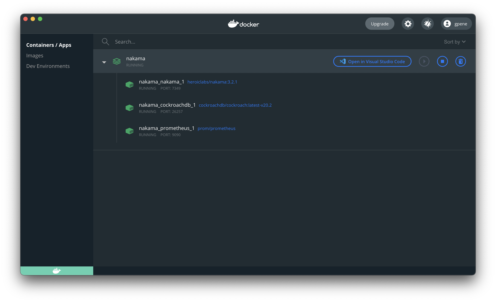
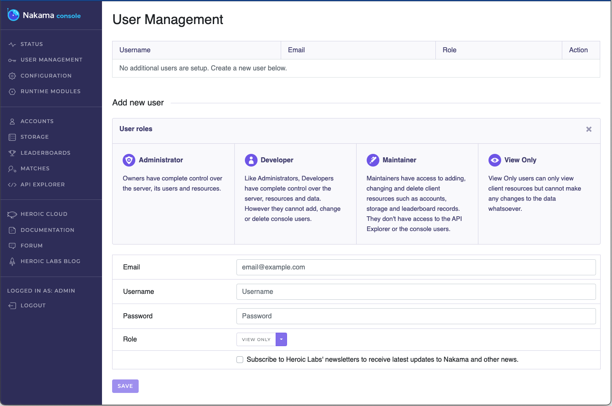

# Docker Quickstart

[Docker](https://www.docker.com/) is the quickest way to download and start developing with Nakama. By using Docker you are able to:

* Install to a pristine environment
* Easily install and run the [CockroachDB](https://www.cockroachlabs.com/) or [PostgreSQL](https://www.postgresql.org/) database for Nakama
* Take snapshots, remove, and re-install Nakama without affecting your primary operating system
* Enjoy a quick and simplified installation experience regardless of your OS

Following this guide, you will use [Docker Compose](https://docs.docker.com/compose/) to quickly and easily define all the necessary services and run your local developement instance of Nakama.

## Prerequisites

Before proceeding ensure that you have [installed Docker Desktop](https://docs.docker.com/get-docker/).

## Running Nakama

1. Start by creating a directory where your Nakama server will sit, for example `Desktop/nakama`.
2. In this folder create a `docker-compose.yml` file and open it using your preferred text editor.
3. Heroic Labs provides two YML files for use: using either [CockroachDB](https://github.com/heroiclabs/nakama/blob/master/docker-compose.yml) or [PostgreSQL](https://github.com/heroiclabs/nakama/blob/master/docker-compose-postgres.yml) as the database.
Copy and paste the contents of your preferred option into your `docker-compose.yml` file.

!!! note "Windows Users"
    You must edit the `nakama:volumes:` entry in your `docker-compose.yml` file so that it looks like the following: `/c/Users/<username>/projects/docker:/nakama/data`.

4. Open a Terminal window and navigate to your Nakama directory. For example:

```sh
cd desktop/nakama
```

5. To pull all required images and start your application, run the following:

```sh
docker-compose -f docker-compose.yml up
```

6. Congratulations! Your Nakama server is now up and running, available at `127.0.0.1:7350`.



Use the **Open in Visual Studio Code** button (or that for your IDE) to edit your `docker-compose.yml` file directly.

## Nakama Console

You can also access the Nakama Console by navigating your browser to `localhost:7351`:



!!! note "Note"
    When prompted to login, the default credentials are `admin:password`. These can be changed via configuration file or command-line flags.

## Configuration File

There are many [configuration options](install-configuration.md) available that you can customize for your Nakama server. You can create a YML file for all configurations you want to set, and pass that file to your Docker containers.

First you will need to make a local storage volume available to Docker:

1. Open your `docker-compose.yml` file in your preferred text editor.
2. Edit the `nakama:volumes:` entry to specify your desired volume. For example, to create a `/data` folder in our `desktop/nakama` directory used above, which would be available at `nakama/data` in the Docker container, it would look like the following:

```yml
volumes:
    - ./data:/nakama/data
```

3. Save the changed file and restart your Docker containers for the change to take effect. From your Terminal:

```sh
docker compose restart
```

4. Next, create your custom configuration file, for example `my-config.yml`, and place it in the `/data` folder that you made available to Docker, above.
5. Open your `docker-compose.yml` file again, this time to edit the `nakama:entrypoint` entry to add the `--config` flag pointing to your configuration file. It should look like this:

```yml
nakama:
    entrypoint:
      - "/bin/sh"
      - "-ecx"
      - >
          /nakama/nakama migrate up --database.address root@cockroachdb:26257 &&
          /nakama/nakama --config /nakama/data/my-config.yml
```

6. Save the changed file and restart your Docker containers for the change to take effect. From your Terminal:

```sh
docker compose restart
```

## Next Steps

With your Nakama server now up and running with the desired configuration, you can get started with your preferred client SDK:

* [.NET/Unity client](unity-client-guide.md)
* [Godot client](godot-client-guide.md)
* [JavaScript client](javascript-client-guide.md)
* [Java/Android client](android-java-client-guide.md)
* [C++ client](cpp-client-guide.md)
* [Cocos2d-x client](cocos2d-x-client-guide.md)
* [Cocos2d-x (Javascript) client](cocos2d-x-js-client-guide.md)
* [Unreal](unreal-client-guide.md)
* [Defold client](defold-client-guide.md)
          