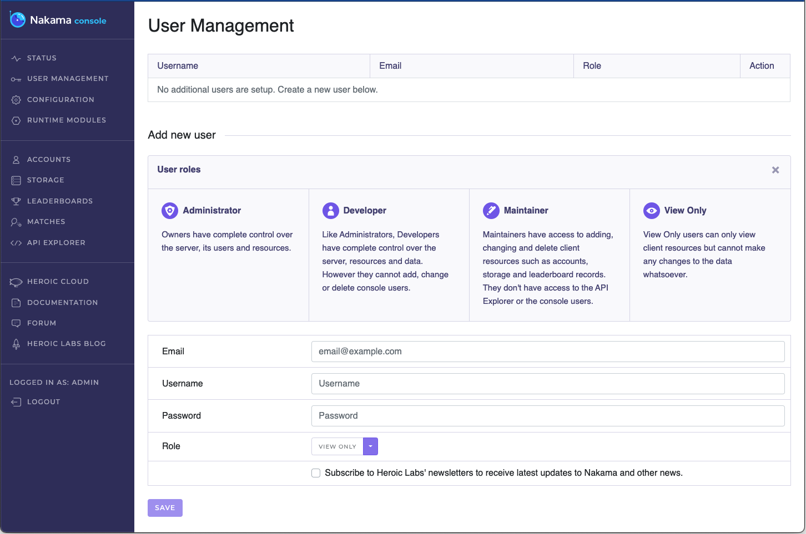

# Docker Quickstart

[Docker](https://www.docker.com/) is the quickest way to download and start developing with Nakama. By using Docker you are able to:

* Install to a pristine environment
* Easily install and run the [CockroachDB](https://www.cockroachlabs.com/) database
* Take snapshots, remove, and re-install Nakama without affecting your primary operating system
* Enjoy a quick and simplified installation experience regardless of your OS

Following this guide, you will pull the required Docker images and run a local developement instance of Nakama.

## Prerequisites

Before proceeding ensure that you have [installed Docker Desktop](https://docs.docker.com/get-docker/).

## Running Nakama

1. Pull the required Docker images. From your terminal, run the following:

```sh
# Pull the latest CockroachDB image
docker pull cockroachdb/cockroach
# Pull the latest Nakama image
docker pull heroiclabs/nakama
```

When complete, your terminal output should look like this:


2. You should now see these images in you Docker Desktop application's **Images** tab:


3. Run the CockroachDB image. From your terminal, run the following:

```sh
docker run --name=db -p 26257 -p 8080 cockroachdb/cockroach start-single-node --insecure
```

This will start a CockroachDB container named `db`, exposed on ports `26257` and `8080`: 


See the [CockroachDB documentation](https://www.cockroachlabs.com/docs/v20.2/cockroach-start-single-node#security) for details on the available configuration flags.

4. Pull this new database and migrate the database schema to that used by Nakama:

```sh
docker run --link=db heroiclabs/nakama migrate up --database.address root@db:26257
```

5. Start the Nakama server:

```sh
docker run --name=nakama --link=db -p 7350:7350 -p 7351:7351 heroiclabs/nakama --database.address root@db:26257
```

This will create a container named `nakama` connected to the `db` container you started earlier:


See the [Configuration page](install-configuration.md) for additional flags available when starting Nakama.

6. Congratulations! You now have both CockroachDB and Nakama running, available at `127.0.0.1:26257` and `127.0.0.1:7350` respectively.

You can also access the Nakama Console by navigating your browser to `localhost:7351`:



!!! note "Note"
    When prompted to login, the default credentials are `admin:password`. These can be changed via configuration file or command-line flags.

7. You can now go get started with your preferred client SDK:
    * [.NET/Unity client](unity-client-guide.md)
    * [Godot client](godot-client-guide.md)
    * [JavaScript client](javascript-client-guide.md)
    * [Java/Android client](android-java-client-guide.md)
    * [C++ client](cpp-client-guide.md)
    * [Cocos2d-x client](cocos2d-x-client-guide.md)
    * [Cocos2d-x (Javascript) client](cocos2d-x-js-client-guide.md)
    * [Unreal](unreal-client-guide.md)
    * [Defold client](defold-client-guide.md)
