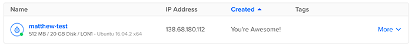

= Digital Ocean

Running Nakama in a Digital Ocean droplet is a great way to develop using Nakama without needing to install it locally.

We'll install Nakama on your Digital Ocean droplet using our standard link:../docker.adoc[Docker installation guide] but first there are some things we need to configure on the droplet.

== Droplet configuration

Your droplet should have the following configuration:

* *Linux distribution:* Ubuntu 16.04 x64
* *RAM:* 4GB RAM / 60GB SSD Disk
* *Storage:* Optionally add block storage (you'll need this to keep your data intact between restarts)
* *Region:* To minimise latency, choose a region close to you.
* *Add a new SSH Key:* **This is important**. Follow https://www.digitalocean.com/community/tutorials/how-to-use-ssh-keys-with-digitalocean-droplets[Digital Ocean's guide^] if you need help setting up a public key.

== Accesing the droplet

Once the droplet is running, make a note of its IP address from within your Digital Ocean console.

For the next steps, we'll need to SSH into the droplet. There isn't a need for username/password as you've pre-authorized yourself using a public key in the previous step.

[source,bash]
----
ssh root@<IP ADDRESS>
# you are now connected to the droplet through an SSH session.
# you can type `exit` to close the session.
----

=== Creating a user to run Nakama

You should create a separate user, with sudo privileges, to run Nakama. You'll see how in https://www.digitalocean.com/community/tutorials/initial-server-setup-with-ubuntu-16-04[this guide^].

=== Installing Docker Compose

To prepare for installing Nakama, you'll need to install both Docker and Docker Compose on your droplet.

The most straightforward way to do that is to follow Digital Ocean's own guides:

. https://www.digitalocean.com/community/tutorials/how-to-install-and-use-docker-on-ubuntu-16-04[install Docker on your droplet]
. https://www.digitalocean.com/community/tutorials/how-to-install-docker-compose-on-ubuntu-16-04[install Docker Compose on your droplet].

== Running Nakama

Now that you've installed Docker and Docker Compose you can follow our link:../docker.adoc[guide to installing Nakama using Docker].
