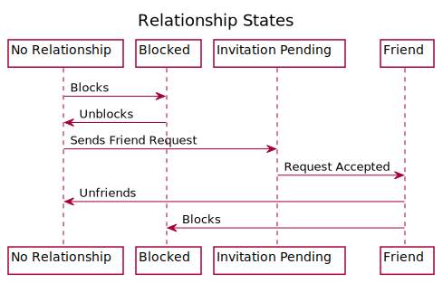

# Best Practices

Friend relationships are a core part of contemporary online gaming. The Nakama feature set and APIs help you build engaging friend experiences into your game.

It is increasingly rare for games to be purely solitary pursuits. From teaming up with a life-long best friend to exchanging barbs with a new rival, games are social experiences. Create engaging experiences as a developer requires a flexible, high-performing system to represent players’ social connections. In Nakama, [friends](friends.md) is a core system.

This page details how Nakama represents friend relationships (both as a concept and a data structure), why they matter, and some guidelines for making the most of the Nakama friend systems.

## Modeling relationships

Nakama provides its own flexible friendship model, able to represent many different relationship states, backed by an efficient and scalable approach to storage.

In Nakama, the conceptual basis for these relationships is edges in a directed graph, inspired by Twitter’s [FlockDB](https://github.com/twitter-archive/flockdb#flockdb).

As an example, suppose you have two players, Player A and Player B. If A and B are friends, then their relationship can be represented by the edges AB (“A has a relationship to B”) and BA (“B has a relationship to A”).

## Relationship state

Relationships between two people are richer than the mere existence of a connection between them. In the Nakama friend system, each relationship (edge) from one player to another has a state: friendship accepted, friendship pending, or blocked. When two players don’t have a relationship, there’s no edge between them.

Nakama represents the following foundational relationship states:

* **No relationship**: The absence of an edge between two players
* **Asymmetric relationships**: A pending friend request from one player to another
* **Symmetric friendships**: Two players are mutual friends
* **Negative relationships**: One player has blocked another

Think of the Nakama friend system as a state machine for relationships between any two players. Players can move from one state to the next through well-defined paths. Below is a diagram of the potential states of a relationship between two players:

This representation of friend relationships not only handles the most-common friendship models used in games, it has the advantage of being efficient to store and query.

## Storing relationships

In its database Nakama uses a small, understandable representation of friend relationship states. This representation has been finely tuned to make the most common tasks, such as finding all of a users’ relationships, fast, efficient, and scalable.

To better understand the Nakama storage model, it is helpful to examine the primary key used in the database schema. This consists of:

* A player ID (`source_id`)
* The state of the relationship (`state`)
* A counter (`position`)

This primary key means that each player relationship is stored, physically on disk, close to that player’s other relationships. When a player’s relationships are recorded, they’re recorded together, sequentially with respect to the type and age of the relationship.

| `source_id` | `state` | `position` |
| ----------- | ------- | ---------- |
| ... | ... | ... |
| 4246fc0f-a55f-45da-9b25-8527c2a0d5d1 | 0 | 7684 |
| 4246fc0f-a55f-45da-9b25-8527c2a0d5d1 | 0 | 7697 |
| 4246fc0f-a55f-45da-9b25-8527c2a0d5d1 | 1 | 7694 |
| ... | ... | ... |

In other words, a player’s mutual friends are recorded alongside their other mutual friends, followed by pending invites, and so on.

From the perspective of a physical database, this layout is suited to the most common queries. For example, if you query all of the relationships for a given player (i.e. `SELECT * from user_edge WHERE source_id=player_a_id`), then you’re querying contiguous rows, which minimizes seek times for the database.

Where the database doesn’t get this benefit automatically, an index hastens lookups. Querying the relationship between two specific users (i.e. relationships between two known player IDs) is specifically indexed.

## Scalability

On top of the benefits to the physical database the friends schema scales to a global audience by allowing you to distribute your friendship data nearer to your players.

Nakama represents both sides of a friendship separately. There’s a record for “player A is friends with player B” and there’s a record for “player B is friends with player A”. When you partition your database geographically — storing friends data on the instance nearest to your player — then lookups aren’t just close together on disk, they take place on hardware nearer to your player too.

## Development best practices

Nakama’s friendship model is meant to make your game easier to develop and grow over time. Follow these best practices to make the most of it.

### Conserving developer resources

There is no need to reinvent your own primitives for representing friend relationships. Nakama provides many of the APIs and data structures you need to represent your game’s social connections. You may find it difficult to retrofit a custom implementation back into Nakama’s systems as you scale.

### Conserving cluster resources

Like your developers’ time, your infrastructure resources are limited. Heroic Labs has tuned the friend system to scale up and out gracefully, intelligently reading, writing, and using friend relationships.

### Creating rich interactions

You may have noticed that no mention of social network accounts, single sign-on, or other integrations has been made. Nakama’s friend system is meant to be a building block for social connections in your game, not the entire structure.

Do you want to sync with a [social provider](authentication.md#social-providers)? Filter [leaderboards](leaderboards.md#list-by-friends) by friends? Create a friend-of-a-friend chat group? You can do this by composing the friend system with Nakama’s other systems or third-party APIs.

## Further reading

Check out the [Friends and Chat](../tutorials/unity/pirate-panic/friends.md) section of the [Pirate Panic](../tutorials/unity/pirate-panic/intro.md) tutorial.
