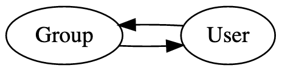

# Groups Best Practices

Groups (sometimes known as “clans”) are a foundational building block of social interaction in games. Whenever users come together, it’s a chance for your users to form closer bonds to other users and to your game. To support group play in your game, Nakama provides a core groups system, which includes a data model and APIs.

Continue reading to learn:

- How Nakama models groups and their membership
- How Nakama stores that data efficiently
- How developers can build their games using groups

## Using groups

The Nakama group system isn’t prescriptive. Groups can be used to represent communities of many shapes, sizes, and characteristics, such as clans, guilds, teams, and factions.

A group is a collection of users, but for what purpose is up to you. Whatever your goals, you can use the groups system to record membership, relationship states, and metadata about them.

## Modeling groups

In Nakama a group is represented in two parts: the group itself and the group’s connections to users, called _group edges_.

A _group_ represents details about the group as a whole, such as:

- Whether the group is open or closed to new members
- The ID of the group’s original creator (regardless of the creator’s current membership)
- The maximum number of members for the group (by default 100)
- Custom metadata

A _group edge_ represents the relationship between a group and a user. For these relationships, Nakama builds on the concept of a directed graph. Like edges in a directed graph, a group edge represents a connection between user and group. Because each edge has a direction, group membership is represented in pairs: an edge from user to group and an edge from group to user.



Whenever a new relationship between a user and a group begins, Nakama creates a pair of group edges. Null relationships aren’t represented in this system.

Additionally, each edge records a relationship state:

- membership requested (or request pending, depending on your perspective)
- membership accepted
- membership as an admin or superadmin
- banned

Group and group edges come together from the moment a new group is created. For a new group to exist, Nakama represents it with:

- The group itself
- The edge from the group to the group creator (the group’s first superadmin)
- The edge from the creator to the group

If any of this sounds familiar, then you probably know [the way Nakama represents friend relationships](friends-best-practices.md). Like friends, groups are modeled to support the most common group relationships needed for games while being flexible enough to handle your game’s unique qualities.

The groups model has another advantage: it’s efficient to store and query.

## Storing and scaling groups

In the database, Nakama uses a succinct representation of groups and group edges. This representation is tuned to make common tasks, such as querying all of a group’s members or all of a user’s groups, fast, efficient, and scalable.

The schema for groups uses a primary key consisting of:

- The time the group is set to expire (`disable_time`)
- A language (`lang_tag`)
- The number of edges associated with the group (`edge_count`)
- A unique ID (`id`)

This primary key ensures that large, active groups of the same language are stored physically close together. This hastens the most common queries used to find a suitable group for a user to join. Additionally, Nakama indexes membership numbers and the time of the last update to speed up queries for the largest groups and for groups with recent activity.

For group edges, the primary key consists of:

- A user or group ID
- A destination ID
- The state of the relationship, such as membership request pending or admin membership
- A counter

This primary key ensures that a user’s group memberships are stored close together, contiguously for the type and age of the membership. And since both directions of the relationship between user and group are stored as separate rows, all of a group’s members are stored close together for the type and age of the membership.

Every group has these records. When a new group is created, it starts with at least three database rows, one each for:

- The group itself
- The edge from group to the creator
- The edge from creator to group

That’s the basis on which you’ll build social relationships specific to your application.

## Developing with groups

Nakama’s groups system is meant to support you and your users in a wide range of social activities. Follow these best practices to get the most out of the groups feature.

### Defaults aren’t set in stone

By default, groups are limited to 100 members (`max_count`), but that is not a hardcoded limit. Not only can you increase or decrease the maximum number of users in general, but also on a per-group basis.

This means you can have differently-sized groups for different purposes. For example, you can increase `max_count` for groups that represent leagues and reduce `max_count` for groups that represent individual teams or squads. You can even vary the size limit of a specific group dynamically. For example, you might reward a group that completed a challenging task by increasing their `max_count` by one.

### Use metadata to layer new functionality

Groups in Nakama are a starting point for developing fun, capable social interactions, even if Nakama’s implementation of groups appears minimalist. You can use the JSONB `metadata` field to develop sophisticated group functionality more quickly than you would by building your own groups system. Consider a couple examples: visibility and permissions.

Without additional metadata, groups have just one binary privacy setting: open to new members and closed to new members. With additional metadata, however, you can add more subtle privacy distinctions. For example, if you add a single boolean `visibility` field to your metadata, then you can form the basis for a wider range of group privacy settings:

<table style="text-align: center">
  <tr>
    <td rowspan="2" colspan="2"></td>
    <td colspan="2">
      <code>visibility</code>
    </td>
  </tr>
  <tr>
    <td>Visible (<code>true</code>)</td>
    <td>Invisible (<code>false</code>)</td>
  </tr>
  <tr>
    <td rowspan="2">
      <code>state</code>
    </td>
    <td style="text-align: right">Open (<code>0</code>)</td>
    <td><strong>Public drop-in groups</strong></td>
    <td><strong>Join-by-secret-link groups</strong></td>
  </tr>
  <tr>
    <td style="text-align: right">Closed (<code>1</code>)</td>
    <td><strong>Invite-only groups</strong></td>
    <td><strong>Private groups</strong></td>
  </tr>
</table>

Like visibility, another layer you might want to add to your groups are roles or privileges. By default, Nakama provides a coarse set of roles for members in a group: superadmins, admins, and members. But that’s not the end of the story.

By pairing metadata with server runtime code, you’re free to expand the range of roles and permissions. You can use metadata to create ranks, privileged members (such as moderators), or fine-grained permissions to grant to members of a group, regardless of their role as superadmin, admin, or member. Behind the scenes, your server runtime code can use a special nil ID to take actions on behalf of the group, to trigger actions based on user privileges.

For example, your group metadata might have a _bouncer_ role for users who can accept new members or kick (expel) existing members for the group. The group `metadata` for this role could look like this:

```json
{
  "roles": {
    "2c0c8e80-fcbc-4b61-901a-dace129f45f5": ["bouncer"],
    "000d8152-3258-457b-905b-05a9223c5c8c": ["bouncer"],
    "b5f5d399-340c-460a-a29a-3720c711a82f": []
  }
}
```

With this metadata you can build a user interface for managing group members that only appears for users with the bouncer role. On the server, you can register custom behaviors before certain events—group user add or kick events—that only complete if initiated by a bouncer (in other words, when `roles[userId].includes('bouncer')` is true).

The `metadata` field isn’t an afterthought, it’s a key part of building your game with the support scaffold that Nakama provides.

### Compose groups with other Nakama systems

Not only can you extend groups with group `metadata` fields, you can link them to other Nakama systems.

Some Nakama systems work with groups in clearly defined ways, such as group-only [chat](realtime-chat.md) conversations. Nakama can take group membership into account to determine which users can participate in a group chat.

But there are countless opportunities to compose groups with other Nakama systems and the systems of your game. Here are some examples:

- [Leaderboard](leaderboards.md) records have an owner ID. Typically this is a user ID, but you could use group IDs instead to rank the results of teams or factions.
- [Realtime parties](parties.md) can be formed from the subset of group members currently online.
- [Matchmaking](matches.md) properties can contain arbitrary fields. You could submit a user’s group IDs as a matchmaking property and use queries that favor matchups which include mutual group members.

Don’t let the groups system be an island. It’s the beginning, not the end, of group interactions in your game.

## Further reading

To see groups in a real game, check out the [_Clans_](../tutorials/unity/pirate-panic/clans.md) section of the [_Pirate Panic_](../tutorials/unity/pirate-panic/intro.md) tutorial.
