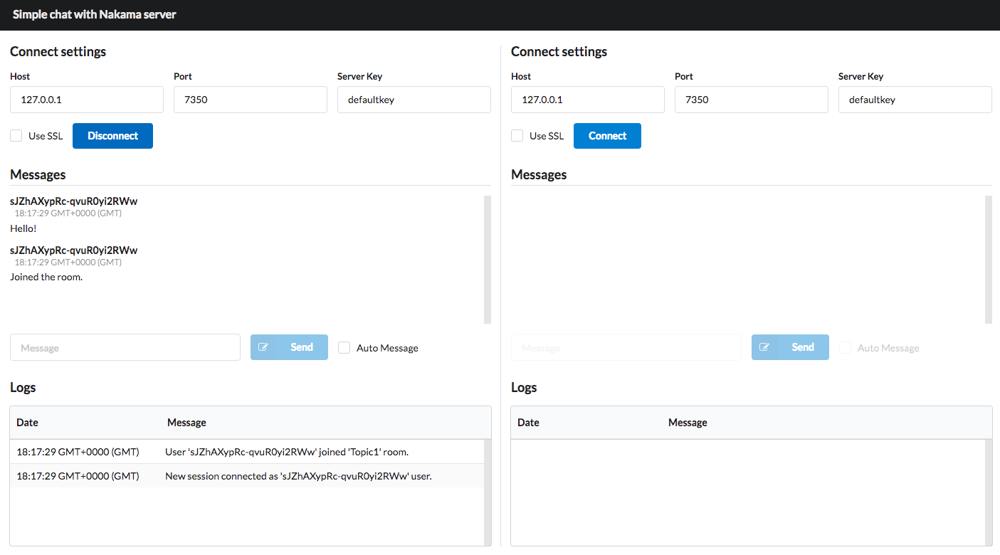

# JavaScript Chat Example

Here we provide an example JavaScript chat application using Nakama server.



The demo uses Semantic UI and React to build a single page component which demonstrates:

* Authentication: Login and registration here is done with auto-generated device IDs. We recommend you use [email/password or others](/authentication.md) in a real application.
* User accounts: A [user account](/user-accounts.md) is created on registration.
* Realtime chat: Messages sent between many users in a [single chat room](/social-realtime-chat.md#rooms).

## Setup

To setup up this sample application, clone the [project repository](-link-) then open a terminal to the project root directory and run:

```sh
yarn install
```

!!! note "Note"
    If you do not have `yarn` installed, see the [official documentation](https://yarnpkg.com/getting-started/install) to learn more.

## Run demo

First [download and setup Nakama server](/nstall-docker-quickstart.md).

With the server and database server setup and running you can run:

```sh
yarn start
```
