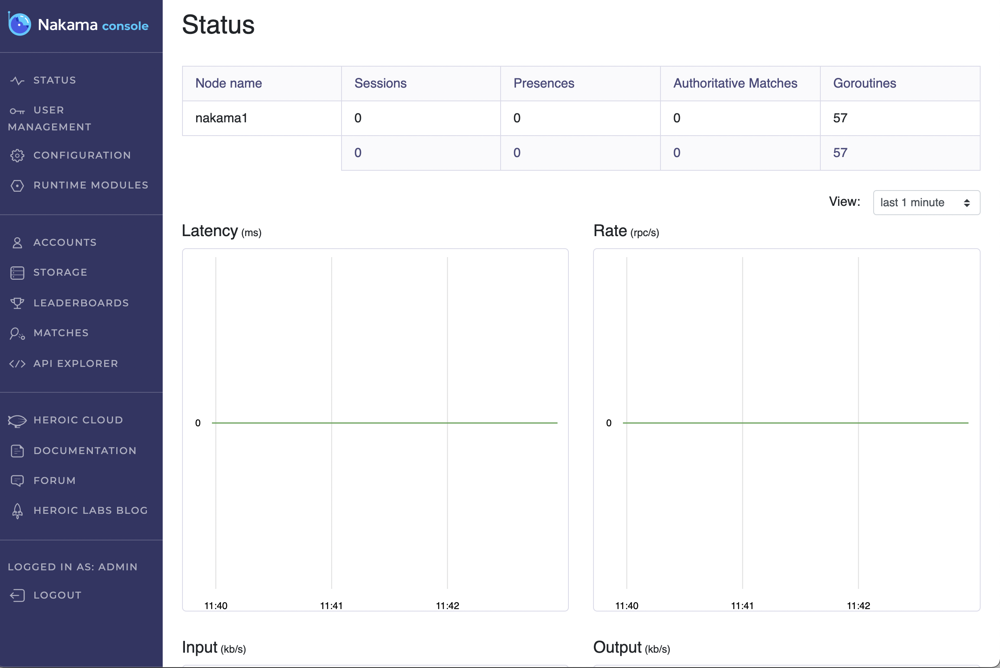
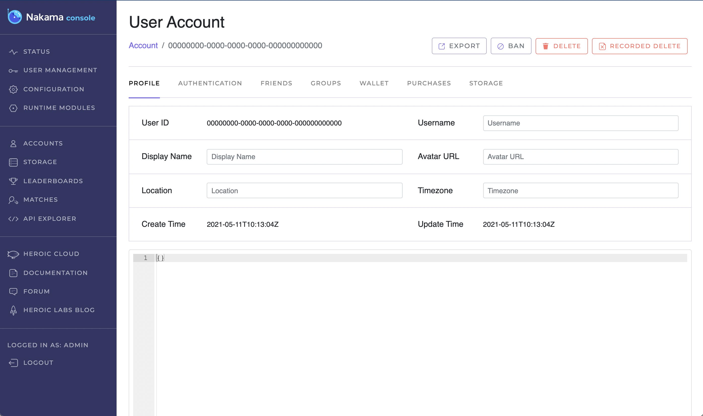
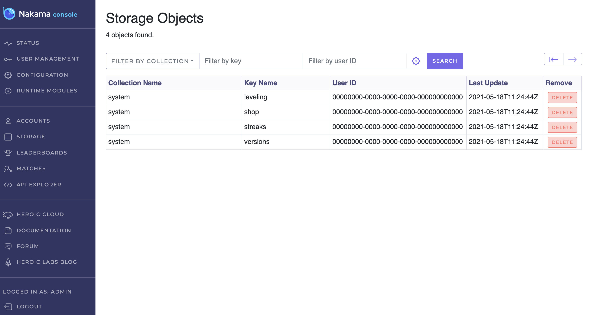
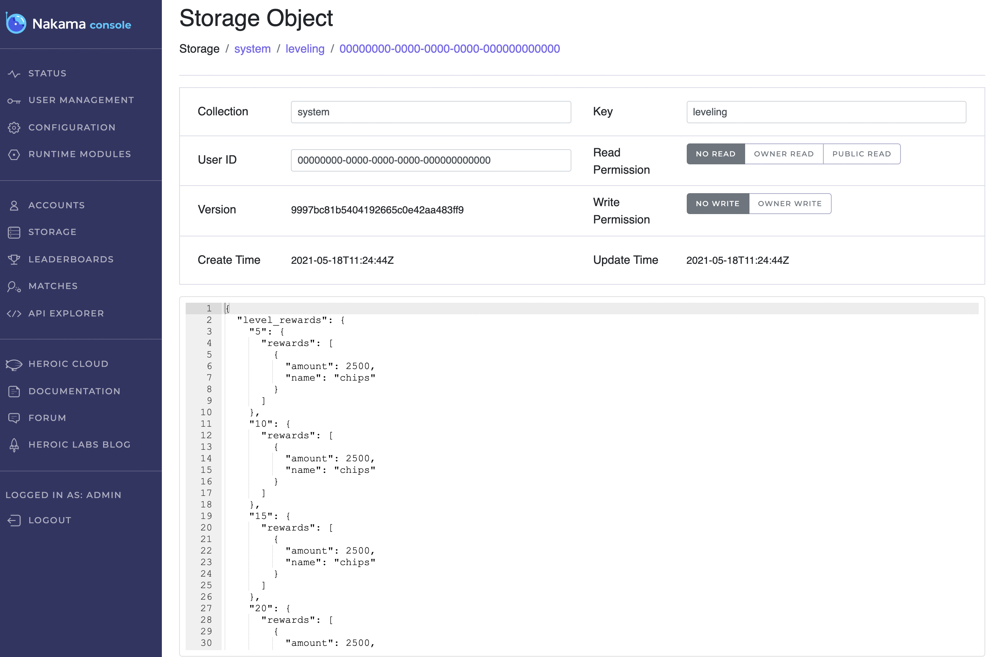
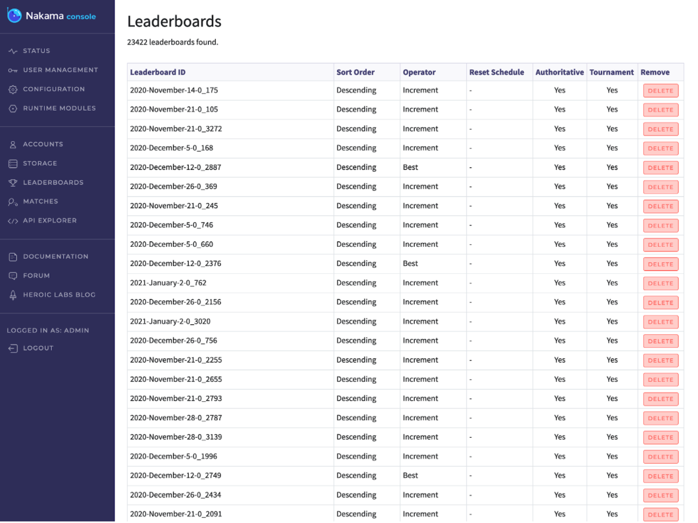
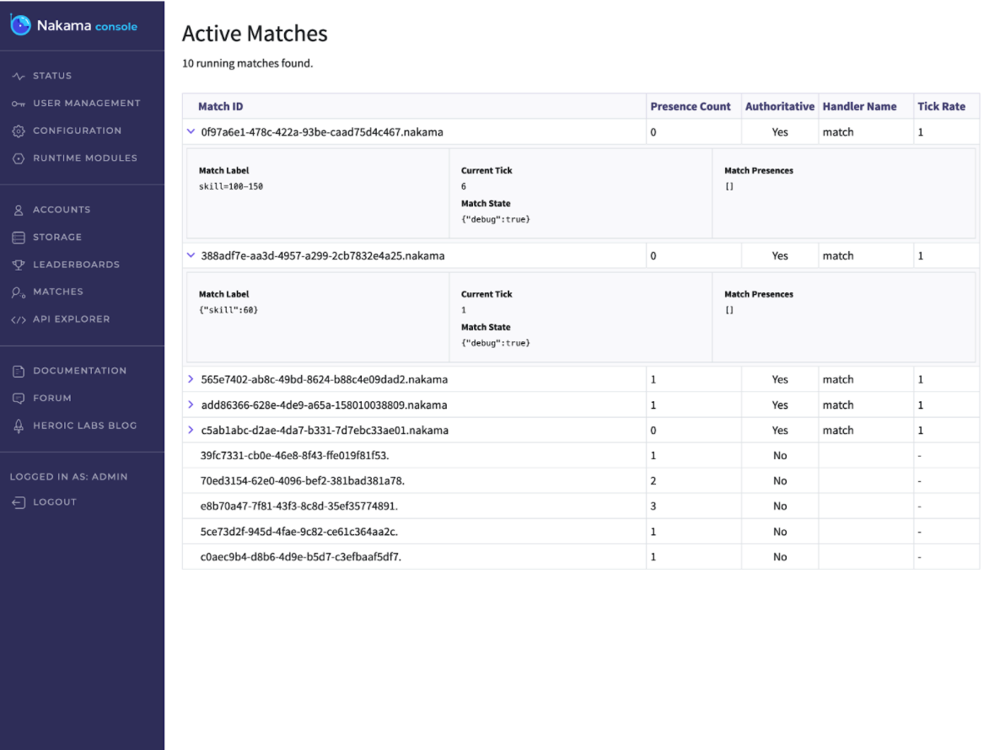

# Nakama Console

The Nakama console is a powerful and flexible UI for your Nakama server instance. It enables easy access to player and server data, allowing both technical and non-technical users to quickly perform any needed service tasks.

By default, Nakama console is available on port `7351`, for example [127.0.0.1:7351](http://127.0.0.1:7351) when running Nakama locally. The console provides the following pages and features:

* [Status](#status)
* [User Management](#user-management)
* [Configuration](#configuration)
* [Runtime Modules](#runtime-modules)
* [Accounts](#accounts)
* [Storage](#storage)
* [Leaderboards](#leaderboards)
* [Matches](#matches)
* [API Explorer](#api-explorer)

In addition to the above, there are also convenient links to the Heroic Labs official [documentation](https://heroiclabs.com/docs/), [forum](https://forum.heroiclabs.com/), and [blog](https://heroiclabs.com/blog/).

## Status



The Status page provides a realtime view of your Nakama server, with usage details for each node and a general view into bandwidth and latency, including:

* Latency: The time spent executing Remote Procedure Call (RPC) functions, in milliseconds (ms).
* Rate: The number of RPCs per second.
* Input: Inbound traffic in kilobytes per second (kb/s).
* Output: Outbound traffic in kilobytes per second (kb/s).

## User management


!!! note "Note"
    The User Management page is only available to users with the Administrator role.

The User Management page allows you to add new console users, or delete any existing users. When creating new users there are four available roles, enabling you to set up your support team with access to only the UI features they need.

## Configuration


The Configuration page enables you to view and export all [configuration](configuration.md) details of your Nakama server.

Additionally, you can [import storage data](#importing-storage-data) or delete all data.

### Importing storage data

Drag-and-drop or browse for and select your desired file to import. A sample JSON file is provided below:

=== "new-storage-objects.json"
    ```json
    [
      {
        "collection": "system",
        "key": "leveling",
        "permission_read": 0,
        "permission_write": 0,
        "user_id": "00000000-0000-0000-0000-000000000000",
        "value": {
          "level_rewards": {
            "10": {
              "rewards": [
                {
                "amount": 2500,
                "name": "chips"
                }
              ]
            }
          }
        }
      },
      {
        "collection": "system",
        "key": "streaks",
        "permission_read": 0,
        "permission_write": 0,
        "user_id": "00000000-0000-0000-0000-000000000000",
        "value": {
          "streaks": [
            {
            "bonus": 1,
            "next_claim_time_sec": 0,
            "progress": 0,
            "unlocks": [
                {
                  "rewards": [
                    {
                      "amount": 500,
                      "name": "chips"
                    }
                  ]
                }
              ]
            }
          ]
        }
      },
      {
        "collection": "system",
        "key": "versions",
        "permission_read": 0,
        "permission_write": 0,
        "user_id": "00000000-0000-0000-0000-000000000000",
        "value": {
          "versions": {
            "PLATFORM_ANDROID": {
              "hard_update": "0.0.0",
              "soft_update": "0.1.0",
              "url": "app://blah"
            },
            "PLATFORM_IOS": {
              "hard_update": "0.0.0",
              "soft_update": "0.1.0",
              "url": "app://blah"
            }
          }
        }
      },
      {
        "collection": "system",
        "key": "shop",
        "permission_read": 0,
        "permission_write": 0,
        "user_id": "00000000-0000-0000-0000-000000000000",
        "value": {
          "iap_codes_prices": {
            "mini_chips": 99,
            "small_chips": 499,
            "medium_chips": 999,
            "large_chips": 1999,
            "xl_chips": 4999,
            "huge_chips": 9999
            },
        "variants": [
            {
              "name": "default",
              "shop_chips": {
                "mini_chips": 30000,
                "small_chips": 200000,
                "medium_chips": 500000,
                "large_chips": 1500000,
                "xl_chips": 6000000,
                "huge_chips": 20000000
              }
            }
          ]
        }
      }
    ]
    ```

## Runtime modules


The Runtime Modules page allows you to easily observe what functions are active within your project and when they were last modified.

Nakama server enables you to write server side code in Go, Lua, and TypeScript. See [Runtime code basics](../server-framework/basics.md) to learn more.

## Accounts

The Accounts page displays a list of all user accounts, searchable according to user ID and username. From here you have view, edit, and delete any user. See [User accounts](../concepts/user-accounts.md) to learn more.

Select any desired user to view and edit the corresponding details:


## Storage



The Storage page displays a list of all storage objects, searchable according to collection name, key name, and user ID. From here you have view, edit, and delete any storage object. See [Collections](../concepts/collections.md) to learn more.

Select any desired object to view and edit the corresponding details:


## Leaderboards



The Leaderboards page enables you to view and manage your leaderboards and tournaments, and their corresponding records. See [Leaderboards](../concepts/leaderboards.md) and [Tournaments](../concepts/tournaments.md) to learn more.

!!! note "Note"
    Leaderboards and tournaments can only created via the server runtime. See [create a leaderboard](../concepts/leaderboards.md#create-a-leaderboard) and [create a tournament](../concepts/tournaments.md#create-tournament) for examples.

Select any desired leaderboard from the list to view its details and records:


## Matches

The Matches page displays the ten most recent matches, enabling you to investigate your running matches and providing you a quick snapshot of what your player base is up to at any given moment.

Select any Match from the list to view its details:


!!! note "Note"
    Only authoritative matches can have state and the labels seen on the console dashboard. See [Authoritative multiplayer](../concepts/server-authoritative-multiplayer.md) to learn more.

## API Explorer


The API explorer enables you to quickly and easily test any of the available features of Nakama server.

The Request Body is prepopulated according to your selected action, just enter the corresponding request details, indicated by `<..>`, and send to view the response.
