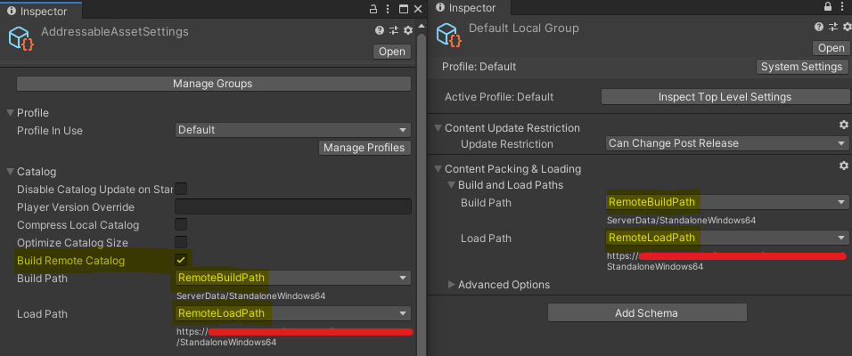
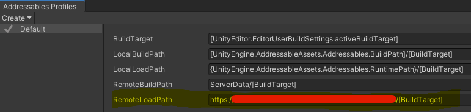

# Asset Management
The following guide demonstrates using Nakama as a secure asset management system, providing clients with temporary access to secure cloud hosted (Amazon S3) assets.

There are several benefits to using an asset management system, such as:

* Assets remain private and are provided on-demand and in a time-limited manner
* The ability to provide clients with different assets (e.g. beta access assets)
* Reduces round trips to your cloud storage provider for things such as listing assets
* Allows for user-generated content and validation of assets

There are 3 major parts to this system:

1. Asset manifests which will be categorized and stored using Nakama Storage Engine
2. An asset upload RPC which will be responsible for taking binary data and uploading it to the cloud, as well as storing the corresponding asset manifest
3. An asset download RPC which will generate a pre-signed temporary download URL to a requested asset

This system is client-agnostic, however at the end of this guide you will see how you can use this to implement a secure asset delivery system, providing runtime access to Unity Addressable assets directly from a private S3 bucket.

## Asset Manifests

By using the Nakama Storage Engine you can store asset manifests which hold meta data on the particular asset that has been uploaded, including:

* name
* category
* owner
* md5 checksum
* created timestamp

Storing asset manifests in Nakama allows the client to retrieve individual records or retrieve lists of records (e.g. by category) without requiring multiple round trips to the cloud storage provider which could incur costs.

You can define the asset manifest and other relevant messages using standard structs, or alternatively you can use a specific messaging format like [Protocol Buffers](https://developers.google.com/protocol-buffers) as shown below:

=== "Proto"
    ```proto
    syntax = "proto3";

    package api;

    option go_package = "heroiclabs.com/nakama-amazon-s3/api";

    message RpcAssetUploadRequest {
        string category = 1;
        string name = 2;
        bytes data = 3;
    }

    message RpcAssetUploadResponse {
        AssetManifest manifest = 1;
    }

    message RpcAssetDownloadRequest {
        string category = 1;
        string name = 2;
    }

    message RpcAssetDownloadResponse {
        string name = 1;
        string download_uri = 2;
    }

    message RpcAllAssetsDownloadResponse {
        repeated RpcAssetDownloadResponse assets = 1;
    }

    message AssetManifest {
        string category = 1;
        string name = 2;
        string owner = 3;
        string md5 = 4;
        int64 created_at = 5;
    }
    ```

!!! note "Note"
    If you're using Protocol Buffers you will also need to use the `protoc` tool to generate the appropriate files from the `.proto` file for your programming language. For more information please read the [Protocol Buffers Basics: Go](https://developers.google.com/protocol-buffers/docs/gotutorial) documentation.

## Bootstrapping the server runtime

Before implementing the asset upload/download RPCs you will need to initialize the Protocol Buffer marshaller and S3 service object and uploader.

!!! note "Note"
    You can pass environment variables to Nakama through the `local.yml` configuration file under the `runtime.env` section. For further information see the [configuration](../../getting-started/configuration/#runtime) documentation.

=== "Go"
    ```go
    func InitModule(ctx context.Context, logger runtime.Logger, db *sql.DB, nk runtime.NakamaModule, initializer runtime.Initializer) error {
        initStart := time.Now()
        env := ctx.Value(runtime.RUNTIME_CTX_ENV).(map[string]string)

        // Ensure AWS environment vars have been configured
        awsAccessKeyID, ok := env["AWS_ACCESS_KEY_ID"]
        if !ok {
        return errors.New("missing AWS_ACCESS_KEY_ID in runtime env")
        }
        awsSecretAccessKey, ok := env["AWS_SECRET_ACCESS_KEY"]
        if !ok {
        return errors.New("missing AWS_SECRET_ACCESS_KEY in runtime env")
        }
        awsRegion, ok := env["AWS_REGION"]
        if !ok {
        return errors.New("missing AWS_REGION in runtime env")
        }
        awsBucket, ok := env["AWS_BUCKET"]
        if !ok {
        return errors.New("missing AWS_BUCKET in runtime env")
        }

        // Create protobuf marshalers
        marshaler := &jsonpb.Marshaler{
        EnumsAsInts: true,
        }

        unmarshaler := &jsonpb.Unmarshaler{
        AllowUnknownFields: false,
        }

        // Create an S3 service object and uploader
        sess := session.Must(session.NewSession(&aws.Config{
        Region:      aws.String(awsRegion),
        Credentials: credentials.NewStaticCredentials(awsAccessKeyID, awsSecretAccessKey, ""),
        }))

        svc := s3.New(sess)
        uploader := s3manager.NewUploader(sess)

        // Register RPCs here...

        logger.Info("Plugin loaded in '%d' msec.", time.Since(initStart).Milliseconds())
        return nil
    }
    ```

## Asset Upload RPC

With the asset manifest defined, you can implement an RPC function that will take binary data encoded as a base64 string, create and store an asset manifest, and upload the binary file to a private Amazon S3 bucket.

=== "Go"
    ```go
    func UploadAssetToS3(marshaler *jsonpb.Marshaler, unmarshaler *jsonpb.Unmarshaler, uploader *s3manager.Uploader, bucketName string) func(ctx context.Context, logger runtime.Logger, db *sql.DB, nk runtime.NakamaModule, payload string) (string, error) {
        return func(ctx context.Context, logger runtime.Logger, db *sql.DB, nk runtime.NakamaModule, payload string) (string, error) {
        // Check if s3 storage client is configured or return error
        if uploader == nil {
            return "", errors.New("s3 uploader not configured")
        }

        if len(bucketName) == 0 {
            return "", errors.New("no s3 bucket name provided")
        }

        // Check user that's making the request
        userID, ok := ctx.Value(runtime.RUNTIME_CTX_USER_ID).(string)
        if !ok {
            return "", errors.New("user ID not found")
        }

        // Unmarshal the upload request input
        request := &api.RpcAssetUploadRequest{}

        logger.Info("got payload: %q", payload)

        if err := unmarshaler.Unmarshal(bytes.NewReader([]byte(payload)), request); err != nil {
            logger.WithField("error", err).Error("error unmarshalling RpcAssetUploadRequest")
            return "", errors.New("error unmarshalling RpcAssetUploadRequest")
        }

        // Check that the input fields are valid
        if request.Category == "" {
            return "", errors.New("asset Category required")
        }

        if request.Name == "" {
            return "", errors.New("asset Name required")
        }

        if len(request.Data) == 0 {
            return "", errors.New("asset Data required")
        }

        // Upload the asset to s3 bucket
        result, err := uploader.Upload(&s3manager.UploadInput{
            Bucket: aws.String(bucketName),
            Key:    aws.String(request.Name),
            Body:   bytes.NewReader(request.Data),
        })
        if err != nil {
            logger.WithField("error", err).Error("failed to upload file")
            return "", errors.New("failed to upload file")
        }

        // Prepare the asset manifest
        md5 := strings.ReplaceAll(*result.ETag, "\"", "")
        manifest := &api.AssetManifest{
            Category:  request.Category,
            Name:      request.Name,
            Owner:     userID,
            Md5:       md5,
            CreatedAt: time.Now().Unix(),
        }

        buf := &bytes.Buffer{}
        if err := marshaler.Marshal(buf, manifest); err != nil {
            logger.WithField("error", err).Error("error encoding asset manifest")
            return "", errors.New("error encoding asset manifest")
        }

        // Write the asset manifest to nakama storage
        if _, err := nk.StorageWrite(ctx, []*runtime.StorageWrite{{
            Collection:      fmt.Sprintf("asset_%s", request.Category),
            Key:             request.Name,
            UserID:          "", // Will be owned by the system user
            Value:           buf.String(),
            PermissionRead:  2, // Clients can read directly
            PermissionWrite: 0, // Only server can write
        }}); err != nil {
            logger.WithField("error", err).Error("error writing asset manifest")
            return "", errors.New("error writing asset manifest")
        }

        // Prepare response to the client
        response := &api.RpcAssetUploadResponse{
            Manifest: manifest,
        }

        buf = &bytes.Buffer{}
        if err := marshaler.Marshal(buf, response); err != nil {
            logger.WithField("error", err).Error("error encoding response")
            return "", errors.New("error encoding response")
        }

        return buf.String(), nil
        }
    }
    ```

Register the RPC in the `InitModule` function.

=== "Go"
    ```go
    if err := initializer.RegisterRpc("upload_asset", UploadAssetToS3(marshaler, unmarshaler, uploader, awsBucket)); err != nil {
        return err
    }
    ```

## Asset Download RPC

The asset download RPC will check for an existing asset manifest for the requested file and then talk to Amazon S3 and generate a pre-signed temporary download URL for the asset which is passed back to the client.

=== "Go"
    ```go
    func GetAssetDownloadUri(marshaler *jsonpb.Marshaler, unmarshaler *jsonpb.Unmarshaler, svc *s3.S3, bucketName string) func(ctx context.Context, logger runtime.Logger, db *sql.DB, nk runtime.NakamaModule, payload string) (string, error) {
        return func(ctx context.Context, logger runtime.Logger, db *sql.DB, nk runtime.NakamaModule, payload string) (string, error) {
        // Check user that's making the request
        _, ok := ctx.Value(runtime.RUNTIME_CTX_USER_ID).(string)
        if !ok {
            // Would happen if calling this RPC server-to-server. See: https://heroiclabs.com/docs/runtime-code-basics/#server-to-server
            // We're choosing not to allow this here, downloads are expected to be done by a user.
            return "", errors.New("user ID not found")
        }

        // Unmarshal the input
        request := &api.RpcAssetDownloadRequest{}
        if err := unmarshaler.Unmarshal(bytes.NewReader([]byte(payload)), request); err != nil {
            logger.WithField("error", err).Error("error unmarshalling request")
            return "", errors.New("error unmarshalling request")
        }

        // Check input fields are valid
        if request.Category == "" {
            return "", errors.New("asset Category required")
        }

        if request.Name == "" {
            return "", errors.New("asset Name required")
        }

        // Look up the asset in the storage manifest
        objects, err := nk.StorageRead(ctx, []*runtime.StorageRead{{
            Collection: fmt.Sprintf("asset_%s", request.Category),
            Key:        request.Name,
            UserID:     "", // Owned by the system user
        }})

        if err != nil {
            logger.WithField("error", err).Error("error reading asset manifest")
            return "", errors.New("error reading asset manifest")
        }

        // Check if the object exists
        if len(objects) == 0 {
            return "", errors.New("asset not found")
        }

        // Get the asset manifest
        manifest := &api.AssetManifest{}
        if err := unmarshaler.Unmarshal(bytes.NewReader([]byte(objects[0].Value)), manifest); err != nil {
            logger.WithField("error", err).Error("error unmarshaling manifest")
            return "", errors.New("error unmarshaling manifest")
        }

        // Prepare a short-lived asset download link
        assetDownload, err := getAssetDownloadUri(request.Name, svc, bucketName)
        if err != nil {
            logger.WithField("error", err).Error(err.Error())
            return "", err
        }

            // Prepare response to client
        buf := &bytes.Buffer{}
        if err := marshaler.Marshal(buf, assetDownload); err != nil {
            logger.WithField("error", err).Error("error encoding response")
            return "", errors.New("error encoding response")
        }

        logger.Info("Responding with:\n%q", buf.String())

        return buf.String(), nil
        }
    }

    func getAssetDownloadUri(key string, svc *s3.S3, bucketName string) (*api.RpcAssetDownloadResponse, error) {
        // Prepare a short-lived asset download link
        req, _ := svc.GetObjectRequest(&s3.GetObjectInput{
        Bucket: aws.String(bucketName),
        Key:    aws.String(key),
        })

        uri, err := req.Presign(24 * time.Hour)
        if err != nil {
        return nil, errors.New("error signing request")
        }

        response := &api.RpcAssetDownloadResponse{
        Name:        key,
        DownloadUri: uri,
        }

        return response, nil
    }
    ```

Register the RPC in the `InitModule` function.

=== "Go"
    ```go
    if err := initializer.RegisterRpc("get_asset_download_uri", GetAssetDownloadUri(marshaler, unmarshaler, svc, awsBucket)); err != nil {
        return err
    }
    ```

## Asset Download By Category RPC

There is a lot of flexibility to filter assets, for example by a category, and return a list of asset download URLs.

=== "Go"
    ```go
    func GetAllAssetDownloadUris(marshaler *jsonpb.Marshaler, unmarshaler *jsonpb.Unmarshaler, svc *s3.S3, bucketName string) func(ctx context.Context, logger runtime.Logger, db *sql.DB, nk runtime.NakamaModule, payload string) (string, error) {
        return func(ctx context.Context, logger runtime.Logger, db *sql.DB, nk runtime.NakamaModule, payload string) (string, error) {
        // Check user that's making the request
        _, ok := ctx.Value(runtime.RUNTIME_CTX_USER_ID).(string)
        if !ok {
            // Would happen if calling this RPC server-to-server. See: https://heroiclabs.com/docs/runtime-code-basics/#server-to-server
            // We're choosing not to allow this here, downloads are expected to be done by a user.
            return "", errors.New("user ID not found")
        }

        // Unmarshal the input
        request := &api.RpcAssetDownloadRequest{}
        if err := unmarshaler.Unmarshal(bytes.NewReader([]byte(payload)), request); err != nil {
            logger.WithField("error", err).Error("error unmarshalling request")
            return "", errors.New("error unmarshalling request")
        }

        // Check input fields are valid
        if request.Category == "" {
            return "", errors.New("asset Category required")
        }

        // Look up the asset in the storage manifest
        objects, _, err := nk.StorageList(ctx, "", fmt.Sprintf("asset_%s", request.Category), 100, "")
        if err != nil {
            logger.WithField("error", err).Error("error reading asset manifest")
            return "", errors.New("error reading asset manifest")
        }

        // Check if any objects exist
        if len(objects) == 0 {
            return "", errors.New("no assets found")
        }

        // Create a response object
        response := &api.RpcAllAssetsDownloadResponse{}

        // Loop through all assets and get a download uri
        for _, object := range objects {
            assetDownload, err := getAssetDownloadUri(object.Key, svc, bucketName)
            if err != nil {
            logger.WithField("error", err).Error(err.Error())
            return "", err
            }

            response.Assets = append(response.Assets, assetDownload)
        }

        // Marshal the response
        buf := &bytes.Buffer{}
        if err := marshaler.Marshal(buf, response); err != nil {
            logger.WithField("error", err).Error("error encoding response")
            return "", errors.New("error encoding response")
        }

        return buf.String(), nil
        }
    }
    ```

Register the RPC in the `InitModule` function.

=== "Go"
    ```go
    if err := initializer.RegisterRpc("get_all_asset_download_uris_by_category", GetAllAssetDownloadUris(marshaler, unmarshaler, svc, awsBucket)); err != nil {
        return err
    }
    ```

## Example: Integrate with Unity Addressables

This asset management system can be integrated with a remote asset delivery pipeline such as Unity's Addressables feature. With Unity Addressables you can package up your assets, host them remotely and then load those assets at runtime.

Unity Addressables works out of the box with public cloud storage like Amazon S3, Google Cloud File Storage or Digital Ocean Object Storage. Unfortunately it does not support private cloud storage out of the box. However, we can integrate our Nakama Asset Management system in just a few small steps.

First, setup your Addressable assets configuration to Build and Load from the Remote path as shown below. Ensure to tick the **Build Remote Catalog** option.



Optionally, configure the remote load path of your Addressable assets from the Addressables Profiles window. Any URL that begins with `http(s)` can be used, and we can change it at runtime.



With the Addressables system configured, build your Addressables asset bundle by clicking the **Build** button in the Addressables Groups window. For the first build, choose **New Build** otherwise choose **Update Previous Build** (This ensures the same catalog file is used which then allows clients to download the latest assets without needing to update their client). Then, upload these assets to a Nakama server using the `asset_upload` RPC created earlier in the guide.

=== "Unity"
    ```cs
    var directoryInfo = new DirectoryInfo("<PathToAssetBundle>/StandaloneWindows64");
    foreach (var fileInfo in directoryInfo.GetFiles())
    {
        var fileBytes = UnityEngine.Windows.File.ReadAllBytes(fileInfo.FullName);
        var request = new RpcAssetUploadRequest
        {
        category = "StandaloneWindows64",
        name = fileInfo.Name,
        data = Convert.ToBase64String(fileBytes)
        };
        await Client.RpcAsync(Session, "upload_asset", JsonUtility.ToJson(request));
    }
    ```

To begin implementing the Nakama asset management system with Unity, add the following class definitions to your project.

=== "Unity"
    ```cs
    [Serializable]
    public class RpcAssetUploadRequest
    {
        public string category;
        public string name;
        public string data;
    }

    [Serializable]
    public class RpcAssetDownloadRequest
    {
        public string category;
        public string name;
    }

    [Serializable]
    public class RpcAssetDownloadResponse
    {
        public string name;
        public string downloadUri;
    }

    [Serializable]
    public class RpcGetAllAssetsDownloadResponse
    {
        public RpcAssetDownloadResponse[] assets;
    }
    ```

Then, create a script called `AddressablesManager` that on start retrieves the platform specific Unity Asset Catalog (hash/json) and Asset Bundle from Nakama.

=== "Unity"
    ```cs
    private IDictionary<string, string> assetPresignedUris = new Dictionary<string, string>();

    private async void Start()
    {
        await FetchPresignedAssets("StandaloneWindows64");
    }

    private async Task FetchPresignedAssets(string buildTarget)
    {
        var payload = new RpcAssetDownloadRequest { category = buildTarget };
        var response = await Client.RpcAsync(Session, "get_all_asset_download_uris_by_category", JsonUtility.ToJson(payload));
        var result = JsonUtility.FromJson<RpcGetAllAssetsDownloadResponse>(response.Payload);

        foreach (var asset in result.assets)
        {
        assetPresignedUris.Add(asset.name, asset.downloadUri);
        }
    }
    ```

Next, assign a new transform function to the Addressable system's `ResourceManager.InternalIdTransformFunc` in the `Start` method that will take the internal asset Id and convert it to our pre-signed asset download URLs.

=== "Unity"
    ```cs

    private async void Start()
    {
        // ...
        Addressables.ResourceManager.InternalIdTransformFunc += TransformFunc;
    }

    private string TransformFunc(IResourceLocation location)
    {
        // If we're trying to load a remote asset over http(s):
        // - grab the file name from the url path
        // - look up the pre-signed url and return that if available; otherwise just return the same location.InternalId
        var regex = new Regex("https?.+/([^?]+)");
        var match = regex.Match(location.InternalId);
        if (match.Success)
        {
        var key = match.Groups[1].Value;
        if (assetPresignedUris.ContainsKey(key))
        {
            return assetPresignedUris[key];
        }
        }

        return location.InternalId;
    }
    ```

Finally, instantiate an addressable asset.

=== "Unity"
    ```cs
    private async void Start()
    {
        // ...
        Addressables.InitializeAsync().Completed += OnInitializeAsyncCompleted;
    }

    private void OnInitializeAsyncCompleted(AsyncOperationHandle<IResourceLocator> obj)
    {
        // e.g.
        // addressablePrefabReference.InstantiateAsync().Completed += go =>
        // {
        //  Instantiate(go.Result);
        // };
    }
    ```

You should now be able to build and run your application and see your privately hosted addressable asset loaded.


