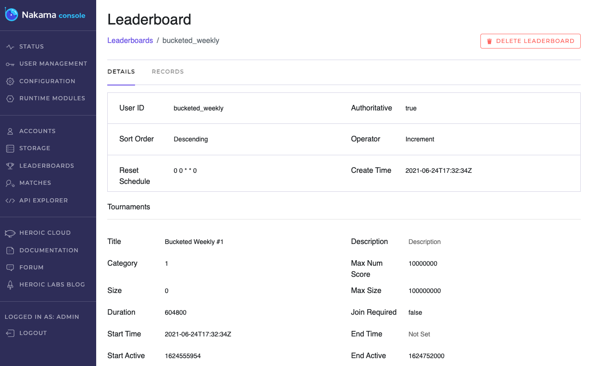

# Bucketed Leaderboards

!!! note "Note"
    If you haven't already, check out the [Leaderboards](../../concepts/leaderboards.md) documentation to familiarize yourself with the relevant concepts and features before proceeding.

As a game's player base grows a fundamental problem of social interaction in online games appears. Global leaderboards, and leaderboards generally, become static, with little movement at any particular skill or score level. This results in a loss, or lack, of engagement for newer players and so a lack of interest in continuing to play the game. One solution for this is the implementation of bucketed leaderboards.

In bucketed leaderboards players don't play against all other players but instead see a limited view of other players (often 25-50). They compete against this group until the leaderboard expires or rolls over to another start time. These smaller groups of players are known as cohorts or "player buckets" which is where the bucketed leaderboards name originates.

Bucketed leaderboards can be seen in many popular games, including several titles in Rovio's Angry Birds franchise.
Using Nakama's [Storage Engine](../../concepts/collections.md), [Leaderboards](../../concepts/leaderboards.md), and [Tournaments](../../concepts/tournaments.md) features enables you to implement bucketed leaderboards in your games with server runtime code, specifically RPC functions.

The Nakama leaderboards API already allows you to pass in a set of user IDs (or usernames) that become the filter used to generate the "bucketed view" of the leaderboard with just those players on it.

This just leaves how to form the user ID set for a specific player, and if it is personalized or follows some other game criteria. This is the key to successful implementation and depends on the particular mechanics of your game. You may want the "views" to be of similarly ranked players, VIP players, the user's friends, or players in the same region.

For our example here, we use a "random" selection of users as the bucket for the specific player to see. We walk through the key portions of the code first, and provide the complete file for reference at the end.

## Create bucketed leaderboard

Here we create a new bucketed leaderboard, `Bucketed Weekly #1`, that rolls over every week.

=== "Go"
    ```go
    func InitModule(ctx context.Context, logger runtime.Logger, db *sql.DB, nk runtime.NakamaModule, initializer runtime.Initializer) error {
        // Set up the bucketed leaderboards tournament
        id := "bucketed_weekly"
        metadata := map[string]interface{}{}

        if err := nk.TournamentCreate(ctx, id, "desc", "incr", "0 0 * * 0", metadata,
            "Bucketed Weekly #1", "", 1, 0, 0, 604800, 100000000, 10000000, false); err != nil {
            return err
        }
        if err := initializer.RegisterRpc("get_bucket_records", rpcGetBucketRecordsFn([]string{id}, 2000)); err != nil {
            return err
        }
        return nil
    }
    ```

## Generate user bucket

Each player will have an individual bucket - the opponent set they are playing against - that is created for, and unique to them. First we define the bucket storage object:

=== "Go"
    ```go
    // Define the bucketed leaderboard storage object
    type userBucketStorageObject struct {
        ResetTimeUnix uint32   `json:"resetTimeUnix"`
        UserIDs       []string `json:"userIds"`
    }
    ```

Then we define an RPC function to get the player's ID and check for any existing bucket. If one is found we fetch it, if not we create a new bucket. Lastly we fetch the actual leaderboard.

=== "Go"
    ```go
    // Get a user's bucket (records) and generate a new bucket if needed
    func RpcGetBucketRecordsFn(ids []string, bucketSize int) func(context.Context, runtime.Logger, *sql.DB, runtime.NakamaModule, string) (string, error) {
        return func(ctx context.Context, logger runtime.Logger, db *sql.DB, nk runtime.NakamaModule, payload string) (string, error) {
            if len(payload) > 0 {
                return "", ErrNoInputAllowed
            }

            userID, ok := ctx.Value(runtime.RUNTIME_CTX_USER_ID).(string)
            if !ok {
                return "", ErrNoUserIdFound
            }

            collection := "buckets"
            key := "bucket"

            objects, err := nk.StorageRead(ctx, []*runtime.StorageRead{
                {
                    Collection: collection,
                    Key:        key,
                    UserID:     userID,
                },
            })
            if err != nil {
                logger.Error("nk.StorageRead error: %v", err)
                return "", ErrInternalError
            }

            // Fetch any existing bucket or create one if none exist
            userBucket := &userBucketStorageObject{ResetTimeUnix: 0, UserIDs: []string{}}
            if len(objects) > 0 {
                if err := json.Unmarshal([]byte(objects[0].GetValue()), userBucket); err != nil {
                    logger.Error("json.Unmarshal error: %v", err)
                    return "", ErrUnmarshal
                }
            }

            // Fetch the leaderboard
            leaderboards, err := nk.LeaderboardsGetId(ctx, ids)
            if err != nil {
                logger.Error("nk.LeaderboardsGetId error: %v", err)
                return "", ErrInternalError
            }

    ```

## Check bucket status

Before proceeding further, we perform a check to see if the leaderboard has reset or if no opponents are present. If either is the case, we must generate a new opponent set.

=== "Go"
    ```go
    // Leaderboard has reset or no current bucket exists for user
    if userBucket.ResetTimeUnix != leaderboards[0].GetPrevReset() || len(userBucket.UserIDs) < 1 {
        logger.Debug("rpcGetBucketRecordsFn new bucket for %q", userID)
    ```

## Generate opponent set

To generate our random opponents list, we will use the `GetUsersRandom` function available in Nakama 3.5.0.

=== "Go"
    ```go
    userBucket.UserIDs = nil
    logger.Debug("rpcGetBucketRecordsFn new bucket for %q", userID)

    users, err := nk.UsersGetRandom(ctx, bucketSize)
    if err != nil {
        logger.Error("Error getting random users.")
        return "", ErrInternalError
    }

    for _, user := range users {
        userBucket.UserIDs = append(userBucket.UserIDs, user.Id)
    }
    ```

!!! note "Note"
    If you want to ultimately end up with a specifically defined opponents list (e.g. Level 10-20 players only), the recommended approach is to (over)scan in the database query by a factor of the desired bucket size, then in the application layer filter based on your relevant criteria (player metadata).

## Write the new bucket

After generating the new opponents list, we write this new user bucket, first setting the bucket reset and leaderboard end times to match.

=== "Go"
    ```go
    // Set the Reset and Bucket end times to be in sync
    userBucket.ResetTimeUnix = leaderboards[0].GetNextReset()

    value, err := json.Marshal(userBucket)
    if err != nil {
        return "", ErrMarshal
    }

    // Store generated bucket for the user
    if _, err := nk.StorageWrite(ctx, []*runtime.StorageWrite{
        {
            Collection:      collection,
            Key:             key,
            PermissionRead:  0,
            PermissionWrite: 0,
            UserID:          userID,
            Value:           string(value),
        },
    }); err != nil {
        logger.Error("nk.StorageWrite error: %v", err)
        return "", ErrInternalError
    }
    ```

Lastly, since the user list is pseudo-randomly generated the user themselves may or may not be included, so we also explicitly add the user to the bucketed leaderboard before listing the records.

=== "Go"
    ```go

    // Add self to the list of leaderboard records to fetch
    userBucket.UserIDs = append(userBucket.UserIDs, userID)

    _, records, _, _, err := nk.LeaderboardRecordsList(ctx, ids[0], userBucket.UserIDs, bucketSize, "", 0)
    if err != nil {
        logger.Error("nk.LeaderboardRecordsList error: %v", err)
        return "", ErrInternalError
    }

    result := &api.LeaderboardRecordList{Records: records}
    encoded, err := json.Marshal(result)
    if err != nil {
        return "", ErrMarshal
    }
    ```

You can verify your leaderboard and its settings using [Nakama Console](../../getting-started/console-overview.md):



## Example file

Download the full example file [bucketed_leaderboards.go](bucket.go)
