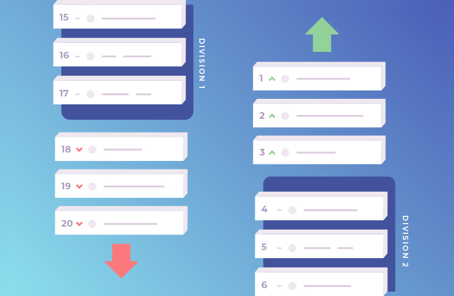
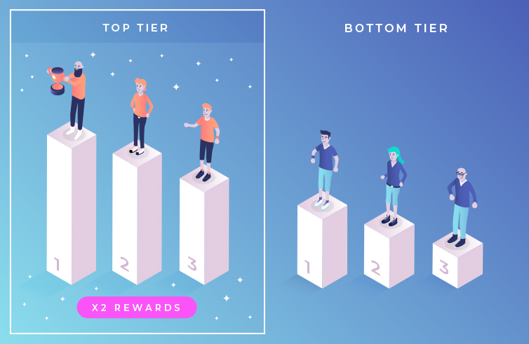

# Tiered Leagues/Seasons

League play can be used to provide an even more engaging social and competitive gameplay experience.

A league functions as a set of linked [leaderboards](../concepts/leaderboards.md) where each leaderboard represents a particular "tier" of your league's hierarchy. At the beginning of the league "season", all players start in the first (bottom) tier. A desired play period is implemented during which players compete against all others in their specific tier. At the end of each play period, a certain set of players at the top of the leaderboard are promoted to the next tier and a certain set at the bottom of the leaderboard are relegated to a lower tier.

Players receive rewards at the end of each play period. The amount and kind of reward is determined by their tier and ranking within it, helping to drive player competition and engagement throughout the league duration.

Leagues can be customized to suit your particular game and needs. The rewards given are dependent on your game's economy, and you may decide to have players pay an entry fee to join the league. You can create an unlimited number of player tiers, using any promotion and relegation logic desired. This could be the creation of promotion and relegation zones on each leaderboard based on percentages (or other metrics), or a defined number of players (e.g top and bottom 10) to be promoted and relegated after each play period.

For our example below, we use a two tiered league where the top three players after each weekly play period are promoted, and the bottom three players each week are relegated. The in-game currency rewards double in value between the bottom and top tiers of the league.

## Create tier leaderboards

Here we create two linked leaderboards for our league, one each for the lower and top tier, that will reset every week.

=== "Go"
    ```go
    // Create the two tiers of leaderboards
    bottomTierId := "bottom-tier"
    topTierId := "top-tier"
    authoritative := true
    sortOrder := "desc"
    operator := "inc"
    resetSchedule := "0 0 * * 1"
    metadata := make(map[string]interface{})
    nk.LeaderboardCreate(ctx, bottomTierId, authoritative, sortOrder, operator, resetSchedule, metadata)
    nk.LeaderboardCreate(ctx, topTierId, authoritative, sortOrder, operator, resetSchedule, metadata)
    ```
=== "TypeScript"
    ```typescript
    // Create the two tiers of leaderboards
    let bottomTierId = "bottom-tier";
    let topTierId = "top-tier";
    let authoritative = true;
    let sortOrder = nkruntime.SortOrder.DESCENDING;
    let operator = nkruntime.Operator.INCREMENTAL;
    let resetSchedule = "0 0 * * 1";
    let metadata = {};
    nk.leaderboardCreate(bottomTierId, authoritative, sortOrder, operator, resetSchedule, metadata);
    nk.leaderboardCreate(topTierId, authoritative, sortOrder, operator, resetSchedule, metadata);
    ```
=== "Lua"
    ```lua
    -- Create the two tiers of leaderboards
    local bottom_tier_id = "bottom-tier"
    local top_tier_id = "top-tier"
    local authoritative = true
    local sort = "desc"
    local operator = "best"
    local reset = "0 0 * * 1"
    local metadata = {}
    nk.leaderboard_create(bottom_tier_id, authoritative, sort, operator, reset, metadata)
    nk.leaderboard_create(top_tier_id, authoritative, sort, operator, reset, metadata)
    ```

## Promotion and relegation

After each weekly play period ends, we promote the top three players from the lower tier to the top tier. Correspondingly, we also relegate the bottom three players from the top tier to the lower one.



Keep in mind that at the beginning all players are in the bottom tier, so we must first check that there are sufficient players advanced to the top tier before performing any relegation.

=== "Go"
    ```go
    // Register leaderboard reset function to handle promotions and relegations
    initializer.RegisterLeaderboardReset(func(ctx context.Context, logger runtime.Logger, db *sql.DB, nk runtime.NakamaModule, leaderboard *api.Leaderboard, reset int64) error {
        // We're only interested in our top/bottom tier leaderboards so return if it isn't them
        if leaderboard.Id != topTierId && leaderboard.Id != bottomTierId {
            return nil
        }

        // Get all leaderboard records (assuming the tier has no more than 10,000 players)
        records, _, _, _, _ := nk.LeaderboardRecordsList(ctx, leaderboard.Id, []string{}, 10000, "", reset)

        // If leaderboard is top tier and has 10 or more players, relegate bottom 3 players
        if leaderboard.Id == topTierId && len(records) >= 10 {
            for _, record := range records[len(records)-3:] {
                // Relegate record owner by copying their record into the bottom tier and deleting their current top tier record
                nk.LeaderboardRecordWrite(ctx, bottomTierId, record.OwnerId, record.Username.Value, record.Score, record.Subscore, nil, nil)
                nk.LeaderboardRecordDelete(ctx, topTierId, record.OwnerId)
            }
        }

        // If leaderboard is bottom tier and has 10 or more players, promote top 3 players
        if leaderboard.Id == bottomTierId && len(records) >= 10 {
            for _, record := range records[0:2] {
                // Promote record owner by copying their record into the top tier and deleting their current bottom tier record
                nk.LeaderboardRecordWrite(ctx, topTierId, record.OwnerId, record.Username.Value, record.Score, record.Subscore, nil, nil)
                nk.LeaderboardRecordDelete(ctx, bottomTierId, record.OwnerId)
            }
        }

        return nil
    })
    ```
=== "TypeScript"
    ```typescript
    // Register leaderboard reset function to handle promotions and relegations
    let leaderboardReset: nkruntime.LeaderboardResetFunction = (ctx: nkruntime.Context, logger: nkruntime.Logger, nk: nkruntime.Nakama, leaderboard: nkruntime.Leaderboard, reset: number) => {
        // We're only interested in our top/bottom tier leaderboards so return if it isn't them
        if (leaderboard.id !== topTierId && leaderboard.id !== bottomTierId) {
            return;
        }

        // Get all leaderboard records (assuming the tier has no more than 10,000 players)
        let result = nk.leaderboardRecordsList(leaderboard.id, null, 10000, null, reset);

        // If leaderboard is top tier and has 10 or more players, relegate bottom 3 players
        if (leaderboard.id === topTierId && result.records.length >= 10) {
            // Relegate record owner by copying their record into the bottom tier and deleting their current top tier record
            result.records.slice(result.records.length-3).forEach(r => {
                nk.leaderboardRecordWrite(bottomTierId, r.ownerId, r.username, r.score, r.subscore, null, null);
                nk.leaderboardRecordDelete(topTierId, r.ownerId);
            });
        }

        // If leaderboard is bottom tier and has 10 or more players, promote top 3 players
        if (leaderboard.id === topTierId && result.records.length >= 10) {
            // Promote record owner by copying their record into the top tier and deleting their current bottom tier record
            result.records.slice(0, 3).forEach(r => {
                nk.leaderboardRecordWrite(topTierId, r.ownerId, r.username, r.score, r.subscore, null, null);
                nk.leaderboardRecordDelete(bottomTierId, r.ownerId);
            });
        }
    };
    initializer.registerLeaderboardReset(leaderboardReset);
    ```
=== "Lua"
    ```lua
    -- Register leaderboard reset function to handle promotions and relegations
    local function leaderboardReset(ctx, leaderboard, reset)
        -- We're only interested in our top/bottom tier leaderboards so return if it isn't them
        if leaderboard.id ~= bottom_tier_id and leaderboard.id ~= top_tier_id then
            return
        end

        -- Get all leaderboard records (assuming the tier has no more than 10,000 players)
        local records, _, _, _ = nk.leaderboard_records_list(leaderboard.id, {}, 10000)

        -- If leaderboard is top tier and has 10 or more players, relegate bottom 3 players
        if leaderboard.id == top_tier_id and #records >= 10 then
            -- Relegate record owner by copying their record into the bottom tier and deleting their current top tier record
            for i=3, 1, -1 do
                local record = records[#records-i]
                nk.leaderboard_record_write(bottom_tier_id, record.owner, record.username, record.score, record.subscore, {})
                nk.leaderboard_record_delete(top_tier_id, record.owner)
            end
        end

        -- If leaderboard is bottom tier and has 10 or more players, promote top 3 players
        if leaderboard.id == bottom_tier_id and #records >= 10 then
            -- Promote record owner by copying their record into the top tier and deleting their current top tier record
            for i=1, 3, 1 do
                local record = records[i]
                nk.leaderboard_record_write(top_tier_id, record.owner, record.username, record.score, record.subscore, {})
                nk.leaderboard_record_delete(bottom_tier_id, record.owner)
            end
        end
    end
    nk.register_leaderboard_reset(leaderboardReset)
    ```

## Rewards



Also at the conclusion of each weekly play period, we distribute rewards to all players inline with their tier and respective ranking within it.

=== "Go"
    ```go
    // Register leaderboard reset function to handle promotions and relegations
    initializer.RegisterLeaderboardReset(func(ctx context.Context, logger runtime.Logger, db *sql.DB, nk runtime.NakamaModule, leaderboard *api.Leaderboard, reset int64) error {
        // Relegation/Promotion code as above...

        // Distribute rewards based on player's tier
        for _, record := range records {
            reward := int64(100)

            // Increase reward for top tier players
            if leaderboard.Id == topTierId {
                reward = 500
            }

            changeset := map[string]int64 {
                "coins": reward,
            }

            nk.WalletUpdate(ctx, record.OwnerId, changeset, nil, true)
        }

        return nil
    })
    ```
=== "TypeScript"
    ```typescript
    // Register leaderboard reset function to handle promotions and relegations
    let leaderboardReset: nkruntime.LeaderboardResetFunction = (ctx: nkruntime.Context, logger: nkruntime.Logger, nk: nkruntime.Nakama, leaderboard: nkruntime.Leaderboard, reset: number) => {
        // Relegation/Promotion code as above...

        // Distribute rewards based on player's tier
        result.records.forEach(r => {
            let reward = 100;

            // Increase reward for top tier players
            if (leaderboard.id === topTierId) {
                reward = 500;
            }

            let changeset = {
                coins: reward
            };

            nk.walletUpdate(r.ownerId, changeset, null, true);
        });
    };
    ```
=== "Lua"
    ```lua
    -- Register leaderboard reset function to handle promotions and relegations
    local function leaderboardReset(ctx, leaderboard, reset)
        -- Relegation/Promotion code as above...

        -- Distribute rewards based on player's tier
        for i=1, #records do
            local record = records[i]
            local reward = 100

            -- Increase reward for top tier players
            if leaderboard.id == top_tier_id then
                reward = 500
            end

            local changeset = {
                coins = reward
            }

            nk.wallet_update(record.owner, changeset, {}, true)
        end
    end
    ```

## Example file

Download a complete example file for this league: [Go](./examples/league.go), [TypeScript](./examples/league.ts), [Lua](./examples/league.lua)
