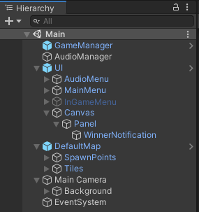
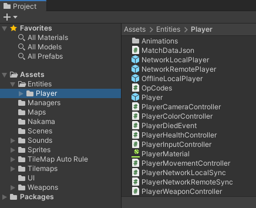
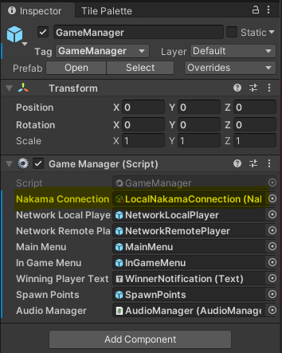
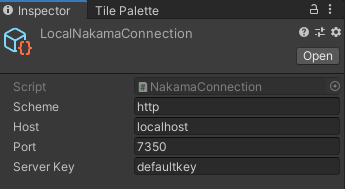

# Fish Game Unity Tutorial

<iframe width="560" height="315" src="https://www.youtube.com/embed/c-5nmkXXWQ8" title="YouTube video player" frameborder="0" allow="accelerometer; autoplay; clipboard-write; encrypted-media; gyroscope; picture-in-picture" allowfullscreen></iframe>

Fish Game is an open-source game project developed using the Unity game engine. It is a fast-paced 2D competitive shooter, inspired by [Duck Game](https://store.steampowered.com/app/312530/Duck_Game/), for up to four players.

This game and tutorial highlight the powerful [authentication](../../concepts/authentication.md), [matchmaking](../../concepts/matches.md), and [realtime multiplayer](../../concepts/client-relayed-multiplayer.md) features of Nakama.

!!! note "Note"
    Check out the accompanying [blog post](https://heroiclabs.com/blog/tutorials/unity-fishgame/) and [video series](https://www.youtube.com/playlist?list=PLOAExZcDNj9tut2gSUlw46OKK4iB--uW1) to this tutorial for additional content.

## Prerequisites

To easily follow with this tutorial, perform the following before proceeding:

* [Install Nakama](../../getting-started/docker-quickstart.md)
* [Download](https://unity3d.com/get-unity/download) and install Unity 2019.4
* [Install the Nakama Unity SDK](https://github.com/heroiclabs/nakama-unity)
* [Download the Fish Game Unity project](https://github.com/heroiclabs/fishgame-unity)
* Familiarize yourself with the [Project](#project-hierarchy) and [Asset](#asset-hierarchy) hierarchies

### Project hierarchy

Open the Fish Game project in Unity and see the project hierarchy:



The following game objects are listed:

* **GameManager**: Controls all match specific game logic, including handling matchmaking.
* **AudioManager**: Handles the game audio.
* **UI**
    * **AudioMenu**: A simple audio mute toggle.
    * **MainMenu**: Menu enabling the player to find a match, cancel a matchmaking request, or view the credits.
    * **InGameMenu**: Menu that the player can invoke mid-game by pressing ESC to quit the match.
    * **Canvas**: A UI canvas that simply contains the winning player notification label.
* **DefaultMap**: The game level including spawn points and tilemap.
* **Main Camera**: The game 2D camera and a background sprite.
* **EventSystem**: The default Unity event system that handles UI interaction.

### Asset hierarchy



The relevant folders for Nakama features are:

* **Entities** > **Player**: Contains the player prefabs, three in total, and all `MonoBehaviour` components associated with them.
* **Managers**: Contains the components responsible for handling global game elements (e.g. `GameManager`) and various menu scripts.
* **Nakama**: Contains the `NakamaConnection` class, which is a `ScriptableObject`, and the `LocalNakamaConnection` asset.
* **Weapons**: Contains the components responsible for handling weapons and projectiles.

## Connecting to Nakama

From the Asset hierarchy, above, you see that our Fish Game project already contains a `NakamaConnection` class and `LocalNakamaConnection` asset.
The `NakamaConnection` inherits from Unity’s `ScriptableObject` class, meaning we can create instances of the `NakamaConnection` class in our project and save them as assets that can be passed as dependencies to other scripts in our game.

To learn about how to connect to our Nakama server, let’s open up the `NakamaConnection.cs` file. After declaring our `NakamaConnection` class, we have defined some public variables that allow us to specify which Nakama server this connection object should connect to:

=== "NakamaConnection.cs"
    ```csharp
    public string Scheme = "http";
    public string Host = "localhost";
    public int Port = 7350;
    public string ServerKey = "defaultkey";
    ```

Next let's look at the workings of the `Connect` function. First we create an instance of the `Nakama.Client` object and pass in our connection values:

=== "NakamaConnection.cs"
    ```csharp
    Client = new Nakama.Client(Scheme, Host, Port, ServerKey, UnityWebRequestAdapter.Instance);
    ```

This `Client` object is then used to interact with Nakama.

Next we attempt to restore an existing user session, for example, if a user previously launched the game and connected to the Nakama server we want to restore that same session if it hasn’t already expired:

=== "NakamaConnection.cs"
    ```csharp
    var authToken = PlayerPrefs.GetString(SessionPrefName);
    if (!string.IsNullOrEmpty(authToken))
    {
        var session = Nakama.Session.Restore(authToken);
        if (!session.IsExpired)
        {
            Session = session;
        }
    }
    ```

Here  we attempt to get an authentication token from `PlayerPrefs`. If found, we call the `Nakama.Session.Restore` function and pass in the authentication token to retrieve a `Session` object. We also perform a check to ensure that the session has not already expired. If the session has not expired, we assign this session object to our private `Session` variable. Otherwise, we need to reauthenticate to create a brand new session.

This happens inside an `if` statement that checks if the `Session` variable is null:

=== "NakamaConnection.cs"
    ```csharp
    // If we weren't able to restore an existing session, authenticate to create a new user session.
    if (Session == null)
    {
        string deviceId;
    
    // ...
    ```

This means we have two potential paths, either the user has played the game before and we have stored their device’s unique identifier or this is their first time playing and we need to get a unique identifier for their device to authenticate with the Nakama server.

For a previous player, we check to see if there is already a value for the `DeviceIdentifierPrefName` key in `PlayerPrefs` and, if yes, grab the value and store it in the `deviceId` variable to be used later in the function:

=== "NakamaConnection.cs"
    ```csharp
    // If we've already stored a device identifier in PlayerPrefs then use that.
    if (PlayerPrefs.HasKey(DeviceIdentifierPrefName))
    {
        deviceId = PlayerPrefs.GetString(DeviceIdentifierPrefName);
    }
    ```

For a new player we attempt to grab their device’s unique identifier from `SystemInfo.deviceUniqueIdentifier`. If this does not return an appropriate identifier value, it will return a value of `SystemInfo.unsupportedIdentifier`.

We can check for this and, if we receive this value, generate our own unique identifier using a Guid before storing it in `PlayerPrefs` for future use:

=== "NakamaConnection.cs"
    ```csharp
    if (deviceId == SystemInfo.unsupportedIdentifier)
    {
        deviceId = System.Guid.NewGuid().ToString();
    }

    // Store the device identifier to ensure we use the same one each time from now on.
    PlayerPrefs.SetString(DeviceIdentifierPrefName, deviceId);
    ```

We can now authenticate with the Nakama server and store the authentication token to `PlayerPrefs`:

=== "NakamaConnection.cs"
    ```csharp
    // Use Nakama Device authentication to create a new session using the device identifier.
    Session = await Client.AuthenticateDeviceAsync(deviceId);

    // Store the auth token that comes back so that we can restore the session later if necessary.
    PlayerPrefs.SetString(SessionPrefName, Session.AuthToken);
    ```

Now that we have a valid Nakama Session we go ahead and open a `Socket`:

=== "NakamaConnection.cs"
    ```csharp
    // Open a new Socket for realtime communication.
    Socket = Client.NewSocket(true);
    await Socket.ConnectAsync(Session, true);
    ```

This allows us to begin communicating with the Nakama server and the other players connected to our game. Calling this connection in Fish Game is accomplished via the `GameManager` object:



### Creating a connection

By using the `CreateAssetMenu` attribute and defining public variables for our connection, this enables us to modify each `NakamaConnection` asset in the Unity Inspector.

This makes it simple to connect to multiple Nakama servers when needed, for example when you have a local, development, and production server.

To create a new Nakama connection asset:

1. From the **Assets** menu, select **Create** > **Nakama Connection**.
2. In the **Inspector** pane, edit the connection properties:
    * Scheme: The connection scheme, whether `http` or `https`.
    * Host: The host name or IP of the server.
    * Port: The port used, `7350` by default.
    * Server Key: The secret key for connecting to the server, `defaultKey` by default.

    

!!! note "Note"
    For production assets, be sure to add `NakamaConnection` assets to your `.gitignore` file so that you don’t commit them to source control and expose your production server secret key. For example:
    ```
    # Heroic Cloud Nakama Connection asset
    HeroicCloudNakamaConnection.asset
    HeroicCloudNakamaConnection.asset.meta
    ```

## Matchmaking

!!! note "Note"
    Our [documentation](../../concepts/matches.md) covers matchmaking in Nakama in more detail.

To review how matchmaking in Fish Game works, we will dive into the `GameManager`, `NakamaConnection`, and `MainMenu` classes and explore the relevant functions.

Here you are creating a new `Dictionary` to store the connected players and subscribing to the following events:

* **ReceivedMatchmakerMatched**: Enables you to react when Nakama has found a match.
* **ReceivedMatchPresence**: Enables you to react when player(s) join or leave the match.
* **ReceivedMatchState**: Enables you to react when receiving a message from the Nakama server.

=== "GameManager.cs"
    ```csharp
    /// <summary>
    /// Called by Unity when the GameObject starts.
    /// </summary>
    private async void Start()
    {
    // Create an empty dictionary to hold references to the currently connected players.
    players = new Dictionary<string, GameObject>();

    // ...

    // Setup network event handlers.
    NakamaConnection.Socket.ReceivedMatchmakerMatched += OnReceivedMatchmakerMatched;
    NakamaConnection.Socket.ReceivedMatchPresence += OnReceivedMatchPresence;
    NakamaConnection.Socket.ReceivedMatchState += async m => await OnReceivedMatchState(m);

    // ...
    }
    ```

From the `MainMenu` class, you can see how the matchmaking request is triggered via the `FindMatch` function.
Here you are calling the `FindMatch` function on the `NakamaConnection` class via a reference on the `GameManager`, and passing in the amount of players (selected via drop-down) to match with:

=== "MainMenu.cs"
    ```csharp
    /// <summary>
    /// Begins the matchmaking process.
    /// </summary>
    public async void FindMatch()
    {
    // ...

    await gameManager.NakamaConnection.FindMatch(int.Parse(PlayersDropdown.options[PlayersDropdown.value].text));
    }
    ```

In the `FindMatch` function in the `NakamaConnection` class, a `Dictionary` is declared with a single `key,value` pair that specifies we’re using the Unity engine, and a function to add this request to the matchmaking pool based on this filter and any other specified parameters:

=== "NakamaConnection.cs"
    ```csharp
    /// <summary>
    /// Starts looking for a match with a given number of minimum players.
    /// </summary>
    public async Task FindMatch(int minPlayers = 2)
    {
    // Set some matchmaking properties to ensure we only look for games that are using the Unity client.
    // This is not a required when using the Unity Nakama SDK,
    // however in this instance we are using it to differentiate different matchmaking requests across multiple platforms using the same Nakama server.
    var matchmakingProperties = new Dictionary<string, string>
    {
        { "engine", "unity" }
    };

    // Add this client to the matchmaking pool and get a ticket.
    var matchmakerTicket = await Socket.AddMatchmakerAsync("+properties.engine:unity", minPlayers, minPlayers, matchmakingProperties);
    currentMatchmakingTicket = matchmakerTicket.Ticket;
    }
    ```

Nakama will then respond by giving you a `MatchmakingTicket`. This ticket is what allows you to join a match that Nakama has found, or to cancel your existing matchmaking request:

=== "NakamaConnection.cs"
    ```csharp
    /// <summary>
    /// Cancels the current matchmaking request.
    /// </summary>
    public async Task CancelMatchmaking()
    {
        await Socket.RemoveMatchmakerAsync(currentMatchmakingTicket);
    }
    ```

Now that you have been added to the matchmaking pool, Nakama searches for a match and notifies you via the `ReceivedMatchmakerMatched` event listener when one is found:

=== "GameManager.cs"
    ```csharp
    /// <summary>
    /// Called when a MatchmakerMatched event is received from the Nakama server.
    /// </summary>
    /// <param name="matched">The MatchmakerMatched data.</param>
    private async void OnReceivedMatchmakerMatched(IMatchmakerMatched matched)
    {
        // Cache a reference to the local user.
        localUser = matched.Self.Presence;

        // Join the match.
        var match = await NakamaConnection.Socket.JoinMatchAsync(matched);

        // ...

        // Spawn a player instance for each connected user.
        foreach (var user in match.Presences)
        {
            SpawnPlayer(match.Id, user);
        }

        // Cache a reference to the current match.
        currentMatch = match;
    }
    ```

The stored reference to the `Self.Presence` value enables quick and easy access to the local player’s Nakama presence, useful for grabbing things such as their Session ID, User ID and Username.

The stored reference to the `JoinMatchAsync()` return value enables access to things such as the current match ID and connected users.

Next we loop through all of the connected users via the `match.Presences` property and [spawn a player](#spawning-players) for each.

The final thing to consider for matchmaking is what to do when a user connects and disconnects. This is done via the `OnReceivedMatchPresence` event handler:

=== "GameManager.cs"
    ```csharp
    /// <summary>
    /// Called when a player/s joins or leaves the match.
    /// </summary>
    /// <param name="matchPresenceEvent">The MatchPresenceEvent data.</param>
    private void OnReceivedMatchPresence(IMatchPresenceEvent matchPresenceEvent)
    {
        // For each new user that joins, spawn a player for them.
        foreach (var user in matchPresenceEvent.Joins)
        {
            SpawnPlayer(matchPresenceEvent.MatchId, user);
        }

        // For each player that leaves, despawn their player.
        foreach (var user in matchPresenceEvent.Leaves)
        {
            if (players.ContainsKey(user.SessionId))
            {
                Destroy(players[user.SessionId]);
                players.Remove(user.SessionId);
            }
        }
    }
    ```

Here the `IMatchPresenceEvent` gives us two things, a list of users who have joined the match and a list of users who have left the match.

For users who have joined, we spawn a player object for them just like we did in the `OnReceivedMatchmakerMatched` event handler.

For users who have left, we check to see if we currently have a reference for that user in the `players` Dictionary based on their Session ID. If we do, we first destroy the `GameObject` for that player, followed by removing them from our players `Dictionary`.

## Spawning players

Here we review the `SpawnPlayer` function called by the `GameManager` in response to matchmaking or user presence events.

First we perform a check to see if we already have a reference to this user in our players Dictionary based on their Session ID. If yes, we return early as we have already spawned this player:

=== "GameManager.cs"
    ```csharp
    // If the player has already been spawned, return early.
    if (players.ContainsKey(user.SessionId))
    {
        return;
    }
    ```

Next we determine where to spawn this player. If a `spawnIndex` hasn’t been passed (`spawnIndex == -1`) then we choose a random spawn point for this player. If a spawn index has been passed we will use that instead:

=== "GameManager.cs"
    ```csharp
    // If the spawnIndex is -1 then pick a spawn point at random, otherwise spawn the player at the specified spawn point.
    var spawnPoint = spawnIndex == -1 ?
        SpawnPoints.transform.GetChild(Random.Range(0, SpawnPoints.transform.childCount - 1)) :
        SpawnPoints.transform.GetChild(spawnIndex);
    ```

Next we check to see whether or not this player is our own local player or a remote player. Based on this we decide which Player prefab to spawn, and then instantiate an instance of the prefab within the game at the relevant spawn point:

=== "GameManager.cs"
    ```csharp
    // Set a variable to check if the player is the local player or not based on session ID.
    var isLocal = user.SessionId == localUser.SessionId;

    // Choose the appropriate player prefab based on if it's the local player or not.
    var playerPrefab = isLocal ? NetworkLocalPlayerPrefab : NetworkRemotePlayerPrefab;

    // Spawn the new player.
    var player = Instantiate(playerPrefab, spawnPoint.transform.position, Quaternion.identity);
    ```

Next we see if this is a remotely connected player and, if so, grab a reference to the `PlayerNetworkRemoteSync` component and set appropriate network data. We pass it the current Match ID and a reference to this user’s `IUserPresence` object:

=== "GameManager.cs"
    ```csharp
    // Setup the appropriate network data values if this is a remote player.
    if (!isLocal)
    {
        player.GetComponent<PlayerNetworkRemoteSync>().NetworkData = new RemotePlayerNetworkData
        {
            MatchId = matchId,
            User = user
        };
    }
    ```

This is used when receiving data to check if that data is meant for that specific player.

We then add the player to our `players` Dictionary using their Session ID as the key and passing in the player `GameObject` as the value:

=== "GameManager.cs"
    ```csharp
    // Add the player to the players array.
    players.Add(user.SessionId, player);
    ```

Next we check to see if this is our local player and, if so, setup an event listener on their `PlayerDied` event:

=== "GameManager.cs"
    ```csharp
    // If this is our local player, add a listener for the PlayerDied event.
    if (isLocal)
    {
        localPlayer = player;
        player.GetComponent<PlayerHealthController>().PlayerDied.AddListener(OnLocalPlayerDied);
    }
    ```

## Player prefabs

Found in then **Entities** > **Player** folder, Fish Game has two player prefabs: `NetworkLocalPlayer` and `NetworkRemotePlayer`.

### NetworkLocalPlayer


This is a simple wrapper around the network agnostic Player prefab, which has components to handle movement, physics, weapon and colour. The root `GameObject` of this prefab has a few noteworthy components:

* **PlayerNetworkLocalSync**: Handles sending out state updates across the network at a specific interval.
* **PlayerInputController**: Handles player input and passes it to the underlying movement controller.
* **PlayerHealthController** Handles player health and is responsible for triggering the `PlayerDied` event.
* **PlayerCameraController** A simple component that ensures the camera follows this player.

### NetworkRemotePlayer


Also a wrapper around the Player prefab, here we have just one component on the root: `PlayerNetworkRemoteSync`.

This component receives state updates from the network and handles the smooth interpolation of it’s current state to the new correct state received. For example, if this object was at position `{ 100, 100 }` and we received a network message to say that the correct position should be `{ 120, 100 }`, this component would handle smoothly correcting this objects position over `LerpTime` seconds.

## Sending player position

To review how we send out position and input updates across the network from `NetworkLocalPlayer`, let's look at `Entities` > `Player` > `PlayerNetworkLocalSync.cs`.

First we have a public variable that determines how often network state syncs updates are sent:

=== "PlayerNetworkLocalSync.cs"
    ```csharp
    /// <summary>
    /// How often to send the player's velocity and position across the network, in seconds.
    /// </summary>
    public float StateFrequency = 0.1f;
    ```

Changing the value here will increase or decrease the frequency with which state updates are sent across the network. Finding a good balance here is a crucial part of creating a smooth feeling multiplayer game.

You can see the default value here of `0.1f`, or 10 ticks per second. For our Fish Game example, let's set this to `0.05f`, doubling our rate to 20 ticks per second:

```csharp
public float StateFrequency = 0.1f;
```

A faster rate will send updates more frequently, which should result in a smoother feel for other players, while sending updates less frequently will result in player positions becoming out of sync on other connected clients and the interpolations/corrections being much more jarring.

Next let's focus on the `LateUpdate` function, used as we only want to send updates after the player’s position has been updated. First is a check to see if the state sync timer has elapsed and, if so, then we need to send a new update:

=== "PlayerNetworkLocalSync.cs"
    ```csharp
    // Send a network packet containing the player's velocity and position.
    gameManager.SendMatchState(
        OpCodes.VelocityAndPosition,
        MatchDataJson.VelocityAndPosition(playerRigidbody.velocity, playerTransform.position));
    ```

Next we check to see if the local player’s input has changed since the last time this function ran and, if not, return early:

=== "PlayerNetworkLocalSync.cs"
    ```csharp
    // If the players input hasn't changed, return early.
    if (!playerInputController.InputChanged)
    {
        return;
    }
    ```

Finally, we send the player’s current input across the network:

=== "PlayerNetworkLocalSync.cs"
    ```csharp
    // Send network packet with the player's current input.
    gameManager.SendMatchState(
        OpCodes.Input,
        MatchDataJson.Input(playerInputController.HorizontalInput, playerInputController.Jump, playerInputController.JumpHeld, playerInputController.Attack)
    );
    ```

### Operation codes

Used in the functions above, operation codes (`OpCodes`) are a numeric representation of specific network actions that can occur in the game.

You can see all the `OpCodes` we have in Fish Game by looking at `Entities` > `Player`> `OpCodes.cs`. These include:

* `VelocityAndPosition`: See above. Send a network message containing the player's velocity and position.
* `Input`: See above. Indicates that a player's input has changed since the last update, and sends a message with the current input.
* `Died`: Indicates death of a player, after which their GameObject is destroyed and they are removed from the `players` Dictionary.
* `Respawned`: Send a message across the network informing other players where you have spawned.
* `NewRound`: Send a message across the network informing other players that you won, and initiate a new round.

## Receiving player position

To review how we receive position and input updates across the network from a `NetworkRemotePlayer`, let's look at `Entities` > `Player` > `PlayerNetworkRemoteSync.cs`.

First we have two public variables: one storing a reference to the current Match ID as well as the player’s `IUserPresence` object, and the other determining the speed at which we interpolate the player’s position:

=== "PlayerNetworkRemoteSync.cs"
    ```csharp
    public RemotePlayerNetworkData NetworkData;

    /// <summary>
    /// The speed (in seconds) in which to smoothly interpolate to the player's actual position when receiving corrected data.
    /// </summary>
    public float LerpTime = 0.05f;
    ```

Within the `Start` function, we set up a a listener for whenever we receive data from the network:

=== "PlayerNetworkRemoteSync.cs"
    ```csharp
    // Add an event listener to handle incoming match state data.
    gameManager.NakamaConnection.Socket.ReceivedMatchState += OnReceivedMatchState;

    // ...

    /// <summary>
    /// Called when receiving match data from the Nakama server.
    /// </summary>
    /// <param name="matchState">The incoming match state data.</param>
    private void OnReceivedMatchState(IMatchState matchState)
    {
        // If the incoming data is not related to this remote player, ignore it and return early.
        if (matchState.UserPresence.SessionId != NetworkData.User.SessionId)
        {
            return;
        }

        // Decide what to do based on the Operation Code of the incoming state data as defined in OpCodes.
        switch (matchState.OpCode)
        {
            case OpCodes.VelocityAndPosition:
                UpdateVelocityAndPositionFromState(matchState.State);
                break;
            case OpCodes.Input:
                SetInputFromState(matchState.State);
                break;
            case OpCodes.Died:
                playerMovementController.PlayDeathAnimation();
                break;
            default:
                break;
        }
    }
    ```

Here, we first determine whether or not the message we are receiving is meant for this object or not by comparing this object’s `NetworkData.User.SessionId` with the `matchState.UserPresence.SessionId` value:

* **If they do not match**, we don’t need to handle this message and return early from this function.
* **If they do match**, we perform a switch on the `matchState.OpCode`. Depending on the `OpCode` we pass the state to one of three functions to be handled, either for:
    * [Receiving position and velocity](#receiving-position-and-velocity)
    * [Receiving input](#receiving-input)
    * [When a player dies](#when-a-player-dies)

### Receiving position and velocity

For this, let's look at the `UpdateVelocityAndPositionFromState` function:

=== "PlayerNetworkRemoteSync.cs"
    ```csharp
    /// <summary>
    /// Updates the player's velocity and position based on incoming state data.
    /// </summary>
    /// <param name="state">The incoming state byte array.</param>
    private void UpdateVelocityAndPositionFromState(byte[] state)
    {
        var stateDictionary = GetStateAsDictionary(state);

        playerRigidbody.velocity = new Vector2(float.Parse(stateDictionary["velocity.x"]), float.Parse(stateDictionary["velocity.y"]));

        var position = new Vector3(
            float.Parse(stateDictionary["position.x"]),
            float.Parse(stateDictionary["position.y"]),
            0);

        // Begin lerping to the corrected position.
        lerpFromPosition = playerTransform.position;
        lerpToPosition = position;
        lerpTimer = 0;
        lerpPosition = true;
    }
    ```

Here we grab the state as a `Dictionary<string, string>` using the helper function `GetStateAsDictionary`, then update the player’s rigid body velocity property with the incoming `velocity.x` and `velocity.y` values.

Next we create a new `Vector3` with the incoming `position.x` and `position.y` values. We then begin the interpolation process by setting the player’s current position as the `lerpFromPosition` and the new position as the `lerpToPosition`. We reset the lerp timer and set the `lerpPosition` value to `true` which will ensure the the interpolation code that lives in `LateUpdate` will run.

### Receiving input

For this, let's look at the `SetInputFromState` function:

=== "PlayerNetworkRemoteSync.cs"
    ```csharp
    /// <summary>
    /// Sets the appropriate input values on the PlayerMovementController and PlayerWeaponController based on incoming state data.
    /// </summary>
    /// <param name="state">The incoming state Dictionary.</param>
    private void SetInputFromState(byte[] state)
    {
        var stateDictionary = GetStateAsDictionary(state);

        playerMovementController.SetHorizontalMovement(float.Parse(stateDictionary["horizontalInput"]));
        playerMovementController.SetJump(bool.Parse(stateDictionary["jump"]));
        playerMovementController.SetJumpHeld(bool.Parse(stateDictionary["jumpHeld"]));

        if (bool.Parse(stateDictionary["attack"]))
        {
            playerWeaponController.Attack();
        }
    }
    ```

Again we grab the state as a `Dictionary<string, string>`, then set the appropriate values on the `PlayerMovementController` from the incoming state data.If the `stateDictionary["attack"]` value is `true` we also update the `PlayerWeaponController` by calling the `Attack` function.

A final consideration here is the `OnDestroy` function. It is always good practice to remove event listeners when no longer needed, such as the `OnReceivedMatchState` handler here when this object is destroyed:

=== "PlayerNetworkRemoteSync.cs"
    ```csharp
    /// <summary>
    /// Called when this GameObject is being destroyed.
    /// </summary>
    private void OnDestroy()
    {
        if (gameManager != null)
        {
            gameManager.NakamaConnection.Socket.ReceivedMatchState -= OnReceivedMatchState;
        }
    }
    ```

### When a player dies

To review how we handle player death let's look at the `Entities` > `Player` > `PlayerHealthController`. A `PlayerDied` event is declared, and called in the `TakeDamage` function when a player's health is less than 1:

=== "PlayerHealthController.cs"
    ```csharp
    public PlayerDiedEvent PlayerDied;

    // ...

    /// <summary>
    /// Reduces the players health by damage, triggers the PlayerDied event if health is 0 or below.
    /// </summary>
    /// <param name="damage">The amount of damage the player should receive.</param>
    public void TakeDamage(int damage = 1)
    {
        // ...

        // If health falls to 0 or below, disable player input controls, play the death animation and fire the PlayerDied event.
        if (health <= 0)
        {
            // ...
            PlayerDied.Invoke(gameObject);
        }
    }
    ```

The local player death is handled via the `OnLocalPlayerDied` function in the `GameManager` class:

=== "GameManager.cs"
    ```csharp
    /// <summary>
    /// Called when the local player dies.
    /// </summary>
    /// <param name="player">The local player.</param>
    private async void OnLocalPlayerDied(GameObject player)
    {
        // Send a network message telling everyone that we died.
        await SendMatchStateAsync(OpCodes.Died, MatchDataJson.Died(player.transform.position));

        // Remove ourself from the players array and destroy our GameObject after 0.5 seconds.
        players.Remove(localUser.SessionId);
        Destroy(player, 0.5f);
    }
    ```


Here we send a message across the network to let other players know that we died, and our location. Then we are removed from the `players` Dictionary and destroyed.

All remaining players then receive the `OpCodes.Died` network action, the response is then handled via the `OnReceivedMatchState` function:

=== "GameManager.cs"
    ```csharp
    /// <summary>
    /// Called when new match state is received.
    /// </summary>
    /// <param name="matchState">The MatchState data.</param>
    private async Task OnReceivedMatchState(IMatchState matchState)
    {
        // Get the local user's session ID.
        var userSessionId = matchState.UserPresence.SessionId;

        // If the matchState object has any state length, decode it as a Dictionary.
        var state = matchState.State.Length > 0 ? System.Text.Encoding.UTF8.GetString(matchState.State).FromJson<Dictionary<string, string>>() : null;

        // Decide what to do based on the Operation Code as defined in OpCodes.
        switch(matchState.OpCode)
        {
            case OpCodes.Died:
                // Get a reference to the player who died and destroy their GameObject after 0.5 seconds and remove them from our players array.
                var playerToDestroy = players[userSessionId];
                Destroy(playerToDestroy, 0.5f);
                players.Remove(userSessionId);

                // If there is only one player left and that us, announce the winner and start a new round.
                if (players.Count == 1 && players.First().Key == localUser.SessionId) {
                    AnnounceWinnerAndStartNewRound();
                }
                break;
            case OpCodes.Respawned:
                // Spawn the player at the chosen spawn index.
                SpawnPlayer(currentMatch.Id, matchState.UserPresence, int.Parse(state["spawnIndex"]));
                break;
            case OpCodes.NewRound:
                // Display the winning player's name and begin a new round.
                await AnnounceWinnerAndRespawn(state["winningPlayerName"]);
                break;
            default:
                break;
        }
    }
    ```

Here we are getting a reference to the Session ID of the connected user who sent the message and storing it in `userSessionId`, then see if there is any state data inside the network message by checking the `matchState.State.Length` property.

Lastly we do a switch over the `matchState.OpCode` and handle each one as necessary.

## Announcing the winner

On each player death, we destroy their `GameObject` and remove them from the `players` Dictionary based on their Session ID.

Next we check to see if they are the only player remaining. If so, the `AnnounceWinnerAndStartNewRound` function is called:

=== "GameManager.cs"
    ```csharp
    /// <summary>
    /// Sends a network message that indicates a player has won and a new round is being started.
    /// </summary>
    /// <returns></returns>
    public async void AnnounceWinnerAndStartNewRound()
    {
        // ...
        var winningPlayerName = localDisplayName;

        // Send a network message telling everyone else that we won.
        await SendMatchStateAsync(OpCodes.NewRound, MatchDataJson.StartNewRound(winningPlayerName));

        // Display the winning player message and respawn our player.
        await AnnounceWinnerAndRespawn(winningPlayerName);
    }
    ```

Here we are grabbing the winning player’s name and sending out a network message with the `OpCodes.NewRound` action telling everyone that the match has been won and the winning player. We then call the `AnnounceWinnerAndRespawn` function:

=== "GameManager.cs"
    ```csharp
    /// <summary>
    /// Displays the winning player message and respawns the player.
    /// </summary>
    /// <param name="winningPlayerName">The name of the winning player.</param>
    private async Task AnnounceWinnerAndRespawn(string winningPlayerName)
    {
        // Set the winning player text label.
        WinningPlayerText.text = string.Format("{0} won this round!", winningPlayerName);

        // Wait for 2 seconds.
        await Task.Delay(2000);

        // Reset the winner player text label.
        WinningPlayerText.text = "";

        // Remove ourself from the players array and destroy our player.
        players.Remove(localUser.SessionId);
        Destroy(localPlayer);

        // Choose a new spawn position and spawn our local player.
        var spawnIndex = Random.Range(0, SpawnPoints.transform.childCount - 1);
        SpawnPlayer(currentMatch.Id, localUser, spawnIndex);

        // Tell everyone where we respawned.
        SendMatchState(OpCodes.Respawned, MatchDataJson.Respawned(spawnIndex));
    }
    ```
This displays the winning player message and, after a short delay (2 seconds here), removes the message. Then we destroy the local player `GameObject` and remove them from the `players` Dictionary before respawning them at a random location.

## Further reading

Learn more about the topics and features in this tutorial with the following:

* [Unity Client Guide](../../client-libraries/unity-client-guide.md)
* [Authentication](../../concepts/authentication.md)
* [Sessions](../../concepts/session.md)
* [Matchmaker](../../concepts/matches.md)
