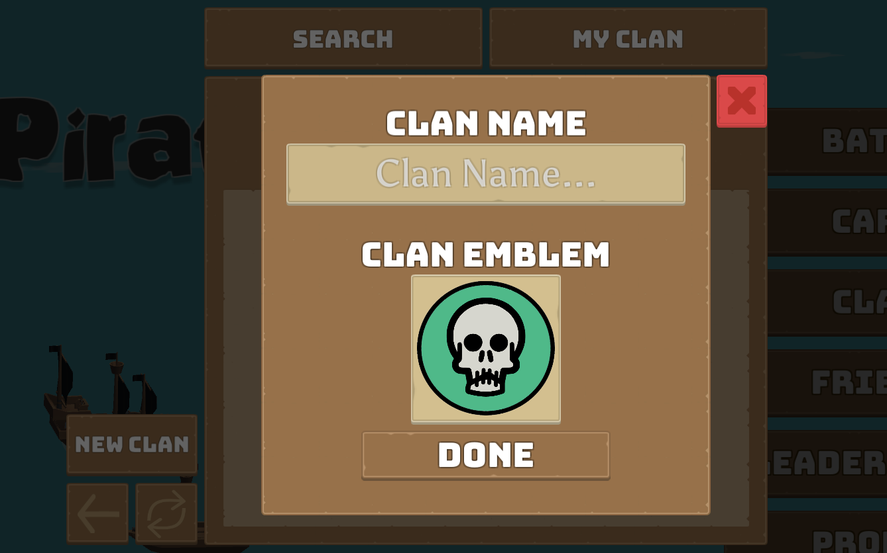
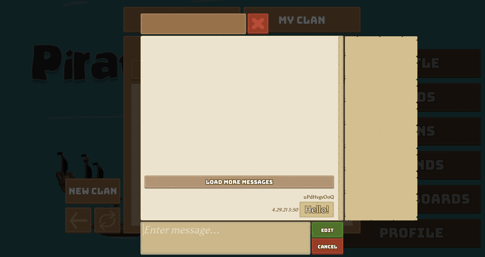
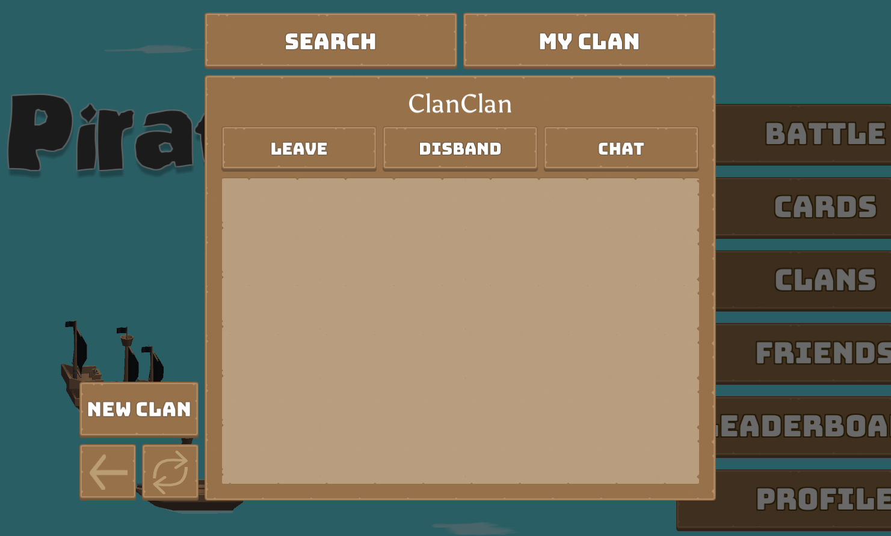

# Setting Up Clans

Nakama enables the ability to create groups, also known as clans, which are small communities for players to team up or hang out together.

With Pirate Panic, we'll learn how to enable players to:

* Create new clans
* Join or disband existing clans
* Search public clans
* Customize shared clan information, such as the name and emblem
* Chat with other members in the clan

!!! note "Note"
    This tutorial does not cover private groups, which require new players to submit join requests before being allowed to join. You can learn more about this at the [official Nakama documentation](../../../../social-groups-clans.md).

## Clans server module

Before jumping into the Unity client implementation, let's take a look at the server side.

Like other modules, we can register custom server behaviors for particular events, such as when someone creates a new clan. For groups, we're focusing on the following:

- `registerAfterJoinGroup`
- `registerAfterKickGroupUsers`
- `registerAfterLeaveGroup`
- `registerAfterPromoteGroupUsers`
- `registerAfterAddFriends`
- `registerBeforeDeleteGroup`

See the [full list of these events](https://github.com/heroiclabs/nakama-common/blob/master/runtime/runtime.go).

### Sending notifications

As an example, a function to send a notification to everyone in the clan when a new player joins would look as follows:

=== "clans.ts"
    ```typescript
    enum ClanNotificationCode {
        Refresh = 2,
        Delete = 3
    }

    function sendGroupNotification(nk: nkruntime.Nakama, groupId: string, code: ClanNotificationCode, subject: string) {
        const members = nk.groupUsersList(groupId, 100);
        const count = (members.groupUsers ?? []).length;
        if (count < 1) {
            return;
        }

        const notifications: nkruntime.NotificationRequest[] = new Array(count);
        members.groupUsers?.forEach(user => {
            const n: nkruntime.NotificationRequest = {
                code: code,
                content: {},
                persistent: false,
                subject: subject,
                userId: user.user.userId,
            }
            notifications.push(n);
        });

        nk.notificationsSend(notifications);
    }
    ```

Here we create custom notification codes to differentiate different types of notifications. These can be any positive numbers. We then obtain a list of all of the members using `groupUsersList`, and for each user in the list, we'll fetch their ID using `user.user.id` and send a `NotificationRequest` to them.

### Setting up runtime hooks

Now, we need to call the function we just created in a way that Nakama will automatically call it every time someone joins a group:

=== "clans.ts"
    ```typescript
    /**
    * Send an in-app notification to all clan members when a new member joins.
    */
    const afterJoinGroupFn: nkruntime.AfterHookFunction<void, nkruntime.JoinGroupRequest> =
        function(
            ctx: nkruntime.Context,
            logger: nkruntime.Logger,
            nk: nkruntime.Nakama,
            data: void, request: nkruntime.JoinGroupRequest) {
                sendGroupNotification(nk, request.groupId ?? "", ClanNotificationCode.Refresh, "New Member Joined!");
            }
    ```

Here we are handling a `JoinGroupRequest`, which contains a `groupId` that we can use to figure out where this notification should be sent.

We can use similar code to extend the notification functionality to other events, for example, notifying everyone in the group if someone was kicked:

=== "clans.ts"
    ```typescript
    /**
    * Send an in-app notification to all clan members when one or more members are kicked.
    */
    const afterKickGroupUsersFn: nkruntime.AfterHookFunction<void, nkruntime.KickGroupUsersRequest> =
            function(ctx: nkruntime.Context, logger: nkruntime.Logger, nk: nkruntime.Nakama, data: void, request: nkruntime.KickGroupUsersRequest) {
        sendGroupNotification(nk, request.groupId ?? "", ClanNotificationCode.Refresh, "Member(s) Have Been Kicked!");
    }
    ```

### Registering the hooks

The final step in getting our functions to work as intended is to register them in our main module. For each of the functions we just created, we can add them as follows:

=== "main.ts"
    ```typescript
        initializer.registerAfterKickGroupUsers(afterKickGroupUsersFn);
        initializer.registerAfterLeaveGroup(afterLeaveGroupFn);
        initializer.registerAfterPromoteGroupUsers(afterPromoteGroupUsersFn);
        initializer.registerAfterAddFriends(afterAddFriendsFn);
        initializer.registerBeforeDeleteGroup(beforeDeleteGroupFn);
        ...
    ```

Here each `register` function is from the [list of runtime events][https://github.com/heroiclabs/nakama-common/blob/master/runtime/runtime.go] and the parameter we pass in is one of the functions we just created in `clans.ts`.

## Creating the client

Next we'll create an interface in Unity for players to interact with the server. In Pirate Panic it will look like this:



!!! note "Note"
    This tutorial does not cover the creation of Unity UI components in detail. See the [official Unity UI tutorial](https://learn.unity.com/tutorial/ui-components#5c7f8528edbc2a002053b4d6) to learn more about this.)

Full code examples for clans can be found in the [Pirate Panic project](https://github.com/heroiclabs/unity-sampleproject/tree/master/PiratePanic/Assets/PiratePanic/Scripts/Menus/Clans).


### Creating a clan

To create a new clan we use the `CreateGroupAsync(session, name, ...)` function, where `session` is a server connection and `name` is the new clan. This function also takes in additional optional parameters which we can use to store information, such as a description or avatar image.

For the Pirate Panic clan creation panel, this looks like:

=== "ClanCreationPanel.cs"
    ```csharp
    private async void CreateClan()
    {
        string name = _clanName.text;

        try
        {
            IApiGroup group = await _connection.Client.CreateGroupAsync(_connection.Session, name, "A super great clan.", _avatarImage.name);
            if (OnClanCreated != null)
            {
                OnClanCreated(group);
            }
        }
        catch (ApiResponseException e)
        {
            Debug.LogError("Error creating clan: " + e.Message);
        }
    }
    ```

In the snippet above:

* `_clanName`: A Unity textbox where players can enter the new clan's name. We are fetching its text here.
* `_connection`: The `GameConnection` object initialized earlier in the code.
* Two optional parameters provided are a description and avatar name.
* Once the clan is created the `OnClanCreated` function is called. This property was assigned on `Awake` in [ClansMenuUI.cs].


Finally, we wrap this async function around a function and bind that to a button action:

=== "ClanCreationPanel.cs"
    ```csharp
    ...
    _doneButton.onClick.AddListener(() =>
        { Hide(); });
    ...
    public override void Hide (bool isMuteSoundManager = false) {
        CreateClan();
        base.Hide(isMuteSoundManager);
    }
    ```

### Clan chat

We can create a channel for an entire group to chat with one another. In Pirate Panic it looks like:



For clan chat we pass in the clan's group ID from above when joining a chat channel, so that everyone in the clan will end up in the same channel.

To join a chat channel, we use `JoinChatAsync`:

=== "ClansMenuUI.cs"
    ```csharp
    private async void StartChat(ClanMenuUIState state)
        ...
        channel = await _connection.Socket.JoinChatAsync(state.UserClan.Id, ChannelType.Group, persistence: true, hidden: true);
        ...
    }
    ```

Here we join a group channel of ID `state.UserClan.Id`.
This channel is **persistent**, meaning messages get saved to the database and will show up even if you disconnect and reconnect. And the player joins as a **hidden** member, meaning they won't show up in the member listing.

These settings can be configured for different types of rooms. Learn more about different settings in the [Realtime Chat documentation](../../../../social-realtime-chat.md).

Once a player has joined a chat channel, sending and receiving messages is done in the same manner as with [direct messages](friends.md#chatting-with-friends).

### Leaving or disbanding a clan

When a player no longer wants to be part of their clan, there are two possible actions: **leave** or **disband**.



Leaving a clan keeps it active, and can only be done if there is another `superadmin` (owner) still in the clan. Disbanding a clan will delete it from the server and remove all members.

For example, to leave a clan:

=== "ClansMenuUI.cs"
    ```csharp
    await _connection.Client.LeaveGroupAsync(_connection.Session, _state.DisplayedClan.Id);
    ```

Here, `_state_` is a `ClansMenuUIState`, a custom class (defined in `ClansMenuUIState.cs`) that contains information about what is currently on the player's screen. And `DisplayedClan.Id` is the ID of the clan the player wants to leave.

To disband a clan:

=== "ClansMenuUI.cs"
    ```csharp
    await _connection.Client.DeleteGroupAsync(_connection.Session, _state.UserClan.Id);
    ```

## Further reading

Learn more about the topics and features, and view the complete source code, discussed above:

* [Groups and Clans](../../../../social-groups-clans.md)
* [Runtime Function Reference - Groups](../../../../runtime-code-function-reference.md#groups)
* [Runtime list](https://github.com/heroiclabs/nakama-common/blob/master/runtime/runtime.go)
* [ClanCreationPanel.cs](https://github.com/heroiclabs/unity-sampleproject/blob/master/PiratePanic/Assets/PiratePanic/Scripts/Menus/Clans/ClanCreationPanel.cs)
* [ClansMenuUI.cs](https://github.com/heroiclabs/unity-sampleproject/blob/master/PiratePanic/Assets/PiratePanic/Scripts/Menus/ClansMenuUI.cs)
* [ClansMenuUIState.cs](https://github.com/heroiclabs/unity-sampleproject/blob/master/PiratePanic/Assets/PiratePanic/Scripts/Menus/Clans/ClanMenuUIState.cs)
* [ChatChannelUI.cs](https://github.com/heroiclabs/unity-sampleproject/blob/master/PiratePanic/Assets/PiratePanic/Scripts/Menus/Clans/Chat/ChatChannelUI.cs)
* [Server main.ts](https://github.com/heroiclabs/unity-sampleproject/blob/master/ServerModules/src/main.ts)
* [Server clans.ts](https://github.com/heroiclabs/unity-sampleproject/blob/master/ServerModules/src/clans.ts)
