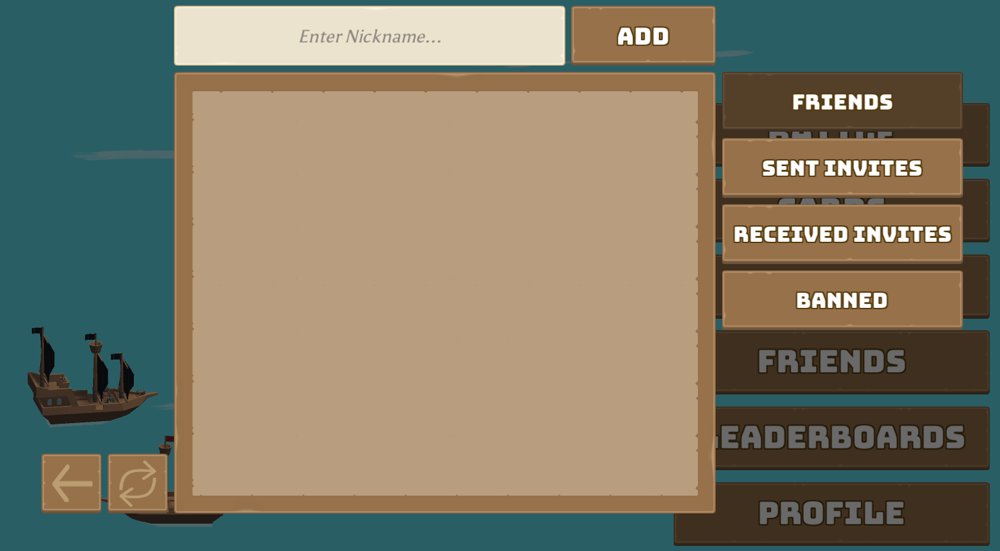

# Friends

A core feature of Nakama is the Friends system, which makes building individual connections within a social network more accessible.

Supported by an invite system and the ability for players to keep their own friends lists, friends can easily interact by chatting with one another, competing on leaderboards, or joining games together.

Here we'll learn how to use Nakama's Friends features to:

* Search the player database for a specific person
* Add new friends and manage invites
* Direct message friends
* Get messages from friends even when offline

In Pirate Panic, it will look like:



You will notice that code throughout this example is often split into **client-side code**, which interfaces directly with Unity, and **server-side code**, which exists in the `ServerModules` folder and is written in Typescript.

This separation allows us to manage and store sensitive information in a central location, and control which parts of it can be seen by players. For example, we might need to store a database of all players and their connections on the server, but players themselves should only be able to see their own friends.

## Finding friends

In order to send and receive data between the client and server, we can write RPC's (remote procedure calls).

A common structure of RPC code is the need to read in a JSON string using `JSON.parse`, operate on the input, then turn it back into a string using `JSON.stringify` to return. The use of JSON allows us to standardize the format of data to make it easier to communicate between multiple engines and languages.

An example of when we need to use an RPC is how to allow players to search for friends' usernames so they are able to add them. Since we don't want clients to have direct access to other players' information we handle it as follows:

1. A player types in a phrase they want to search for
2. The client sends this phrase to the server using an RPC
3. The server queries the database directly to see if there are any matches
4. The server returns the matches to the client so they can be displayed

### Registering RPCs on the server

We start by implementing the RPC on the server-side so that the client will have something to call:

=== "main.ts"
  ```typescript
  const rpcSearchUsernameFn: nkruntime.RpcFunction = function(
    ctx: nkruntime.Context,
    logger: nkruntime.Logger,
    nk: nkruntime.Nakama,
    payload: string): string {

    const input: any = JSON.parse(payload)

    // NOTE: Must be very careful with custom SQL queries to performance check them.
    const query = `
    SELECT id, username FROM users WHERE username ILIKE concat($1, '%')
    `
    const result = nk.sqlQuery(query, [input.username]);

    return JSON.stringify(result);
  }
  ```

This RPC is a function that outputs a JSON object back to the client. The [context object](../../../../runtime-code-basics.md#context) contains a number of useful properties that let us know where this call originated from. The Nakama instance allows us to interface with the Nakama runtime API, and
the payload is a JSON object that contains any custom information sent by the client.

Here, for example, a payload might look like `{username: "BobNorris101"}` if we're looking for our friend named "BobNorris101".

Once we've parsed the JSON, we can then use the information to interface directly with the database using a SQL query. The call to `nk.sqlQuery` will return an object that might look like `{{id: '3ea5608a-43c3-11e7-90f9-7b9397165f34', username: 'BobNorris101'} ...}`

We don't need to explicitly call this function anywhere, we just register the RPC to an event:

```typescript
initializer.registerRpc('search_username', rpcSearchUsernameFn);
```

So whenever the client calls `search_username`, our function will run and automatically send the result back to the client.

### Calling RPCs on the client

To call our RPC defined above on the Unity client:

=== "UsernameSearcher.cs"
  ```csharp
  private struct SearchResult {
      public string username;
  }
  ...
  private async void SearchUsers(string text)
  {
      ... // Do some error handling (see source for examples)

      // Construct a payload
      var searchRequest = new Dictionary<string, string>() { { "username", text } };

      // Convert the payload to JSON for delivery
      string payload = searchRequest.ToJson();
      //RPC method ID from server
      string rpcid = "search_username";

      Task<IApiRpc> searchTask; // Can also put this in a try/catch to handle errors

      //creating search task - sending request for running "search_username" method on server with text parameter
      searchTask = _connection.Client.RpcAsync(_connection.Session, rpcid, payload);

      //awaiting for server returning value
      IApiRpc searchResult = await searchTask;

      //unpacking results to SearchResult struct object
      SearchResult[] usernames = searchResult.Payload.FromJson<SearchResult[]>();

      ...
  }
  ```

The key function here is `RpcAsync`, which takes in the Nakama client session, the RPC identifier `search_username`, and our payload. Since this is a asynchronous network request, we have to make sure to handle the request asynchronously using `await searchTask` so that we can process the output when it arrives.

Our RPC converts and returns our database query as a JSON string, so we need to convert this information to a C# object to work with it.
To do this, we make a custom `SearchResult` `struct` that has the field `username` since that's the format we expect the JSON to be in.

## Adding and inviting friends

Now that we have the validated username returned from the server, we can use the `AddFriendsAsync` function to add them:

=== "FriendsMenuUI.cs"
  ```csharp
  public async void AddFriend()
  {
      // This is from the UsernameSearcher we made earlier
      string[] usernames = new[] { _usernameSearcher.InputFieldValue };
      await _connection.Client.AddFriendsAsync(_connection.Session, new string[] { }, usernames);
      var friends = await _connection.Client.ListFriendsAsync(_connection.Session);
      // Do stuff with friends list (friends[i].State...)
      ...
  }
  ...
  ```

Here, we can add a list of friends using either ID's or usernames. Since we use the username in this example, the ID list is left blank.

After adding a friend, we then update the UI to show the new status using `ListFriendsAsync`. This function asynchronously returns a list of `IApiFriend` objects. Each `IApiFriend` contains a `User` property and a `State` property which can be used to display information about each friend.

The `User` property contains all of the common information about the user (ID, username, etc.).

The `State` property describes the relationship between a player and their friend:

* State `0` means they are friends with each other
* State `1` means A has sent an invitation, but B has not yet accepted
* State `2` is the opposite of `1`: B sent an invitation to A
* State `3` means that B was blocked by A

Calling `AddFriendsAsync` will put a player into state `1`. The other player then needs to call `AddFriendsAsync` on their end to turn both states into `0`.

Finally we need to create an interface that lets players view their invites, and ideally press an 'Accept' button to call `AddFriendsAsync` for them.

The code for doing so is very similar to the code for adding a friend, and can be found in [FriendPanel.cs][https://github.com/heroiclabs/unity-sampleproject/blob/master/PiratePanic/Assets/PiratePanic/Scripts/Menus/Friends/FriendPanel.cs] for reference.

## Blocking and unblocking friends

A player can also decide to block any of their friends. This action is handled as follows:

=== "FriendsPanel.cs"
  ```csharp
  private async void BlockOrUnblockThisFriend()
  {
      //Checking if player status is blocked.
      if (!_blocked)
      {
        //if is not blocked, then block this friend
          string[] ids = new[] { _friend.User.Id };

          await _connection.Client.BlockFriendsAsync(_connection.Session, ids);
          OnDataChanged();
      }
      else
      {
          //unblock this friend
          await _connection.Client.DeleteFriendsAsync(_connection.Session, new[] { _friend.User.Id });
      }
  }
  ```

Here, `_friend` is an `IApiFriend` object that was passed into the `FriendPanel` class when it was created, and `_blocked` is a boolean that flips whenever this friend is blocked or unblocked.
The important part is the `BlockFriendsAsync` function, which takes in a list of ID's and sets all of the friend states to `3`.

It might be counterintuitive why we call `DeleteFriendsAsync` to unblock. The alternative is to change the Friend State to either an invitation (`1` or `2`) or friendship (`0`). We don't want to do this so we just delete the Friend object entirely. You are then free to reinvite the friend.

`DeleteFriendsAsync` can also be used in the same manner to remove a friend who is not blocked.

!!! note "Note"
  There is a difference between blocking and banning a user. A ban is done server-side and prevents a player from joining the game entirely. Learn more about [banning](../../../../social-friends.md#ban-a-user).

## Chatting with friends

Nakama makes it easy to enable chat between friends.

Chat within the server is divided into channels, each with a particular ID. If we want a private channel, we pass in the ID of the player we want to chat with (since these ID's are unique).

To join a chat channel, we can use `JoinChatAsync`:

=== "FriendsMenuUI.cs:
  ```csharp
  private async void StartChatWithUser(string userId, string username)
  {
      IChannel chatChannel;

      ...
      chatChannel = await _connection.Socket.JoinChatAsync(userId, ChannelType.DirectMessage, persistence: true, hidden: true);
      ...

      _chatChannelUI.SetChatChannel(chatChannel);
      _chatChannelUI.gameObject.SetActive(true);
  }
  ```

Let's examine the parameters of the `JoinChatAsync` function:

There are three main types of chat channels:

* `DirectMessage`: Used for creating private rooms between two players
* `Group`:Used to support private chats with multiple people in the same clan
* `Room`: Creates a dynamic public chat that anybody can join. Once everyone leaves the room, the channel no longer exists until someone joins back.
  - You can learn more about the differences between these three channels [here](https://heroiclabs.com/docs/social-realtime-chat/#join-chat).

`Persistent` means that messages get saved to the database and are available for message history listing at a later date. And `hidden` members won't show up in the member listing.

Now that a player has joined a channel, they can send chat messages:

=== "ChatChannelUI.cs"
```csharp
var content = new Dictionary<string, string>(){{"content", _chatInputField.text}}.ToJson();
_connection.Socket.WriteChatMessageAsync(_chatChannel.Id, content);
```

Here, `_chatChannel` is the same channel we created with `JoinChatAsync` in the previous function. The format for the `content` we pass in comes in a dictionary where the key is a particular custom field (in this case, `content`) and the value is the information we want to send.

To receive a message sent to the group, we can add a function to the `ReceivedChannelMessage` handler like so:

```csharp
_connection.Socket.ReceivedChannelMessage += AddMessage;
```

Here `AddMessage` is what we want to do with the received message. For example:

=== "ChatChannelUI.cs"
  ```csharp
  private void AddMessage(IApiChannelMessage message)
  {
      // Manage message prefabs, etc. (not shown in this snippet)
      ...

      // If the message is from the same user as newest we should hide his username on this message
      bool hideUsername = (message.Username == _lastMessageUsername) && !message.Persistent;

      // Initializing message with ID, username, message content, time of creation, and whether or not we should hide it
      messageUI.InitMessage(message.MessageId, message.Username,
      message.Content.FromJson<Dictionary<string, string>>()["content"], message.CreateTime, hideUsername);

      ...

      //If message is historical change order in hierarchy, the latest historical message is the oldest
      if (message.Persistent)
      {
          messageUI.transform.SetSiblingIndex(1);
      }
  }
  ```

Some constructs, like `MessagePrefab` or `messageUI`, are specific to this tutorial and can be customized further depending on your need, the above code gives an example of how we can use the `IApiChannelMessage` object passed in by the `ReceivedChannelMessage` handler.

We can see that the `message` object has several attributes:

* `SenderId`: The client that sent this message
* `Username`: The name of the player who sent it
* `Persistent`: Boolean that tells us if the message is saved or not
* `CreateTime`: When the message was sent
* `Content`: JSON object that can be converted to its actual contents using `message.Content.FromJson<Dictionary<string, string>>()["content"]`

## Subscribing to channels

By default, when a client disconnects and reconnects to the server (e.g. if a player quits the game), they will not be automatically re-subscribed to any chat channels.

If this is something you want in your game (e.g. you want players to receive notifications when they get messages), you will need to make sure that clients re-join chat channels on start.

To subscribe to all friend channels:

=== "Scene01MainMenuController.cs"
  ```csharp
  private async void Start() {
      var friends = await _connection.Client.ListFriendsAsync(_connection.Session);

      foreach(IApiFriend friend in friends) {
          var userId = friend.User.Id;
          await _connection.Socket.JoinChatAsync(userId, ChannelType.DirectMessage, persistence: true, hidden: true);
      }
    ...
  }
  ```

This code loops through each friend in the friends list on app start, and joins each friend's direct message channel so that any chats delivered by any friend will be received automatically.

## Further reading

Learn more about the topics and features, and view the complete source code, discussed above:

* [Friends](../../../../social-friends.md)
* [Realtime Chat](../../../../social-realtime-chat.md)
* [UsernameSearcher.cs](https://github.com/heroiclabs/unity-sampleproject/blob/master/PiratePanic/Assets/PiratePanic/Scripts/Menus/Friends/UsernameSearcher.cs)
* [FriendsMenuUI.cs](https://github.com/heroiclabs/unity-sampleproject/blob/master/PiratePanic/Assets/PiratePanic/Scripts/Menus/FriendsMenuUI.cs)
* [FriendPanel.cs](https://github.com/heroiclabs/unity-sampleproject/blob/master/PiratePanic/Assets/PiratePanic/Scripts/Menus/Friends/FriendPanel.cs)
* [ChatChannelUI.cs](https://github.com/heroiclabs/unity-sampleproject/blob/master/PiratePanic/Assets/PiratePanic/Scripts/Menus/Clans/Chat/ChatChannelUI.cs)
* [Server main.ts](https://github.com/heroiclabs/unity-sampleproject/blob/master/ServerModules/src/main.ts)
