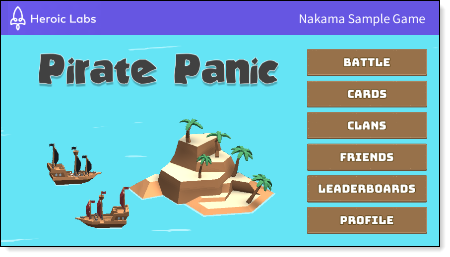

# Pirate Panic Tutorial

Welcome to the Pirate Panic tutorial!

In this tutorial, we will cover all of the major Nakama features implemented in [Pirate Panic](https://github.com/heroiclabs/unity-sampleproject).

This tutorial is split into multiple sections, each exploring a different feature of Nakama and how it can be used with Unity in the context of Pirate Panic. This resource provides an example of Nakama in a full-scale project and is meant to help you adapt the big ideas and code snippets easily into your own games!

## Prerequisites

So that you can follow along with this tutorial, please ensure you have done the following before proceeding:

* [Installed Nakama](../../../../install-docker-quickstart.md)
* [Download](https://unity3d.com/get-unity/download) and install Unity
* [Install the Nakama Unity SDK](https://github.com/heroiclabs/nakama-unity)
* [Download the Pirate Panic Unity project]((https://github.com/heroiclabs/unity-sampleproject))

## Topics

This tutorial is composed of the following sections:

* [Authentication](authentication.md)
* [Friends and Chat](friends.md)
* [Clans](clans.md)
* [Storage](storage.md)
* [Matchmaking](matchmaking.md)
* [Realtime Multiplayer](realtime-multiplayer.md)
* [Leaderboards](leaderboards.md)
* [Notifications](notifications.md)

## Source files

All of the files referenced in this tutorial can be found in our [Unity Sample Project](https://github.com/heroiclabs/unity-sampleproject) repository.
