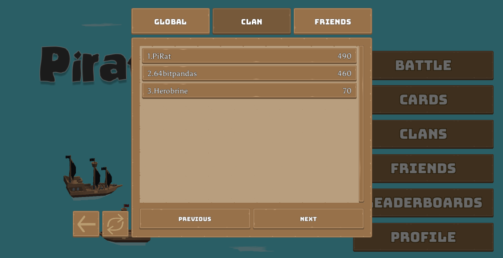

# Leaderboards

We have set up matches, friends, clans, and ways to store data. Let's put them all together to display a [leaderboard](../../../concepts/leaderboards.md) of top players to foster some competition.



## Setting up the leaderboard

For each of the leaderboards we want to create, we run `leaderboardCreate`. This function takes in several parameters:

* The ID/name
* Boolean for if the leaderboard is authoritative (if yes, then only the server is allowed to update the leaderboard)
* Sort order (`SortOrder.ASCENDING` or `SortOrder.DESCENDING`)
* Operator to aggregate scores
    * `Operator.BEST`: Always taking the best score submitted
    * `Operator.SET`: Always taking the latest score submitted
    * `Operator.INCR`: Adding submitted scores to the total
*  Reset schedule, which is a [CRON expression](https://en.wikipedia.org/wiki/Cron) or `null` for a leaderboard that never resets
*  Metadata to store within the leaderboard

For Pirate Panic, we set up a global leaderboard that shows the best high score of all time from all players:

=== "main.ts"
    ```typescript
    const id = "global_leaderboard";
    const authoritative = false;
    const metadata = {};
    const scoreOperator = nkruntime.Operator.BEST;
    const sortOrder = nkruntime.SortOrder.DESCENDING;
    const resetSchedule = null;
    nk.leaderboardCreate(id, authoritative, sortOrder, scoreOperator, resetSchedule, metadata);
    ```

Now the leaderboard is ready to accept new records.

## Adding to the Leaderboard

After every match ends we will record the player scores to the leaderboard. Whenever a match is over the client sends an RPC request to the server to handle end-game behaviors:

=== "LeaderboardsMenuUI.cs"
    ```typescript
    interface MatchEndRequest { // Create a structure to align the payload to
        matchId : string;
        placement: MatchEndPlacement;
        time : number;
        towersDestroyed : number;
    }


    const rpcHandleMatchEnd: nkruntime.RpcFunction = function(ctx: nkruntime.Context, logger: nkruntime.Logger, nk: nkruntime.Nakama, payload: string): string {
        ... // Add gems to wallet, calculate score, etc. etc.
        let request : MatchEndRequest = JSON.parse(payload);
        let score = calculateScore(request.placement == MatchEndPlacement.Winner, request.towersDestroyed, request.time);
        nk.leaderboardRecordWrite(globalLeaderboard, ctx.userId, ctx.username, score);
        ...
    }
    ```

How you want to calculate the score is up to you and the mechanics of your game. You could take into account who won, how long it took to win, or how many towers they destroyed like we did in this example. All of this information is passed into the payload from the client.

Once a score is calculated, we pass it as a number into `leaderboardRecordWrite` along with the user ID and the username to display, and the leaderboard engine will take care of the rest.

In addition, it's possible to do this on the Unity side using [WriteLeaderboardRecordAsync](../../../concepts/leaderboards.md#submit-a-score).

## Listing leaderboard records

Now that the server is set up to handle new leaderboard records, let's make a way for players to view what's stored on the server This is done on the client-side using `ListLeaderboardRecordsAsync`:

=== "LeaderboardsMenuUI.cs"
    ```csharp
    [SerializeField] private int _recordsPerPage = 100;
    ...
    public async void ShowGlobalLeaderboards(string cursor = null)
    {
        // Fetch all records from the leaderboard "global"
        IApiLeaderboardRecordList records = await _connection.Client.ListLeaderboardRecordsAsync(_connection.Session, "global", ownerIds: null, expiry: null, _recordsPerPage, cursor);

        SetLeaderboardsCursor(records, ShowGlobalLeaderboards);
        ...
    }
    ```

For the example above, `SetLeaderboardsCursor` might look like:

=== "LeaderboardsMenuUI.cs"
    ```csharp
    private void SetLeaderboardsCursor(IApiLeaderboardRecordList records, Action<string> caller)
    {
        if (records.PrevCursor != null) {
            _prevPageButton.interactable = true;
            _prevPageButton.onClick.RemoveAllListeners();
            _prevPageButton.onClick.AddListener(() => caller(records.PrevCursor));
        } else {
            _prevPageButton.interactable = false;
        }
        if (records.NextCursor != null) {
            _nextPageButton.interactable = true;
            _nextPageButton.onClick.RemoveAllListeners();
            _nextPageButton.onClick.AddListener(() => caller(records.NextCursor));
        } else {
            _nextPageButton.interactable = false;
        }
    }
    ```

Here the list of `records` returned by `ListLeaderboardRecordsAsync` comes with two functions, a `PrevCursor` and `NextCursor`, which each grab the previous or next page of records (if such a page exists).

By binding these functions to buttons, we can allow the player to browse records easily. Both `PrevCursor` and `NextCursor` abide by the records per page as set in the original `ListLeaderboardRecordsAsync` call, and will update the `records` object to hold the next page of records.

To actually display these records, we can use a `foreach` loop over each record in `records`:

=== "LeaderboardsMenuUI.cs"
    ```csharp
    foreach (IApiLeaderboardRecord record in records)
    {
        string username = record.Username;
        if (localId == record.OwnerId)
        {
            username += " (You)";
        }
        ...
    }
    ```

Each `record` holds a `Username`, `OwnerId`, `Score`, as well as any other custom fields stored in the optional metadata.

## Filtering leaderboards

We can also filter out the global leaderboard to see how our friends or clans are doing.

In the previous section we left `ownerIds` as `null` since we wanted to get all of the entries. Now, we can use this parameter to get only the entries with certain owners.

For example, we can get all of our friends using `ListFriendsAsync`:

```csharp
var friends = await _connection.Client.ListFriendsAsync(_connection.Session);
```

We can then extract all of their user ID's and store them into a list:

```csharp
List<string> ids = friends.Friends.Select(x => x.User.Id).ToList();
```

Finally, we can pass in the `ids` list into the filter, and only the users in that list will be displayed in the `records`:

```csharp
IApiLeaderboardRecordList records = await _connection.Client.ListLeaderboardRecordsAsync(_connection.Session, "global", ids, null, 1, cursor);
```

Here, we're fetching records from the same leaderboard (`global`), but now passing in `ids` as `ownerIds` and setting the number of records per page to `1`.

A very similar process can be done to filter the leaderboard to only show scores from members of your clan:

```csharp
var users = await _connection.Client.ListGroupUsersAsync(_connection.Session, _userClan.Group.Id, null, 1, null);
IEnumerable<string> ids = users.GroupUsers.Select(x => x.User.Id);

IApiLeaderboardRecordList list = await _connection.Client.ListLeaderboardRecordsAsync(_connection.Session, "global", ids, null, 1, cursor);
```

## Further reading

Learn more about the topics and features, and view the complete source code, discussed above:

* [Leaderboards](../../../concepts/leaderboards.md)
* [Server-side function reference](../../../server-framework/function-reference.md#leaderboards)
* [BattleMenuUI.cs](https://github.com/heroiclabs/unity-sampleproject/blob/master/PiratePanic/Assets/PiratePanic/Scripts/Menus/BattleMenuUI.cs)
* [LeaderboardsMenuUI.cs](https://github.com/heroiclabs/unity-sampleproject/blob/master/PiratePanic/Assets/PiratePanic/Scripts/Menus/LeaderboardsMenuUI.cs)
* [Server main.ts](https://github.com/heroiclabs/unity-sampleproject/blob/master/ServerModules/src/main.ts)
