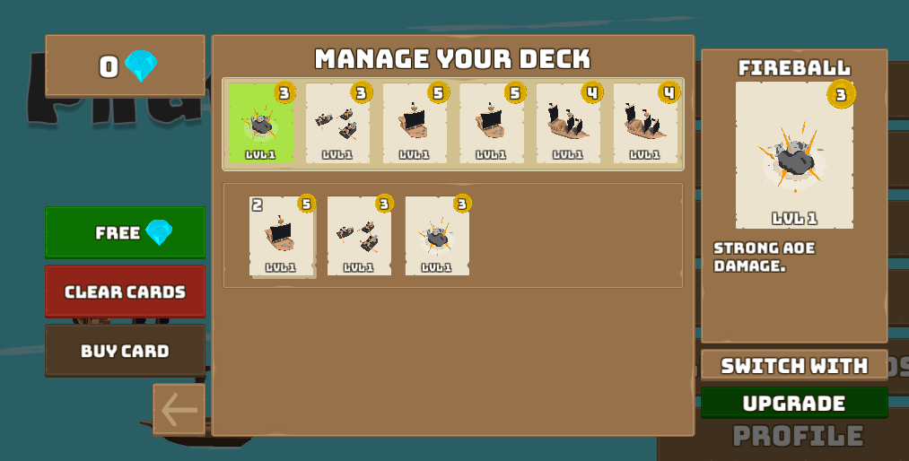
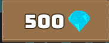
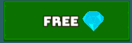

# Persistent Storage

For most games, it is necessary to keep track of important player data (e.g. inventory or game stats). In a single-player game this can be done by storing information locally on the client, but for multiplayer games data often needs to be sent to multiple clients at the same time, or protected against tampering.

The Nakama [Storage Engine](../../../concepts/collections.md) makes it easy to securely store and access per-user information on the server

In this section, we'll explore how to:

* Read and write from the server database
* Create a wallet for holding virtual currencies
* Manage transactions with a wallet ledger
* Include custom metadata in wallets

## Collections

In Nakama, custom user data is organized into `collections` which contain groups of `objects` that hold some data for a particular user. This structure allows us to store similar information together for easy access.

In Pirate Panic, each player holds a deck of cards to bring into battle:



We want to store the state of this deck on the server so that each user has their own deck that gets saved even if they close the game and rejoin later.

### Read and write from server

First, let's set up a way to give each player some cards to start:

=== "deck.ts"
    ```typescript
    let deck: any = {};

    const DefaultDeckCards = [
      {
        type: 1,
        level: 1,
      },
      ... // more cards here
    ]

    DefaultDeckCards.forEach(c => {
      deck[nk.uuidv4()] = c;
    });
    ```

Here, our original deck data was represented as an array of object literals. Each object contains two numeric properties: what type of card it is and the level it has been upgraded to.

The details of what type and level represent are specific to Pirate Panic, so your game will likely have its own custom information to store. For example, each object could also include the date obtained, special variants, or anything else players might want to know.

We then need to convert the data into storage objects by assigning each one a unique ID using the `uuidv4()` function. This is necessary to keep track of cards that might be otherwise identical.

Once we have this deck, we can store it using the `storageWrite` function:

=== "deck.ts"
    ```typescript
    nk.storageWrite([
      {
        key: "card_collection",
        collection: "user_cards",
        userId: userId,
        value: deck,
        permissionRead: 2,
        permissionWrite: 0,
      }
    ]);
    ```

This will create a collection that has the following structure:

```typescript
card_collection
 user_cards: {
    userId: some-user-id-3fb1d6, // some arbitrary ID
    permissionRead: 2,
    permissionWrite: 2,
    ... // some other properties
    value: {
      some-random-id: { // another arbitrary ID
        type: 1,
        level: 1,
      }
      ... // more cards
    }
 }
```

Now, if we want to access these cards in the future, we can call `storageRead` using a request object:

=== "deck.ts"
    ```typescript
    function loadUserCards(nk: nkruntime.Nakama, logger: nkruntime.Logger, userId: string): CardCollection {
      let storageReadReq: nkruntime.StorageReadRequest = {
        key: DeckCollectionKey,
        collection: DeckCollectionName,
        userId: userId,
      }

      let objects: nkruntime.StorageObject[] = nk.storageRead([storageReadReq]);

      // Get the original collection for processing
      let storedCardCollection = objects[0].value;
      ...
    }
    ```

Multiple requests can be made at the same time using a single `storageRead` call by appending multiple `StorageReadRequest`s to the array in `storageRead`.

### Read and write from client

For interfacing with collections from the Unity client we use RPCs like we did with [finding friends](friends.md#finding-friends). This helps us control the types of requests users can make, and keeps all sensitive operations strictly on the server.

It is also possible for the local player to read their data using the function `ReadStorageObjectsAsync` directly:

=== "ProfilePanel.cs"
    ```csharp
    StorageObjectId personalStorageId = new StorageObjectId();
    personalStorageId.Collection = "personal";
    personalStorageId.UserId = _connection.Session.UserId;
    personalStorageId.Key = "player_data";

    IApiStorageObjects personalStorageObjects = await _connection.Client.ReadStorageObjectsAsync(_connection.Session, personalStorageId);
    ```

Here we pass in a `Collection`, `UserId`, and `Key` property into a `StorageObjectId` `struct` which is used to identify the object we're looking for.

### Adding permissions

Nakama supports handling of read and write permissions from the database to prevent unauthorized access of sensitive data.

Objects can be protected for reads with three different `permissionRead` levels:

* `0`: Nobody can read the object (except for the server)
* `1`: Only the user that owns this object (the `userId` matches) can read it
* `2`: Anybody can read this object

Writes have two levels, `0` for no writes allowed or `1` for owner writes allowed. As with the reads, the server bypasses these permissions and can write to any object. Level `0` is often used so that write requests can be checked on the server rather than letting users edit their data themselves.

For example, we want user stats to be able to be seen by everyone but they can't be changed except by the server:

```typescript
const writeStats: nkruntime.StorageWriteRequest = {
  collection: "stats",
  key: "public",
  permissionRead: 2,
  permissionWrite: 0,
  value: initialState,
  userId: ctx.userId,
}
```

### Conditional reads and writes

Multiple users may need to access (and possibly write to) the same object.

In order to make sure that modifications don't conflict, you can pass in a `version` property into any write request. For this use either `writeStorageObjects` on the server or `WriteStorageObjectsAsync` on the client and the write will only be accepted if the version inputted matches the version stored in the database.

This feature is not showcased in Pirate Panic, but you can learn more about the [conditional storage](../../../concepts/collections.md#conditional-writes) and implement it in your own games.

## Wallet

On top of normal collections, Nakama also has a wallet feature that specifically supports storing and making transactions with a currency in-game.

In Pirate Panic, this currency comes in the form of Gems that can be used to purchase new cards.



### Updating wallet amounts

Unlike collections, wallets can only be directly updated from the server to make it more difficult for unintended or exploitative transactions to occur.

Changing the value in the wallet server-side can be done using `walletUpdate`, which takes four parameters:

* The user ID of the wallet to change
* An object containing key-value pairs matching every currency name with an amount to update by
* A metadata object
* Boolean that tells the server whether it should update the ledger

Since we only have one currency in Pirate Panic it is convenient to write a helper function so that we can just pass in a number rather than reconstructing `changeset` every time we want to add some gems:

=== "economy.ts"
    ```typescript
    const currencyKeyName = "gems" // Can be changed to whatever you want!
    ...
    function updateWallet(nk: nkruntime.Nakama, userId: string, amount: number, metadata: {[key: string]: any}): nkruntime.WalletUpdateResult {
      const changeset = {
        [currencyKeyName]: amount,
      }
      let result = nk.walletUpdate(userId, changeset, metadata, true);

      return result;
    }
    ```

Note is that `amount` is how much we want to change the current wallet balance by and does not completely replace the current balance. For example, if our wallet had 900 gems and `updateWallet` is called with amount 100, then we can expect the new balance to be 1000 (not 100).

We can then wrap this in an RPC to let the Unity client add gems in certain situations. For example, let's say we're feeling generous and want to make a button that gives free gems:



The RPC would look like:

```typescript
const rpcAddUserGems: nkruntime.RpcFunction = function(ctx: nkruntime.Context, logger: nkruntime.Logger, nk: nkruntime.Nakama): string {
  let walletUpdateResult = updateWallet(nk, ctx.userId, 100, {});
  let updateString = JSON.stringify(walletUpdateResult);

  logger.debug("Added 100 gems to user %s wallet: %s", ctx.userId, updateString);

  return updateString;
}
```

And to call it from Unity:

```csharp
private void Awake() {
    ...
    _getFreeGemsButton.onClick.AddListener(HandleAddFreeGems); // Bind function to button
}
...
private async void HandleAddFreeGems() {
    // Call the RPC we just made!
    IApiRpc newGems = await _connection.Client.RpcAsync(_connection.Session, "add_user_gems");
    // IMPORTANT: Update the account instance to get the latest results!
    _connection.Account = await _connection.Client.GetAccountAsync(_connection.Session);
    ...
}
```

We can also subtract gems from a player's wallet by simply passing in a negative amount. For example, if we want to buy a card using 100 gems we could call `updateWallet(nk, ctx.userId, -100, {});`.

### Custom metadata

The metadata object enables you to put in any custom information into each wallet transaction. Every item in `walletLedgerList` will then have this information carried with it so it can be referenced in the future.

For example, we might want to tag each reward with its match ID so we can make sure they are all coming from the same place and print out the total reward for players to see:

```typescript
let metadata = {
  source: "match_reward",
  match_id: request.matchId,
};

updateWallet(nk, ctx.userId, score, metadata);
```

### Fetching wallet amounts

On the client side wallet information is stored in `connection.Account.Wallet`, where `connection.Account` is an `IApiAccount` instance of the `GameConnection` class that holds the connection information we established while setting up authentication.

Once we get this `Wallet` variable, which comes in the form of a stringified JSON object, we can extract the number of gems in the wallet using the following code:

```csharp
private int GetGems(string wallet)
{
    Dictionary<string, int> currency = wallet.FromJson<Dictionary<string, int>>();

    if (currency.ContainsKey("gems"))
    {
        return currency["gems"];
    }

    return 0;
}
```

In Pirate Panic, since we created `GameConnection`, we can call `GetGems` using:

```csharp
GetGems(_connection.Account.Wallet);
```

### Transaction ledgers

There is one final parameter, `updateLedger`, that we set to true above.

Every time `walletUpdate` is called with `updateLedger` set to `true`, a new ledger entry is created. This allows us to go through all previous transactions and see their details.

To do so call `walletLedgerList` which by default will grab a list of all of the transactions sorted from least to most recent.

We can then use the `cursor` to skip to any entry desired. For example, if we want to get the latest cursor update:

=== "match.ts"
    ```typescript
    let items = nk.walletLedgerList(ctx.userId, 100);
    while (items.cursor) {
      items = nk.walletLedgerList(ctx.userId, 100, items.cursor);
    }
    ```

This is useful, for example, to skip to the current match rewards. If we set the initial reward to have a cursor update, and continue listing incremental updates (like tower capture) with no cursor update, we can then get a list of all transactions in the latest match using this strategy.

## Further reading

Learn more about the topics and features, and view the complete source code, discussed above:

* [Server-side functions reference - Storage](../../../server-framework/function-reference.md#storage)
* [Server-side functions reference - Wallet](../../../server-framework/function-reference.md#wallet)
* [Storage Collections](../../../concepts/collections.md)
* [Permissions](../../../concepts/access-controls.md)
* [Wallets](../../../concepts/user-accounts.md#virtual-wallet)
* [ProfilePanel.cs](https://github.com/heroiclabs/unity-sampleproject/blob/master/PiratePanic/Assets/PiratePanic/Scripts/Menus/Profile/ProfilePanel.cs)
* [GameConnection.cs](https://github.com/heroiclabs/unity-sampleproject/tree/master/PiratePanic/Assets/PiratePanic/Scripts)
* [Server economy.ts](https://github.com/heroiclabs/unity-sampleproject/blob/master/ServerModules/src/economy.ts)
* [Server deck.ts](https://github.com/heroiclabs/unity-sampleproject/blob/master/ServerModules/src/deck.ts)
* [Server match.ts](https://github.com/heroiclabs/unity-sampleproject/blob/master/ServerModules/src/match.ts)
